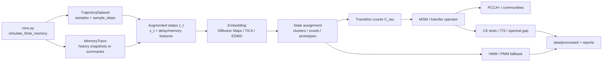

# Markov-Dynamik als inhaltlicher Anker für das Emergenzprojekt Knoten

## Executive Summary

Das Repository **Knoten** ist bereits näher an einer belastbaren Markov-Dynamik-Perspektive, als es auf den ersten Blick wirkt. Sein kanonischer Kern ist ein **stochastischer Prozess mit endlichem Gedächtnis**: Ein Zustandsvektor `x_n` wird mit einem relaxierenden Speicher gekoppelt, die Speicherlänge wird aus `memory_factor / alpha` und `max_memory` bestimmt, und die Dynamik entsteht aus Gaußrauschen plus einem zweiskaligen, aus vergangenen Zuständen gebildeten Gradientenfeld. README, `core.py` und `kernels.py` formulieren genau diese Struktur; historisch wird sie im Repo selbst bereits mit **metastabilen Knoten**, **Relaxationsskalen** und **Grobkörnigkeit** verbunden. citeturn19view3turn43view0turn43view2turn43view3turn13view0

Der stärkste wissenschaftliche Anschluss ist deshalb nicht einfach „ein bisschen MSM“, sondern eine sehr präzise Aussage aus der Transferoperator-/MSM-Literatur: **Noé und Nüske** schreiben, dass „**any stochastic process with finite memory can be transformed into a Markov process**“. Genau das ist die saubere theoretische Lizenz, das aktuelle Knoten-Modell **in einen augmentierten Zustandsraum** zu heben und dann mit **Transferoperator**, **Markov State Model**, **PCCA+** und – falls das Coarse-Graining auf `x_t` allein zu viel Gedächtnis versteckt – **Hidden-Markov-/Projected-Markov-Modellen** weiterzuarbeiten. citeturn42view0turn42view9turn42view3

Der kanonische Paketkern ist dafür **gut vorbereitet, aber noch nicht auf dieser Ebene angekommen**. Vorhanden sind eine kompakte Python-Kernbibliothek, reproduzierbare Referenzläufe, Geometrie-Diagnostiken (`D_cov`, `D_occ`, `D_spec`, Residence) und NPZ/JSON-Serialisierung. Nicht vorhanden sind in der kanonischen API bislang **Zustandsdiskretisierung**, **Übergangsmatrizen**, **lag-time sweeps**, **dominante Eigenfunktionen/-werte des Propagators**, **implied timescales**, **Chapman-Kolmogorov-Tests**, **PCCA-Memberships** und **nichtmarkovsche Erweiterungen**. Genau diese Lücke ist der Punkt, an dem die Markov-Dynamik-Ecke inhaltlich und softwareseitig am meisten Hebel bietet. citeturn20view1turn14view3turn26view1turn12view0turn19view1

Meine klare Empfehlung für den „inhaltlichen Anker“ lautet daher: **Knoten als endlich-gedächtnisbehafteter stochastischer Prozess, dessen metastabile Grobstruktur über Transferoperatoren operationalisiert, über MSM/PCCA quantifiziert und bei Bedarf über HMM/PMM nichtmarkovsch korrigiert wird.** Das ist zugleich theoretisch sauber, kompatibel mit dem existierenden Code und sofort falsifizierbar über standardisierte Validierungsmessgrößen wie **implied timescales**, **Chapman-Kolmogorov-Konstanz** und **spectral gaps**. citeturn42view0turn42view1turn42view3turn42view9turn33view0

## Analyse des Repositorys

Die Programmiersprache wird im About-Text nicht explizit genannt, ist aber bei Durchsicht des Repos eindeutig **Python**: Die Installation läuft über `pip`, das Projekt ist über `pyproject.toml` paketiert, die README nennt `pytest`-Tests und der kanonische Code liegt unter `src/emergenz_knoten/*.py`. Die Architekturübersicht teilt das Projekt in drei Schichten: **Kernbibliothek**, **Experiment-Entry-Points** und **Dokumentation/Audits**. Der öffentliche Kernexport umfasst laut README `SimulationConfig`, `simulate_finite_memory`, `simulate_finite_memory_numba`, `SimulationRunner`, `run_simulation`, `save_simulation_result` und `load_simulation_result`; `simulation.py` ist nur noch ein dünner Legacy-Kompatibilitätslayer, der diese Objekte re-exportiert. Zum Zeitpunkt der Durchsicht zeigt GitHub außerdem **0 Issues**; die Roadmap liegt also faktisch in den Markdown-Dokumenten, nicht im Issue-Tracker. citeturn8view0turn19view1turn20view1turn16view0turn23view0

Inhaltlich ist der Kern des Projekts sehr klar. `SimulationConfig` parametrisiert Schrittzahl, Dimension, Rauschstärke `epsilon`, Driftstärke `eta`, Memory-Relaxation `alpha`, repulsive/attractive Skalen `sigma_rep` und `sigma_att`, Amplituden, `memory_factor`, `max_memory`, Burn-in und Sampling-Intervall. `finite_memory_step` berechnet aus der History und den Gewichten einen **double_gaussian_gradient**, addiert Normalrauschen und integriert die Dynamik als  
`x_{n+1} = x_n + epsilon * noise - eta * grad`. Die eigentliche Simulation legt einen History-Buffer an, berechnet die endlichen Exponentialgewichte, verschiebt die History als FIFO-ähnlichen Puffer und sammelt `samples` sowie `sample_steps`; die Numba-Variante spiegelt dieses Verhalten und gibt zusätzlich `final_x`, `memory` und `weights` zurück. Entscheidend ist dabei die Speicherhorizont-Formel `min(max_memory, max(1, int(memory_factor / alpha)))`: Das Modell hat also explizit eine **kontrollierte endliche Gedächtnislänge**, und diese hängt direkt an `alpha`. citeturn43view0turn43view1turn43view2turn43view3turn43view4turn43view5

`kernels.py` macht die Dynamik mathematisch sauber lesbar. `exponential_weights(alpha, horizon)` definiert die finite Gedächtnisverteilung `alpha * (1-alpha)^k`; `gaussian_gradient` akkumuliert gewichtete Gauß-Gradienten über den Speicher; `double_gaussian_gradient` zieht eine langsamer variierende attraktive von einer engeren repulsiven Komponente ab. Genau diese Zweiskalenstruktur ist als minimaler Mechanismus für lokalisierte, metastabile Strukturen interessant, weil sie bereits ein natürliches Spannungsverhältnis aus lokaler Vermeidung und globalerer Anziehung erzeugt. citeturn13view0turn13view1turn13view2

Die momentane Diagnostik ist dagegen **noch vorwiegend geometrisch**, nicht operatorisch. `covariance_dimension` benutzt den Participation-Ratio-Schätzer auf dem Kovarianzspektrum; `occupancy_dimension` fitttet `log(N_boxes)` gegen `log(1/scale)`; `residence_statistics` aggregiert wiederholte Voxelbesuche zu Größen wie `knot_count`, `mean_residence` und `max_residence`; `spectral_dimension` baut aus paarweisen Abständen einen exponentiellen Kernel, normiert zeilenweise und schätzt daraus eine Form von Spektraldimension. Das ist nützlich, aber es ist wichtig, es begrifflich sauber zu halten: **„spectral“ bedeutet im aktuellen Paket nicht Spektrum eines Transferoperators oder einer Übergangsmatrix, sondern Spektrum eines Geometriekernels auf Punktwolken.** Genau hier verläuft die zentrale inhaltliche Grenze zwischen der bestehenden Diagnostik und einer eigentlichen Markov-Schiene. citeturn11view0turn11view2turn11view3turn12view0turn12view1turn11view5

Die Datenstrukturen sind funktional, aber für Markov-Analysen noch unvollständig. `SimulationResult` ist in `experiments.py` als `dict[str, np.ndarray]` gesetzt; gespeichert wird wahlweise als **`.npz`** oder **`.json`**. Tests und Kerncode zeigen die gegenwärtig wichtigsten Felder: `samples` mit Form `(n_samples, dim)`, `sample_steps`, und – in der Numba-Variante – `memory` sowie `weights`, deren Längen konsistent sein müssen. Für reine Dimensions- oder Knock-in/Knock-out-Analysen reicht das; für Übergangsoperatoren fehlt aber ein entscheidendes Element: **es werden nur die finalen Memory-Zustände zurückgegeben, nicht die Memory-Snapshots entlang der gesamten Trajektorie**. Gerade diese laufenden Snapshots wären jedoch der natürlichste Rohstoff für eine Markovisierung im augmentierten Zustandsraum. citeturn14view3turn14view4turn43view5turn18view0turn17view6

Die Entry-Points sind sauber genug, um als Markov-Integrationspunkte zu dienen. `demo_simulation.py` zeigt den Minimalworkflow `SimulationConfig -> run_simulation -> NPZ`. `reference_experiment.py` setzt reproduzierbare Parameter, simuliert, prüft auf genügend Samples und schreibt derzeit nur `D_cov`, `D_occ` und `residence_statistics` in eine JSON-Datei. Die CLI ordnet historische Skripte in Kategorien wie `dimension_selection`, `propagation_speed`, `knot_stability`, `fractal_analysis`, `ou_limit`, `LQG` und `reference` ein. Das ist sehr hilfreich: Es gibt also bereits eine kanonische Schiene für reproduzierbare Versuche, aber sie endet aktuell **vor** Übergangsmatrizen, Spektralzerlegungen und metastabilen State-Assignments. citeturn26view0turn26view1turn27view0turn23view0

Die Tests bestätigen diesen Eindruck. `test_core.py` deckt synthetische Linien-/Flächen-/Wolkenfälle für `covariance_dimension`, eine endliche `occupancy_dimension`, Residence-Zählung, die Exponentialgewichte, deterministische RNG-Nutzung in `finite_memory_step` sowie Laufbarkeit der Python- und Numba-Simulation ab. `test_experiments.py` prüft NPZ/JSON-Serialisierung. Was fehlt, sind genau die Tests, die ein operatorischer Anker verlangen würde: **Übergangszählung auf bekannten Ketten**, **lag-time convergence**, **implied timescales**, **Chapman-Kolmogorov**, **reversible/nonreversible Schätzung**, **PCCA-Rekonstruktion** und **HMM-Vergleich gegen plain MSM**. Bemerkenswert ist, dass der repo-eigene Härteplan viele dieser Ideen bereits andeutet – unter anderem Residence-Time-Verteilungen, lokale Relaxationsspektren, Kontroll-Baselines und Seed-Ensembles. citeturn18view0turn17view6turn21view1turn21view4

Strategisch ist wichtig: Die README und `THEORETICAL_CONTEXT.md` sprechen bereits von **irreversibler Speicherdynamik**, **metastabilen Knoten**, **Arrow of Time**, **effektiver Zeit-/Raumstruktur** und verknüpfen diese Claims mit konkreten Experimentordnern. Gleichzeitig sagt dieselbe Kontextdatei offen, dass sie aus „ChatGPT-derived notes“ kompiliert wurde. Das ist kein Makel, aber es zeigt, warum ein belastbarer Primärliteratur-Anker jetzt wichtig ist: Das Projekt hat bereits starke physikalische Intuitionen und Explorationsspuren; was ihm fehlt, ist eine **saubere, literaturgestützte Operator-Sprache**, mit der diese Intuitionen technisch überprüfbar werden. citeturn28view1turn19view3

## Priorisierte Literatur und expliziter Repo-Abgleich

Die folgende Liste ist bewusst **nicht** als allgemeine Bibliographie gemeint, sondern als priorisierte Auswahl für genau diesen Zweck: das vorhandene finite-memory-Knotenmodell in eine belastbare Markov-/Transferoperator-Schiene zu überführen.

| Priorität | Publikation | Kurzbeschreibung | Relevanz | Expliziter Repo-Abgleich | Konkretes Zitat und Seite |
|---|---|---|---|---|---|
| Sehr hoch | **Noé & Nüske, *A variational approach to modeling slow processes in stochastic dynamical systems* (2013)** | Führt ein Variationsprinzip für dominante Eigenfunktionen und Eigenwerte des Propagators ein. Das Paper ist besonders stark, weil es langsame, metastabile Prozesse direkt adressiert und den Schritt von Daten zu langsamer Dynamik formalisiert. | **5.0/5** | Passt am direktesten auf `core.py`: Das Repo simuliert bereits einen endlichen Gedächtnisprozess mit explizitem History-Buffer und Exponentialgewichten. Was fehlt, ist genau der in diesem Paper motivierte Schritt von `samples` zu einem **augmentierten Markov-Zustand**, einem **Propagator-Schätzer** und einer **dominanten Spektralzerlegung**. citeturn43view0turn43view3 | „**any stochastic process with finite memory can be transformed into a Markov process**“, S. 635. citeturn42view0 |
| Sehr hoch | **Prinz et al., *Markov models of molecular kinetics: Generation and validation* (2011)** | Klassische Referenz für Aufbau, Diskretisierung und Validierung von MSMs. Besonders wertvoll ist die Verbindung von Modellschätzung, Fehlerquellen und Validierung. | **5.0/5** | Das Repo liefert mit `samples`, `sample_steps`, `run_simulation` und NPZ/JSON bereits die Rohdaten für lag-basierte Modelle. Es fehlen aber Zustandsdiskretisierung, Übergangszählung, reversible Schätzer, implied timescales und Chapman-Kolmogorov-Tests – also genau die Arbeitspakete, die Prinz et al. systematisieren. citeturn26view1turn14view3turn43view5 | „**approximated by a Markov chain on a discrete partition of configuration space**“, S. 174105-1. citeturn42view1 |
| Sehr hoch | **Deuflhard & Weber, *Robust Perron Cluster Analysis in Conformation Dynamics* (2005)** | PCCA/PCCA+ ist die klassische Brücke von Operator-Eigenvektoren zu metastabilen, oft fuzzy formulierten Zustandszuordnungen. Für metastabile Knoten ist das methodisch fast ideal. | **4.9/5** | Das Repo spricht konzeptionell von „Knoten“ und misst Residence-Zeiten, hat aber noch keine echte **metastabile Zerlegung**. PCCA+ würde aus einem geschätzten Übergangsoperator genau die Memberships liefern, die aus visuellen/voxelbasierten Knoten **operatorisch definierte metastabile Zustände** machen. citeturn11view3turn19view3turn21view4 | „**metastable conformations, which are almost invariant sets**“, S. 1. citeturn42view2 |
| Sehr hoch | **Noé et al., *Projected and hidden Markov models for calculating kinetics and metastable states of complex molecules* (2013)** | Zeigt, wie man mit nichtmarkovschen Projektionen auf beobachtete Cluster umgeht, ohne die volle Physik verloren zu geben. Das ist die richtige Referenz, wenn Coarse-Graining auf `x_t` allein zu viel Gedächtnis versteckt. | **4.8/5** | Im Knoten-Repo steckt Gedächtnis explizit im Prozess. Ein plain MSM auf `samples` allein wird daher oft zu optimistisch sein; PMM/HMM ist der methodische Reparaturmechanismus, wenn CK-Tests oder ITS-Plateaus scheitern. Genau diese Fallunterscheidung sollte in die API eingebaut werden. citeturn43view5turn26view1turn21view4 | „**discard the assumption that dynamics are Markovian on the discrete clusters**“, S. 184114-1. citeturn42view9 |
| Hoch | **Schütte, Huisinga & Deuflhard, *Transfer Operator Approach to Conformational Dynamics in Biomolecular Systems* (1999)** | Transferoperator-Perspektive auf effektive Dynamik, fast invariant sets und algorithmische Reduktion. Sehr guter theoretischer Oberbau für metastabile Zustände und grobkörnige Dynamik. | **4.7/5** | Dieses Paper liefert den saubersten Überbau für das, was README und `THEORETICAL_CONTEXT.md` bereits intuitiv sagen: Aus einer Mikrodynamik werden unter geeigneter Grobkörnigkeit metastabile effektive Strukturen. Was im Repo fehlt, ist nicht die Intuition, sondern die **Operator-Infrastruktur**, um diese Behauptung zu messen. citeturn19view3turn28view1turn20view1 | „**transfer operator approach to effective dynamics of molecular systems**“, S. 1. citeturn42view3 |
| Hoch | **Klus et al., *Data-driven model reduction and transfer operator approximation* (2018)** | Review, der Transferoperatoren, TICA, DMD und verwandte Verfahren zusammenzieht. Für ein schnell wachsendes Explorationsprojekt ist das methodisch besonders wertvoll, weil es Silos verhindert. | **4.5/5** | Das Repo besitzt bereits Kernsimulation, Kernel und „spectral“-Geometrie, aber noch keine klare Methodenschicht für **slow-coordinate extraction**. Klus et al. ist die beste Blaupause für ein eigenständiges `markov/embedding.py`, das Diffusion Maps, TICA oder EDMD nicht als Konkurrenz, sondern als zusammenhängende Schiene behandelt. citeturn20view1turn12view0 | „**based on transfer operator theory**“, S. 1. citeturn42view10 |
| Hoch | **Coifman, Kevrekidis, Lafon, Maggioni & Nadler, *Diffusion maps, reduction coordinates and low dimensional representation of stochastic systems* (2006)** | Wendet Diffusion-Map-Ideen direkt auf stochastische Systeme an und verbindet sie mit Fokker-Planck-/Reaktionskoordinaten. Für Knoten ist das attraktiver als ein rein geometrischer Diffusion-Maps-Use-Case. | **4.4/5** | `diagnostics.py` enthält bereits eine spektrale Kernel-Diagnostik, aber keine eigentlichen Diffusion-Map-Koordinaten. Diese Arbeit zeigt, wie aus simulierten Punkten bzw. augmentierten Zuständen **reduzierte Koordinaten** für Zustandsdiskretisierung und Metastabilität gemacht werden können. citeturn12view0turn26view1 | „**first few eigenfunctions of the backward Fokker-Planck diffusion operator**“, S. 1. citeturn42view5 |
| Hoch | **Chodera & Noé, *Markov state models of biomolecular conformational dynamics* (2014)** | Kompakter Review mit Fokus auf Praxis, softwareseitiger Reife und Lag-Time-Fragen. Sehr gut geeignet, um eine methodische Einführung für Paper oder Repo-Doku zu schreiben. | **4.2/5** | Im Repo gibt es bereits reproduzierbare Entry-Points und historische Survey-Skripte. Für eine saubere methodische „Front Door“ in `docs/` oder `paper/` ist dieser Review ideal, weil er den Weg von kurzen Trajektorien zu langen kinetischen Aussagen knapp und verständlich formuliert. citeturn23view0turn26view1turn30view0 | „**MSMs can predict both stationary and kinetic quantities on long timescales**“, S. 135. citeturn42view4 |
| Mittel bis hoch | **Mezić, *Spectral Properties of Dynamical Systems, Model Reduction and Decompositions* (2005)** | Grundlegende Koopman-Perspektive auf observable space, Spektren und Modellreduktion. Besonders stark, wenn Ihr nicht nur Zustände, sondern auch Observablen und Responses ernst nehmt. | **4.1/5** | Das Knoten-Projekt interessiert sich explizit für Signalantworten, Relaxationsskalen und effektive Kinematik. Die Koopman-Sicht wäre deshalb eine sinnvolle zweite Schiene neben MSM/PF: erstens für Observable-basierte Reduktion, zweitens als Brücke zu EDMD/DMD in einem späteren Ausbauschritt. citeturn19view3turn21view4 | „**spectral properties of the linear Koopman operator**“, S. 1. citeturn42view8 |
| Mittel | **Meilă & Shi, *A Random Walks View of Spectral Segmentation* (2001)** | Verankert Spectral Clustering probabilistisch als Random-Walk-Problem. Das ist ein nützlicher Anker, wenn die Zustände zunächst über Ähnlichkeitsgraphen statt direkt über Übergangszählung erzeugt werden. | **3.9/5** | Für Knoten kann das als Vorstufe dienen: erst Diffusions-/Ähnlichkeitsgraph auf augmentierten Zuständen, dann spektrale Segmentierung, danach erst Übergangsmatrix. Das ersetzt PCCA nicht, kann aber ein robuster Explorations- und Initialisierungsschritt sein. citeturn12view0turn20view1 | „**pairwise similarities as edge flows in a Markov random walk**“, S. 1. citeturn42view6 |
| Mittel | **Pons & Latapy, *Computing Communities in Large Networks Using Random Walks* (2006)** | Walktrap ist eine community-detection-Methode auf Random-Walk-Basis. Sie ist kein Ersatz für Transferoperator-Spektren, aber ein sehr nützlicher Baseline-Vergleich auf spärlichen oder nichtreversiblen Zustandsgraphen. | **3.7/5** | Sobald Ihr eine Übergangsgrafik oder Zustandsgraphen aus Voxeln/Clustern habt, liefert Walktrap eine explorative Community-Struktur. Das ist besonders praktisch als **Baseline gegen PCCA+**, um zu testen, ob metastabile Knoten operatorisch robust oder nur graph-topologisch sichtbar sind. citeturn11view3turn31view0 | „**captures well the community structure in a network**“, S. 191. citeturn42view7 |

Die Synthese aus dieser Tabelle ist eigentlich sehr klar: **Noé & Nüske** legitimieren die Markovisierung des vorhandenen finite-memory-Modells; **Prinz** liefert Schätz- und Validierungsregeln; **Deuflhard/Weber** geben metastabile Memberships; **Noé et al. 2013** erklären, was zu tun ist, wenn die Projektion auf sichtbare Zustände trotzdem nicht markovsch wird. Damit entsteht eine durchgehende methodische Linie vom bestehenden Knoten-Code bis zu einer belastbaren, publizierbaren Operator-Interpretation. citeturn42view0turn42view1turn42view2turn42view9

## Integrationsdesign für eine Markov-Schiene

Die wichtigste architektonische Einsicht für die Integration ist diese: Das Repo besitzt bereits **Simulationsergebnisse**, aber noch kein geeignetes **Markov-Dataset**. Das aktuelle `SimulationResult` speichert `samples`, `sample_steps` und – in der Numba-Variante – nur den **finalen** Memory-Buffer. Für MSM/HMM/Transferoperatoren braucht Ihr aber entweder **vollständige Memory-Snapshots entlang der Zeitachse** oder mindestens eine konsistente **augmentierte Feature-Repräsentation** je Samplezeitpunkt. Ohne diesen Zwischenschritt bleibt das Projekt bei Geometriediagnostik auf Punktwolken hängen. citeturn43view5turn14view3turn26view1



Für die Paketstruktur würde ich **keine großen Umbauten** im Kern erzwingen, sondern eine additive Schicht unter `src/emergenz_knoten/markov/` anlegen. Sinnvoll wäre ungefähr folgendes API-Design:

```python
from dataclasses import dataclass
from typing import Literal
import numpy as np
from numpy.typing import NDArray

@dataclass(frozen=True)
class LaggedDataset:
    X: NDArray[np.float64]      # states/features at time t
    Y: NDArray[np.float64]      # states/features at time t + lag
    steps: NDArray[np.int64]    # original sample steps
    lag: int
    feature_names: tuple[str, ...]

@dataclass(frozen=True)
class MSMConfig:
    lag: int
    n_states: int
    embedding: Literal["raw", "delay", "diffmap", "tica"] = "delay"
    reversible: bool = True

def transition_counts(labels: NDArray[np.int64], lag: int, n_states: int) -> NDArray[np.int64]:
    C = np.zeros((n_states, n_states), dtype=np.int64)
    for t in range(len(labels) - lag):
        C[labels[t], labels[t + lag]] += 1
    return C
```

Der entscheidende neue Kernbaustein ist dabei **nicht** `transition_counts`, sondern eine Funktion wie `build_augmented_states(...)`. Für einen ersten Implementationsschnitt würde ich drei Modi unterstützen: **raw** (`z_t = x_t`), **delay** (`z_t = [x_t, x_{t-1}, ..., x_{t-k}]`) und **memory-summary** (`z_t = [x_t, weighted_mean(history_t), weighted_var(history_t), optional recent points]`). Der Delay-/Memory-Modus ist theoretisch näher am vorhandenen Modell, weil er das reale Gedächtnis des Prozesses besser repräsentiert. Genau hier sitzt der stärkste Gewinn aus Noé/Nüske 2013. citeturn42view0turn43view0turn43view3

Für die **Datenformate** würde ich die bestehende NPZ/JSON-Logik weiterverwenden, aber um klare Schemata ergänzen. Ein sinnvolles minimales Layout wäre:

```text
data/raw/reference/trajectory_run_*.npz
  samples            (T, d)
  sample_steps       (T,)
  history_snapshots  (T, m, d)    # neu, optional komprimiert
  memory_weights     (m,)
  seed               scalar
  config_json        scalar string

data/processed/markov/msm_lag_*.npz
  features           (T, p)
  embedding          (T, k)
  labels             (T,)
  counts             (n, n)
  transition_matrix  (n, n)
  eigvals            (n,)
  eigvecs            (n, r)
  memberships        (n, m_meta)

reports/markov/validation_*.json
  lag_grid
  implied_timescales
  ck_errors
  spectral_gaps
  state_residence
  bootstrap_ci
```

Das passt gut zur bestehenden Repo-Kultur: `save_simulation_result` und `load_simulation_result` können erhalten bleiben, `reference_experiment.py` kann eine parallele Markov-Variante bekommen, und der Härteplan fordert ohnehin bereits **Parameter-/Seed-/Git-Manifesting**. Anders gesagt: Ihr müsst keine neue Datenphilosophie einführen, sondern nur die bestehende serieller und markov-tauglicher machen. citeturn14view3turn14view4turn21view1turn31view0

Konzeptionell würde ich die Integrationsreihenfolge so wählen. **Erstens** augmentierte Zustände verfügbar machen. **Zweitens** daraus eine kleine Schiene `embedding -> clustering -> transition estimation` bauen. **Drittens** auf dem Übergangsoperator zwei konkurrierende Interpretationen anbieten: **PCCA+** als primärer metastabiler Zerleger und **Walktrap/Spectral Clustering** als graphische Baseline. **Viertens** HMM/PMM nur dann aktivieren, wenn plain MSMs auf sichtbaren Zuständen an CK/ITS scheitern. Das ist methodisch schlank und verhindert, dass das Projekt sich zu früh in einem HMM-Overkill verheddert. citeturn42view2turn42view7turn42view9

## Validierung und wissenschaftliche Kriterien

Wenn Ihr die Markov-Schiene einzieht, sollte die Validierung **nicht** optional an die Seite geklebt werden, sondern Teil des Kern-Designs sein. Das ist auch deshalb wichtig, weil das Repo aktuell bereits robuste geometrische Diagnostiken hat; neue operatorische Metriken müssen also echten Mehrwert zeigen und nicht nur neues Vokabular liefern. Prinz et al. betonen genau diese Validierungsfrage und diskutieren den **Chapman-Kolmogorov-Test** explizit als Robustheitsprüfung eines MSM. Außerdem schreiben sie, dass die echten langsamen Eigenfunktionen die Koordinaten liefern, in denen sich langsame und schnelle Dynamik sauber trennen lassen; andere Projektionen führen notwendig zu **memory terms**. Für Knoten ist das eine fast schon wörtliche Warnung: Wenn Ihr falsch grobkörnt, verlagert Ihr die Gedächtnisstruktur nur in den Modellfehler. citeturn33view0

Die erste Pflichtmetrik sind daher **implied timescales**. Für eine Übergangsmatrix \(P(\tau)\) mit Eigenwerten \(\lambda_i(\tau)\) nutzt man
\[
t_i(\tau) = -\tau / \ln |\lambda_i(\tau)|.
\]
Die Idee ist nicht, einen hübschen Plot zu haben, sondern zu prüfen, ob die langsamen Zeitskalen über ein Lag-Grid **Plateaus** bilden. Im Knoten-Kontext ist das besonders aussagekräftig, weil die effektive Gedächtnislänge im Kerncode durch `memory_factor / alpha` gesetzt wird: Ein gutes Lag-Grid sollte daher sowohl deutlich **unter** als auch **über** dieser Skala liegen, gemessen in den tatsächlichen `sample_steps`. citeturn33view0turn43view3turn43view5

Die zweite Pflichtmetrik ist der **Chapman-Kolmogorov-Test**. Praktisch würde ich nicht alle Matrixeinträge vergleichen, sondern – ganz im Sinn von Prinz et al. – metastabile Mengen bzw. Membership-basiert definierte Aggregate beobachten: Ist die vorhergesagte Aufenthaltswahrscheinlichkeit in einem metastabilen Knoten nach \(k\tau\) konsistent mit \((P(\tau))^k\)? Genau hier wird sich zeigen, ob ein plain MSM genügt, ob ein Delay-Embedding nötig ist oder ob die Projektion auf sichtbare Zustände so viel verborgenes Memory enthält, dass ein HMM/PMM besser passt. citeturn33view0turn42view9

Als dritte Größe braucht Ihr einen klaren **spectral-gap**-Begriff. Im MSM-Fall ist relevant, ob zwischen \(\lambda_m\) und \(\lambda_{m+1}\) ein robuster Abstand besteht; das gibt eine datenbasierte Begründung dafür, warum es gerade \(m\) metastabile Makrozustände geben sollte. Das wäre für Knoten methodisch viel stärker als die heutige Praxis, Knoten vor allem über Voxelaufenthalte oder Visuals zu diskutieren. Wichtig ist dabei wieder die begriffliche Hygiene: Der heutige `spectral_dimension`-Schätzer in `diagnostics.py` darf **nicht** mit einem MSM-spectral-gap verwechselt werden; er ist eine Geometriegröße auf einem Ähnlichkeitskernel, keine Relaxationsskala des dynamischen Transferoperators. citeturn12view0turn12view1turn42view2turn42view3

Als vierte Ebene würde ich die bestehende Repo-Diagnostik **nicht ersetzen**, sondern als semantische Validierung wiederverwenden. `residence_statistics` ist nicht das gleiche wie ein MSM-Dwell-Time-Modell, aber es ist ein wertvoller Quercheck: Wenn PCCA-/HMM-Zustände wirklich „Knoten“ abbilden, sollten ihre Dwell-Times, Rückkehrzeiten und state-wise Occupancies systematisch mit Residence-Maßen zusammenhängen. Ebenso sollten `D_cov`, `D_occ` und ggf. Diffusion-Map-Koordinaten je metastabilen Zustand berichtbar sein. So bleibt das Projekt nicht in abstrakter Operator-Sprache stecken, sondern bindet Markov-Zustände an bestehende Emergenz-Observablen zurück. citeturn11view2turn11view3turn26view1

Als fünfte Ebene würde ich sehr bewusst **Negativkontrollen** bauen. Der Härteplan des Repos fordert bereits Brownian-/Random-Walk-Kontrollen, shuffled memory, sign-flipped attraction und single-scale Kernels. Eine gute Markov-Schiene sollte genau daraus ihre Testbatterie machen: CK und ITS dürfen bei echten metastabilen Regimen besser aussehen als bei den Kontrollen; wenn das nicht passiert, ist der Markov-Anker zwar mathematisch elegant, aber physikalisch leer. Das ist im besten Sinn falsifizierbar. citeturn21view1turn21view4

Neue Tests im Paket würde ich deshalb ganz konkret als `pytest`-Fälle anlegen, etwa `test_transition_counts_known_chain`, `test_ck_holds_for_synthetic_markov_chain`, `test_delay_embedding_improves_nonmarkov_projection`, `test_pcca_recovers_double_well_basins`, `test_hmm_beats_plain_msm_on_hidden_memory_process` und `test_diffusion_map_embedding_separates_metastable_sets`. Das schließt direkt an die bestehende Testkultur an, die bereits synthetische Dimensionsfälle, RNG-Reproduzierbarkeit und Serialisierung prüft. citeturn18view0turn17view6

## Roadmap

Die folgende Roadmap nimmt ein **unspezifiziertes Zeitbudget und eine unspezifizierte Teamgröße** ernst; deshalb sind die Aufwände bewusst nur als **low / medium / high** klassifiziert.

| Arbeitspaket | Inhalt | Aufwand | Abhängigkeiten | Erwartetes Ergebnis |
|---|---|---:|---|---|
| **Kern erweitern um Trajectory- und Memory-Traces** | `simulate_finite_memory` und `simulate_finite_memory_numba` bekommen optionales Recording für History-Snapshots oder kompakte Memory-Summaries pro Samplezeitpunkt. Zusätzlich Manifest mit Seed, Parametern, Git-Revision und Library-Versionen. | **Medium** | Keine | Markov-taugliche Rohdaten statt nur finalem Memory-Buffer. |
| **Lagged-Dataset-API einführen** | Neues Modul `markov/dataset.py` mit `LaggedDataset`, Delay-Embedding, Memory-Summary-Features und Hilfsfunktionen für Lag-Grids in Schritt- und Sampleeinheiten. | **Medium** | Trajectory-/Memory-Trace | Saubere Datenschnittstelle zwischen Simulation und Operator-Schätzung. |
| **Übergangszählung und MSM-Schätzung** | `markov/transition.py` mit Counts, row-stochastic Normalisierung, optional reversibler Schätzung und grundlegender Eigenzerlegung. | **Medium** | Lagged-Dataset | Erste belastbare Übergangsmatrizen und Relaxationsspektren. |
| **Embedding-Schicht aufbauen** | `markov/embedding.py` mit zunächst Delay-Embedding und Diffusion-Maps; später optional TICA/EDMD. Fokus zunächst auf wenigen robusten Modi, nicht auf Methodenfülle. | **Medium bis High** | Lagged-Dataset | Niedrigdimensionale, dynamisch sinnvolle Koordinaten für Clustering und Visualisierung. |
| **Metastabilitäts-Schicht implementieren** | `markov/metastability.py` mit PCCA+-ähnlicher Membership-Schätzung; zusätzlich graphische Baseline per Walktrap/Spectral Clustering. | **Medium** | MSM-Schätzung, Embedding | Operatorisch definierte „Knoten“ statt rein voxelbasierter Heuristik. |
| **Validierungsschicht hinzufügen** | `markov/validation.py` mit implied timescales, CK-Tests, spectral gaps, bootstrap over seeds und Vergleich gegen Residence-/Dimension-Diagnostiken. | **Medium** | MSM-Schätzung, Metastabilität | Reviewer-taugliche Qualitätsmaße für jede Modellvariante. |
| **Nichtmarkovsche Erweiterung als Fallback** | HMM/PMM-Modul für Fälle, in denen Projektionen auf sichtbare Zustände CK/ITS nicht bestehen. Start klein: nur ein robustes HMM mit diskreten Emissionen über Clusterlabels. | **High** | Validierungsschicht, Metastabilität | Kontrollierter Umgang mit verborgenem Gedächtnis statt erzwungener Markov-Annahme. |
| **Legacy-Integration und Paper-Anschluss** | Historische Skripte aus `dimension_selection`, `knot_stability`, `propagation_speed` an die neue `markov/`-Schiene hängen; zusätzlich Doku in `docs/` und Methodenbeschreibung für `paper/`. | **Medium bis High** | Alle vorherigen Pakete | Brücke zwischen alter Explorationslandschaft und neuem, zitierbarem Kernworkflow. |

Wenn Ihr diese Pakete sequentiell statt parallel angeht, ist die beste Reihenfolge ziemlich eindeutig: **Trace-Erweiterung → Lagged API → MSM-Schätzung → Validierung → PCCA → HMM-Fallback**. Das minimiert das Risiko, früh viel Komplexität zu bauen, bevor die Datenbasis und die Validierung überhaupt stehen. Inhaltlich würde ich schon nach Arbeitspaket drei einen ersten Bericht erzeugen: plain MSM auf `x_t`, plain MSM auf Delay-Embedding und plain MSM auf Memory-Summary-Features – allein dieser Vergleich wäre bereits ein sehr starkes Signal dafür, ob die Markov-Schiene bei Euch tatsächlich etwas „sieht“. citeturn42view0turn42view1turn42view9turn21view4