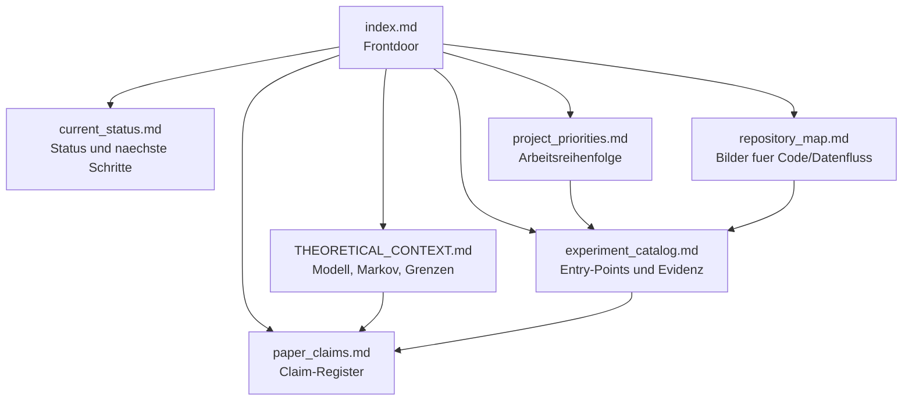
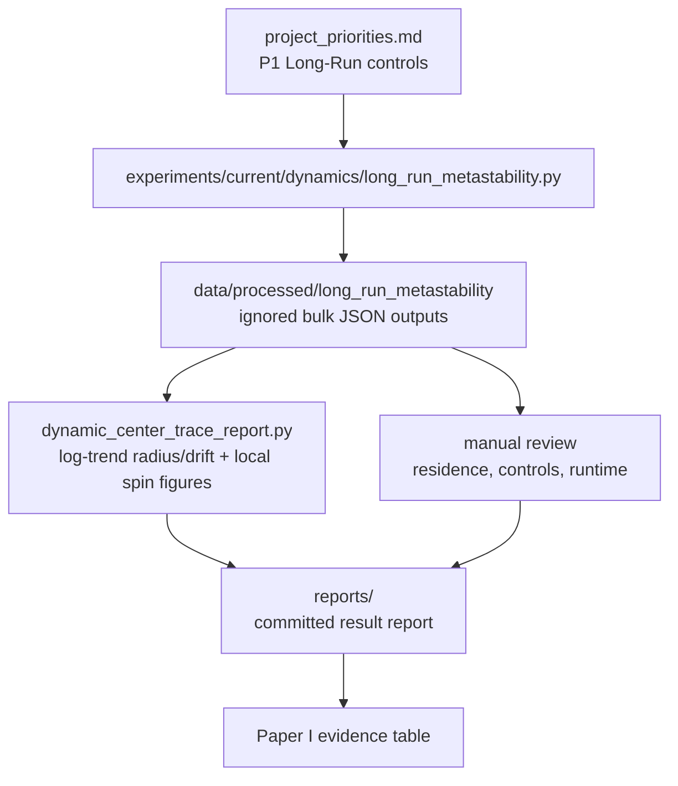

# Repository Map

Stand: 2026-07-21.

Diese Seite ist die visuelle Orientierung fuer das Repository. Die Diagramme
sind grob, aber sie zeigen die aktive Struktur ohne die alten Parallel-Dokumente.

## Top-Level-Struktur

```mermaid
flowchart TD
    root["Emergenz_Knoten"]

    root --> src["src/emergenz_knoten<br/>kanonischer Paketkern"]
    root --> experiments["experiments<br/>reproduzierbare Entry-Points"]
    root --> tests["tests<br/>kleine deterministische Tests"]
    root --> docs["docs<br/>7 aktive Dokumente + Rohmaterial"]
    root --> paper["paper<br/>Paper 0, I, II, III und Kindle-PDFs"]
    root --> reports["reports<br/>datierte Evidenz + README-Index"]
    root --> data["data/processed<br/>generated outputs, ignored by default"]
    root --> figures["figures<br/>draft, paper, external + README-Index"]

    experiments --> sync_exp["synchronization/<br/>frozen, signed and one-way source gates"]
    experiments --> score_exp["knot_score_report.py<br/>reviewed scorecard reports"]
    experiments --> trace_exp["dynamic_center_trace_report.py<br/>co-moving trace and spin-proxy plots"]
    experiments --> vector_exp["vector_memory_pilot.py<br/>2D oriented-memory AR pilot"]
    experiments --> spectral_rho_exp["spectral_rho_field_pilot.py<br/>O(M) representation gate"]
    experiments --> diffusion_exp["relaxation_diffusion_field_pilot.py<br/>mode-dependent field gate"]
    experiments --> low_mode_exp["low_mode_ar_feature_closure.py<br/>real-space + AR control gate"]
    experiments --> reconcile_exp["reconcile_low_mode_ar_runs.py<br/>N=100k vs N=1M"]
    experiments --> identity_exp["low_mode_identity_audit.py<br/>seed + segment eigenvector matching"]
    experiments --> checkpoint_exp["reference_state_checkpoints.py<br/>clean-revision z_N formation"]
    experiments --> kernel_audit["kernel_compensation_audit.py<br/>zero-integral / curvature constraints"]
    experiments --> sigma_pilot["fixed_curvature_sigma_pilot.py<br/>one-axis q test at fixed chi"]
    experiments --> comp_pilot["three_scale_compensation_pilot.py<br/>exact zero integral + curvature match"]
    experiments --> signed_pilot["signed_cross_channel_pilot.py<br/>null/product/label-flip gate"]
    experiments --> one_way_exp["one_way_dynamic_source_pilot.py<br/>paired moving-source controls"]
    experiments --> core_audit["kernel_core_audit.py<br/>near-field force and matched ablation"]
    experiments --> att_scan["attractive_only_regime_scan.py<br/>dimensionless A-axis + linear benchmark"]
    experiments --> field_bridge["field_equation_bridge.py<br/>Gaussian heat map vs local mediator"]

    src --> core["core.py<br/>SimulationConfig, finite memory simulation"]
    src --> kernels["kernels.py<br/>Memory weights, Gaussian potentials and gradients"]
    src --> analytic["analytic.py<br/>dimensionless groups, modes, linear radius"]
    src --> field["field.py<br/>heat transfer and relaxation-diffusion bridge"]
    src --> diagnostics["diagnostics.py<br/>D_cov, D_occ, residence, geometry spectrum"]
    src --> knot_score["knot_score.py<br/>scorecards v0.3-v0.6 + shape gates"]
    src --> experiments_api["experiments.py<br/>runner and serialization"]
    src --> markov["markov/<br/>augmented-state operator layer"]
    src --> anchor["anchor.py<br/>Paper-0 compatibility facade"]
    src --> state["state.py<br/>complete memory state; rigid placement"]
    src --> checkpoints["checkpoints.py<br/>versioned z_N + checksums"]
    src --> probe["weak_probe.py<br/>paired pulse + null path"]
    src --> frozen["frozen_source.py<br/>localized fixed field + paired controls"]
    src --> coupled["coupled_nodes.py<br/>one-way source + relational/shape observables"]
    src --> signed["signed_cross_channel.py<br/>separate signed scalar cross coupling"]
    src --> continuation["_continuation.py<br/>shared Numba continuation primitives"]
    probe --> continuation
    frozen --> continuation
    coupled --> continuation
    signed --> continuation
    src --> sync["synchronization.py<br/>lag response; exact sign-flip rank"]
    src --> vector_memory["vector_memory.py<br/>oriented memory channel and vector features"]
    src --> spectral_rho["spectral_memory_field/runtime.py<br/>Fourier rho + cached O(M) operators"]
    src --> diffusion_rho["relaxation_diffusion_memory.py<br/>heat-semigroup field update"]
    src --> spectral_trace["spectral_memory_trace.py<br/>Numba traces + real-history audit"]

    markov --> closure_api["closure.py<br/>AR skill + physical feature eigenspaces"]
    markov --> features["features.py<br/>memory-summary features"]
    markov --> dataset["dataset.py<br/>z_i samples and lagged pairs"]
    markov --> transition["transition.py<br/>labels, counts, transition matrices"]
    markov --> validation["validation.py<br/>rates, timescales, CK errors"]
    markov --> metastability["metastability.py<br/>slow modes, spectral gap"]
```

## Aktive Doku-Struktur

## Code- und Datenfluss

```mermaid
flowchart LR
    config["SimulationConfig"] --> sim["finite-memory simulation<br/>or augmented feature simulation"]

    sim --> samples["samples x_i"]
    sim --> steps["sample_steps n_i"]
    sim --> memory["memory buffer / weights"]
    memory --> fullstate["FiniteMemoryState<br/>x + complete retained memory"]
    fullstate --> checkpoint["versioned checkpoint<br/>config + N + seed + checksums"]
    checkpoint --> reload["validated reload<br/>fresh common future noise"]
    reload --> rigid["rigid placement<br/>translation / orthogonal rotation"]
    rigid --> weakprobe["paired weak probe<br/>+delta / -delta / unprobed / eta_zero"]
    weakprobe --> response["response matrices<br/>energy rank + sign-flip rank"]
    sim --> zfeatures["augmented features z_i"]
    sim --> vfeatures["vector-memory features<br/>optional p_i summaries"]
    sim --> rhohat["spectral rho_hat<br/>explicit compact Markov state"]
    rhohat --> tracecore["Numba trace<br/>paired noise + final rho_hat"]
    tracecore --> lowmodes["phase-aligned low modes"]
    tracecore --> realhistory["finite real-history force<br/>tail-bounded reference"]
    lowmodes --> closure["cross-seed AR closure<br/>persistence + shuffled controls"]
    realhistory --> closure
    closure --> lagged

    samples --> geom["diagnostics.py<br/>D_cov, D_occ, residence"]
    geom --> score["knot_score.py<br/>v0.5 evidence + v0.6 stationarity eligibility"]
    zfeatures --> lagged["markov.dataset<br/>(z_i, z_i+ell)"]
    vfeatures --> lagged
    steps --> lagged

    lagged --> labels["markov.transition<br/>labels"]
    labels --> counts["transition counts"]
    counts --> matrix["row-stochastic matrix U_ell"]
    matrix --> validation["markov.validation<br/>eigenvalues, rates, CK"]
    matrix --> meta["markov.metastability<br/>slow modes"]

    geom --> reports["reports / paper tables"]
    score --> reports
    validation --> reports
    meta --> reports
    response --> reports

    reports --> privacy["privacy_and_control_plan<br/>public sanitized policy"]
    reports --> paper0["Paper 0<br/>technical anchor"]
    reports --> paper1["Paper I<br/>minimal model and evidence"]
    paper1 -.later.-> paper2["Paper II<br/>propagation / c_eff"]
    paper2 -.later.-> paper3["Paper III<br/>internal modes / synchronization"]
```

## Kernelreduktions- und Feldschiene

```mermaid
flowchart LR
    old["two-scale reference<br/>(A_rep,A_att)=(1,35)"] --> core["near-field audit<br/>R_mem / sigma_rep about 2e-4"]
    core --> matched["curvature match<br/>attractive-only (0,26)"]
    matched --> scan["A_att=0..40<br/>5 seeds, common eta=0"]
    scan --> family["family match<br/>A_eff = A_att - 9"]
    family --> linear["linear memory benchmark<br/>r_next=q(1-g)r+q epsilon xi"]
    linear --> longrun["N=30M/300M reconciliation<br/>max error 1.16 percent"]
    longrun --> nonlinear["fixed g gate<br/>R/L = 0.03, 0.1, 0.3"]
    nonlinear --> scaleaudit["scale audit<br/>voxel residence confounded"]
    scaleaudit --> decision["scalar control baseline<br/>no metastable branch isolated"]
    decision --> spectral["spectral rho representation<br/>exact at nu=0; 64 modes"]
    spectral --> epsilon_gate["epsilon 1e-8..1e-4<br/>exact linear scaling"]
    epsilon_gate --> mediator["relaxation-diffusion extension<br/>q_k=(1-lambda) exp(-nu k^2)"]
    mediator --> smooth["pilot: smooth weakening<br/>no new branch"]
    smooth --> closure["low-mode AR closure<br/>real-space / nu=0 / eta=0 gates pass"]
    closure --> longmode["N=1M / 10,000 memory times"]
    longmode --> realmode["aggregate real rates<br/>N gate passes"]
    longmode --> complexfail["complex side modes<br/>eta=0 subspace overlap"]
    complexfail --> identity["mode identity complete<br/>no stable single eigenmode"]
```

The reduced scalar trajectory identifies the product eta M0 A_att, not its
three raw factors separately. The matched kernel families and fixed-g gate
now close the scalar identification branch as a controlled relaxation
baseline with only a weak smooth finite-kernel correction. The field branch
is deliberately separate: the Gaussian heat-semigroup representation uses
an auxiliary coordinate, whereas a physical relaxation-diffusion field
changes the dynamics.

## Long-Run-Schiene

## Referenzzustands- und Interaktionsschiene

```mermaid
flowchart LR
    clean["clean Git revision"] --> formation["final-state formation<br/>N=1e8; no trajectory storage"]
    formation --> z3["checkpoint d=3<br/>x_N + 600 memory points"]
    formation --> z10["checkpoint d=10<br/>x_N + 600 memory points"]
    z3 --> paired["paired branches<br/>same z_N + same future noise"]
    z10 --> paired
    paired --> free["free self-dynamics<br/>no cross coupling"]
    paired --> probe["weak localized frozen source"]
    probe --> fieldaudit["static potential / force audit<br/>sign, parity, monopole error"]
    probe --> ladder["calibrated distance ladder<br/>target deformation / response rank"]
    fieldaudit --> compgate["kernel compensation gate<br/>exact zero integral + curvature match complete"]
    ladder --> compgate
    compgate --> channel["signed scalar cross-channel complete<br/>exact nulls + product reversal"]
    channel --> seeds["later: 6-10 independent states<br/>no retuning"]
    channel --> one_way["one-way source v0.6<br/>pre-launch stationarity + paired shape gate"]
    one_way --> launch["paired point launch<br/>source deforms; target sub-threshold"]
    launch --> transport["next: coherent whole-state or<br/>local / retarded transport"]
    transport -.gate.-> reciprocal["later: reciprocal knots<br/>identity + balance diagnostics"]
    seeds -.formation gate.-> reciprocal
    free --> delta["control-subtracted changes<br/>geometry, response rank, stability"]
    probe --> delta
    one_way --> delta
    launch --> delta
```

The checkpoint is complete for the implemented finite-memory approximation.
It deliberately does not contain the preceding `1e8` positions or a PRNG state:
the Markov branch comparison supplies a fresh explicit common future-noise
array. Independent seeds remain necessary for inferential claims.

## Leseregeln

- `src/emergenz_knoten` ist der belastbare Codekern. Der externe Response-
  Pfad liegt in `state.py`, `checkpoints.py`, `weak_probe.py`,
  `frozen_source.py`, `coupled_nodes.py`, `signed_cross_channel.py` und
  `synchronization.py`.
- `spectral_memory_field.py` ist eine kompakte Reprasentation des alten
  Memory. `relaxation_diffusion_memory.py` aendert mit modeabhaengigem
  Zerfall die Dynamik; `spectral_memory_trace.py` validiert niedrige Moden
  gegen eine endliche Realraumhistorie.
- `experiments/` sind Entry-Points, nicht automatisch stabile API. Reports
  werden erst nach Kontroll- und Reproduzierbarkeitspruefung Evidenz.
- `docs/` enthaelt nur sieben aktive Arbeitsdokumente; historische Unterordner
  sind Rohmaterial.
- `reports/` sind datierte Zwischenstaende; `reports/README.md` markiert die aktuelle Evidenzschiene und den Status jedes Gate-Typs.
- `data/processed/` und `results/` bleiben generiert und werden nur nach
  Review ueber Reports zusammengefasst. Einzelne getrackte JSONs unter
  `data/processed/` sind kuratierte Snapshots oder Test-/Report-Fixtures, nicht
  das Muster fuer neue Bulk-Laeufe.

## Aufraeumregeln

- Die sieben MkDocs-Seiten sind die aktive Steuerzentrale. Neue Arbeitsnotizen
  sollen zuerst dort einsortiert werden, bevor neue Dokumente entstehen.
- `docs/archive/emergente_raumzeit`, `docs/historical/chatgpt/topics`, `paper/*/archiv`
  und `experiments/archive/legacy` sind Rohmaterial oder historische Referenz, keine
  aktive Quelle fuer Claims.
- Generierte Rohdaten unter `data/processed/` bleiben standardmaessig ignoriert.
  Nur reviewed JSON-Zusammenfassungen, Reports und Figuren werden gezielt
  committed; fuer neue Snapshots ist ein explizites `git add -f` erforderlich.
- Top-level Buildprodukte wie `site/`, `results/`, `tmp/`, Caches und lokale Venvs
  duerfen nicht als Projektstand gelesen werden.
