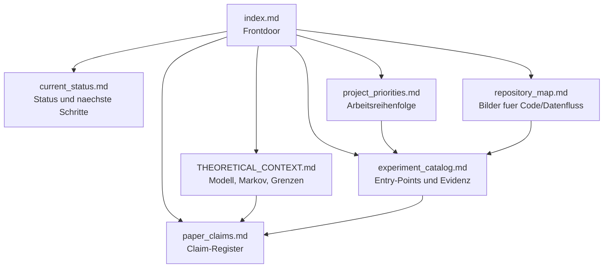
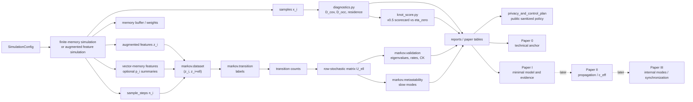
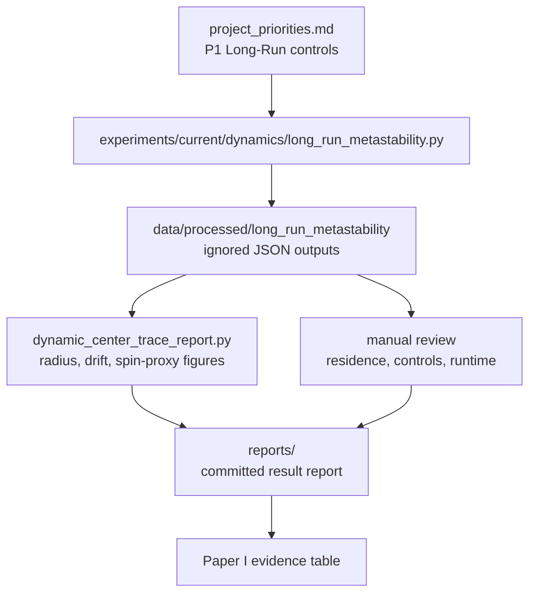

# Repository Map

Stand: 2026-07-12.

Diese Seite ist die visuelle Orientierung fuer das Repository. Die Diagramme
sind grob, aber sie zeigen die aktive Struktur ohne die alten Parallel-Dokumente.

## Top-Level-Struktur

```mermaid
flowchart TD
    root["Emergenz_Knoten"]

    root --> src["src/emergenz_knoten<br/>kanonischer Paketkern"]
    root --> experiments["experiments<br/>reproduzierbare Entry-Points"]
    root --> tests["tests<br/>kleine deterministische Tests"]
    root --> docs["docs<br/>7 aktive Dokumente + Rohmaterial"]
    root --> paper["paper<br/>Paper 0, I, II, III und Kindle-PDFs"]
    root --> reports["reports<br/>datierte Reviews und Analyseberichte"]
    root --> data["data/processed<br/>generierte Outputs, ignoriert"]
    root --> figures["figures<br/>draft/result figures"]

    experiments --> sync_exp["synchronization/<br/>planned single-/multi-knot protocols"]
    experiments --> score_exp["knot_score_report.py<br/>reviewed scorecard reports"]
    experiments --> trace_exp["dynamic_center_trace_report.py<br/>co-moving trace and spin-proxy plots"]
    experiments --> vector_exp["vector_memory_pilot.py<br/>2D oriented-memory AR pilot"]

    src --> core["core.py<br/>SimulationConfig, finite memory simulation"]
    src --> kernels["kernels.py<br/>Memory weights, deposition modes, Gaussian kernels"]
    src --> diagnostics["diagnostics.py<br/>D_cov, D_occ, residence, geometry spectrum"]
    src --> knot_score["knot_score.py<br/>scorecard helpers v0.3-v0.5"]
    src --> experiments_api["experiments.py<br/>runner and serialization"]
    src --> markov["markov/<br/>augmented-state operator layer"]
    src --> anchor["anchor.py<br/>Paper-0 compatibility facade"]
    src --> sync["synchronization.py<br/>phase-lock, lag response, response rank"]
    src --> vector_memory["vector_memory.py<br/>oriented memory channel and vector features"]

    markov --> features["features.py<br/>memory-summary features"]
    markov --> dataset["dataset.py<br/>z_i samples and lagged pairs"]
    markov --> transition["transition.py<br/>labels, counts, transition matrices"]
    markov --> validation["validation.py<br/>rates, timescales, CK errors"]
    markov --> metastability["metastability.py<br/>slow modes, spectral gap"]
```

## Aktive Doku-Struktur

## Code- und Datenfluss

## Long-Run-Schiene

## Leseregeln

- `src/emergenz_knoten` ist der belastbare Codekern; `synchronization.py` ist aktuell nur eine kleine Diagnostikschicht, `vector_memory.py` ein kontrollierter Modellzweig fuer orientierte Memory-Tests.
- `experiments/` sind Entry-Points, nicht automatisch stabile API; `knot_score_report.py` und `vector_memory_pilot.py` erzeugen reviewbare Reports aus Rohdaten bzw. Kurzpiloten.
- `docs/` enthaelt nur sieben aktive Arbeitsdokumente; historische Unterordner
  sind Rohmaterial.
- `reports/` sind datierte, zitierbare Zwischenstaende.
- `data/processed/` und `results/` bleiben generiert und werden nur nach
  Review ueber Reports zusammengefasst.

## Aufraeumregeln

- Die sieben MkDocs-Seiten sind die aktive Steuerzentrale. Neue Arbeitsnotizen
  sollen zuerst dort einsortiert werden, bevor neue Dokumente entstehen.
- `docs/archive/emergente_raumzeit`, `docs/historical/chatgpt/topics`, `paper/*/archiv`
  und `experiments/archive/legacy` sind Rohmaterial oder historische Referenz, keine
  aktive Quelle fuer Claims.
- Generierte Rohdaten unter `data/processed/` bleiben ignoriert. Nur reviewed
  JSON-Zusammenfassungen, Reports und Figuren werden gezielt committed.
- Top-level Buildprodukte wie `site/`, `results/`, Caches und lokale Venvs
  duerfen nicht als Projektstand gelesen werden.
