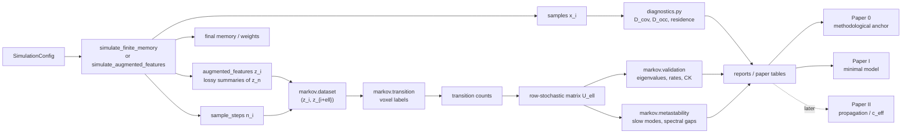
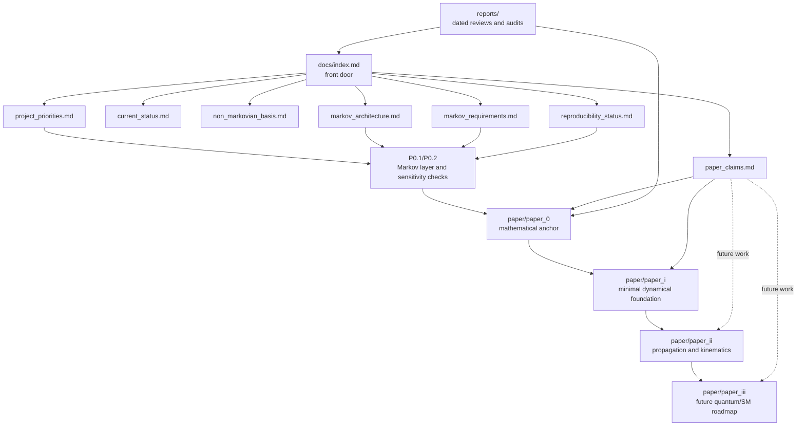

# Repository Map

Stand: 2026-06-29.

Diese Seite ist als visuelle Orientierung gedacht. Die Diagramme sind bewusst
grob: Sie zeigen, welche Teile des Repositories welche Rolle spielen und wie
Code, Experimente, Papers und Dokumentation zusammenhaengen.

## Top-Level-Struktur

```mermaid
flowchart TD
    root["Emergenz_Knoten"]

    root --> src["src/emergenz_knoten<br/>kanonischer Paketkern"]
    root --> experiments["experiments<br/>reproduzierbare Entry-Points"]
    root --> tests["tests<br/>kleine deterministische Tests"]
    root --> docs["docs<br/>kuratierte Projektdokumentation"]
    root --> paper["paper<br/>Paper 0, I, II, III und Kindle-PDFs"]
    root --> reports["reports<br/>datierte Reviews und Analyseberichte"]
    root --> data["data<br/>processed outputs, meist ignoriert"]
    root --> figures["figures<br/>draft/result figures"]
    root --> results["results<br/>lokale Pipeline-Ausgaben, ignoriert"]
    root --> tmp["tmp/site/cache<br/>lokale Build-Artefakte, ignoriert"]

    src --> core["core.py<br/>SimulationConfig, finite memory simulation"]
    src --> kernels["kernels.py<br/>Memory weights, Gaussian kernels"]
    src --> diagnostics["diagnostics.py<br/>D_cov, D_occ, residence, geometry spectrum"]
    src --> experiments_api["experiments.py<br/>runner and serialization"]
    src --> markov["markov/<br/>augmented-state operator layer"]
    src --> anchor["anchor.py<br/>Paper-0 compatibility facade"]

    markov --> features["features.py<br/>memory-summary features"]
    markov --> dataset["dataset.py<br/>z_i samples and lagged pairs"]
    markov --> transition["transition.py<br/>labels, counts, transition matrices"]
    markov --> validation["validation.py<br/>rates, timescales, CK errors"]
    markov --> metastability["metastability.py<br/>slow modes, spectral gap"]
```

## Code- und Datenfluss

## Paper- und Doku-Fluss

## Leseregeln

- `src/emergenz_knoten` ist der belastbare Codekern.
- `experiments/` sind Entry-Points, nicht automatisch API.
- `docs/` und `reports/` sind kuratiert; historische Chatnotizen bleiben
  Rohmaterial.
- `paper/` darf nur Claims tragen, die durch Modell, Code oder klar markierte
  Future-Work-Sprache gedeckt sind.
- `data/processed/` und `results/` sind standardmaessig generiert und
  ignoriert; kleine Evidenzartefakte koennen gezielt committed werden.
