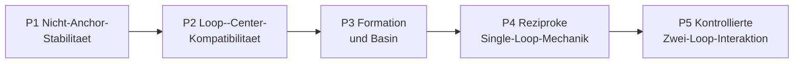

# Projektprioritaeten

Stand: 2026-08-22.

Diese Seite ist ausschliesslich die prospektive Arbeitsliste. Befunde und
Grenzen stehen im [aktuellen Status](current_status.md), Paper-Sprache im
[Claim-Register](paper_claims.md). Die fruehere gemischte Arbeits- und
Statusliste ist im
[Archivstand vom 2026-08-21](../archive/status/project_priorities_through_2026-08-21.md)
vollstaendig erhalten.

Es gilt genau eine primaere wissenschaftliche Gate-Folge. Publikations-
Hardening darf parallel laufen, aber weder ein gescheitertes Gate ersetzen
noch Modellparameter veraendern.

## Gemeinsames Ziel

Die bisher getrennten Schleifen- und Center-Aeste sollen an **demselben
eingefrorenen finite-memory Kandidaten** zusammengefuehrt werden. Dafuer reicht
nicht, dass beide Reduktionen einzeln plausibel sind. Die gemeinsamen
Koordinaten und ihre Antwort muessen einen prospektiven Kompatibilitaetstest
bestehen.

Bis dahin gelten zwei strikte Grenzen:

- Ein Schleifenbefund beweist weder Center-Mechanik noch Masse.
- Eine positive Center-Filtertraegheit beweist weder stabile Rotation noch
  Formation.

Die Zusammenfuehrung ist nach P1 erstmals testbar und bei einem P2-Pass
methodisch erreicht. Sie ist kein vorweggenommener Befund.

## P1: Eine Nicht-Anchor-Zelle auf Stabilitaet falsifizieren

**Frage:** Ist die lokale Quellenstabilitaet eine Besonderheit des Anchors,
oder ueberlebt sie an wenigstens einer vorab gewaehlten zweiten Skala?

Vor Einsicht in ein neues Spektrum werden in einem eigenen Protokoll
eingefroren:

- genau eine bereits existenzzertifizierte Nicht-Anchor-Zelle;
- zwei vorab getrennte Arnoldi-Panels samt Toleranzen;
- Behandlung der neutralen ambienten `SO(2)`-Richtung;
- Stoerungsrichtungen, Amplituden, Lauflaenge und primaere Metrik;
- `pass`, `fail` und `inconclusive` einschliesslich harter Stopregeln.

Ein Pass erlaubt nur die Aussage „lokale numerische Stabilitaetsevidenz an
einer deklarierten Nicht-Anchor-Skala“. Er beweist weder ein vollstaendig
eingeschlossenes Spektrum noch Stabilitaet der ganzen Leiter. `fail` oder
`inconclusive` blockiert P2--P5 und oeffnet kein Retuning.

## P2: Prospektive Loop--Center-Kompatibilitaetsbruecke

**Frage:** Bilden raeumliche Schleife und Center-Filter am selben nativen
Zustand eine konsistente gemeinsame Reduktion, oder sind sie nur getrennt
passende Beschreibungen?

Der Test verwendet ohne Kernel- oder Gain-Retuning dieselbe in P1 gepruefte
Zelle. Vor dem Lauf werden mindestens folgende Groessen und Kontrollen
festgelegt:

- \(c_H\) aus der nativen endlichen Historie und \(r_n=x_n-c_{H,n}\);
- die vorhergesagte Center-Antwort aus
  \(T_{f\to v^c,H}(z)\), aufgebaut aus dem exakten \(B_H(z)\) und dem
  unabhaengig fixierten \(g_H\), ohne neu gefittete Pole oder Koeffizienten;
- ein kleiner center-konjugierter zero-net Probe-Puls, `probe-off`,
  Vorzeichenflip und mehrere vorab festgelegte Bahnphasen;
- Schleifenobservablen im Relativzustand: Radius, Winkelinkrement,
  Transversalabstand und saekularer Drift;
- Centerobservablen: Kovarianz unter Rotation/Translation, Linearitaet,
  Phasenuniformitaet und geschlossene effektive Arbeitsbilanz.

Falsifiziert wird die Bruecke insbesondere durch phasenabhaengige
Transferkoeffizienten ausserhalb der registrierten Numerikgrenzen, nichtlineare
Antwort im deklarierten Kleinsignalbereich, anhaltende Relativdrift oder eine
Bilanz, die sich nicht in Center- und Quellenarbeit schliessen laesst.

Ein Pass zeigt nur die Kompatibilitaet einer vorbereiteten Schleife mit einem
**effektiven** Center-Port. Er identifiziert noch keinen mikroskopischen
Aktuator und keine physikalische Masse.

## P3: Formation und begrenztes Basin

**Frage:** Wird die gepruefte Schleife aus vorab deklarierten,
nichtkreisfoermigen Historien erreicht, oder existiert sie nur bei
vorbereiteter Kreisgeschichte?

Erforderlich sind:

- feste nichtkreisfoermige Historienfamilien und unabhaengige Holdouts;
- chirality-symmetrische Seeds sowie eine vorbereitete-Bahn-Positivkontrolle;
- unveraenderte Modellparameter aus P1/P2;
- vorab definierte Eintritts-, Verweil- und Abbruchkriterien im quotientierten
  Relativzustand.

Ein Pass ist Basin-Evidenz fuer genau das getestete Ensemble, keine globale
Formation oder generische Rauschrobustheit. Erst danach duerfen getrennte
Rauschzellen geoeffnet werden. Der bestehende \(A_{\rm att}=7\)-Holdout bleibt
bis dahin versiegelt.

## P4: Mikroskopisch reziproke Single-Loop-Mechanik

**Frage:** Laesst sich der effektive Center-Port durch eine eingefrorene
Read-/Write-Mikromechanik mit Gegenkraft und vollstaendigem Arbeitsledger
realisieren, ohne die gesuchte Traegheit in die Gleichungen einzusetzen?

Vor einer Simulation wird genau eine Architektur gewaehlt und hergeleitet:

- dynamische Memory-Traeger mit Deposition, Alterung, Ausscheiden, Randarbeit
  und Gegenkraft; oder
- ein Source-/Write-Aktuator, dessen Elimination nachweislich
  \(F_c\,\Delta c\) statt nur \(F\,\Delta x\) liefert.

Der effektive \(B_H\)-Wrapper dient als Positivkontrolle, nicht als
Emergenznachweis. Ein explizit eingesetzter Massenterm, ein offenes
Source-/Sink-Ledger oder fehlende actio-reactio-Reziprozitaet sperrt jeden
physischen Masseclaim. Eine zweite Zeitordnung darf nur aus der gemessenen
Transferantwort abgeleitet, nicht als harmonischer Oszillator angenommen
werden.

## P5: Kontrollierte Zwei-Loop-Interaktion

**Frage:** Tauschen zwei unabhaengig erzeugte, einzeln zugelassene Schleifen
ueber die in P4 gepruefte Architektur reziprok Impuls und Arbeit aus?

Das Protokoll muss mindestens Single-Loop-, `channel-off`-, Vorzeichen-/
Chiralitaets- und Distanzkontrollen enthalten. Primaer sind gemeinsame
Centerbilanz, gleiche und entgegengesetzte Portarbeit, Formtreue beider
Relativzustaende und ein vorregistriertes Distanzgesetz. Ein Pass stuetzt nur
die getestete Interaktion; Ladung, Feldtheorie, intrinsischer Spin oder
Quantisierung folgen daraus nicht.

## Paralleles Publikations-Hardening

Diese Arbeiten duerfen P1--P5 begleiten, sind aber kein Ersatz fuer sie:

- mindestens einen Root mit einem unabhaengigen outward-rounded
  Intervallbackend reproduzieren;
- den Kontinuumsroot intervallmaessig einschliessen oder die verbleibende
  numerische Vertrauensbasis explizit begrenzen;
- Claim-Texte erst nach einer Gate-Entscheidung gemaess
  [Paper-Claims](paper_claims.md) aktualisieren.

## Globale Stopregeln

- Kein Parameter-, Seed-, Fenster- oder Schwellen-Retuning nach Oeffnung der
  primaeren Ausgabe.
- `fail` bleibt `fail`; ein anderer Ast darf ihn nicht semantisch retten.
- `inconclusive` autorisiert nur eine vorab begruendete Messhaertung, keinen
  Mechanismenwechsel unter demselben Gate-Namen.
- Ambienter Kreis, Torus oder Persistent Homology ersetzen weder interne
  Topologie noch Mechanik.
- Jedes Gate erzeugt Protokoll, maschinenlesbares Ergebnis, Review und eine
  explizite Claim-Grenze, bevor das naechste Gate geoeffnet wird.
