# Projektprioritaeten

Stand: 2026-09-01.

Diese Seite ist ausschliesslich die prospektive Arbeitsliste. Abgeschlossene
Befunde, historische Fails und Ergebnisgrenzen stehen im
[aktuellen Status](current_status.md), erlaubte Paper-Sprache im
[Claim-Register](paper_claims.md). Die fruehere ausfuehrliche Arbeitschronik
bleibt im
[Prioritaetenarchiv](../archive/status/project_priorities_through_2026-08-21.md)
erhalten.

Es gilt eine primaere wissenschaftliche Gate-Folge. Publikations-Hardening
und Paper-I-Konsolidierung duerfen parallel laufen, aber kein Gate ersetzen,
keine Zielausgabe vorzeitig oeffnen und keine Modellparameter nachfitten.

## Aktiver Uebergang

| abgeschlossene Voraussetzung | reviewed Status | Konsequenz |
| --- | --- | --- |
| P4 | `p4-source-write-architecture-fail` | historischer Fail bleibt unveraendert |
| P4-R-phi | diskreter Chiral-Response-Pass | enger L3-Port-/Ledger-/Antwortbefund |
| Source-Audit | restricted pass | drei Major-Restriktionen bleiben offen |
| P4-R-S | `p4rs-anchor-scale-transfer-pass`, Review aufrechterhalten | N0 wurde prospektiv ausgefuehrt |
| N0 | `n0-noise-stability-window-bracketed-reviewed-pass` | P5-Design darf targetfrei beginnen |
| P5-D Design | `p5d-mutual-center-design-identifiable`, CI gruen | Protokoll wurde getrennt eingefroren |
| P5-D Protokoll | Commit `1342258`, CI gruen, Target weiter ungeoeffnet | Implementierung darf beginnen |

```mermaid
flowchart LR
    p4["P4 formal fail"]
    p4r["P4-R reviewed pass<br/>diskrete L3-Antwort"]
    source["Source-Audit<br/>restricted pass"]
    p4rs["P4-R-S reviewed pass<br/>Anchor/L3 kompatibel"]
    n0["N0 reviewed bracket<br/>1e-4 stable / 1e-3 fail"]
    p5d["P5 Designaudit<br/>eingefroren"]
    p5p["P5 Protokoll<br/>eingefroren"]
    p5i["P5 Implementierung<br/>naechster Schritt"]
    p5t["P5 Target<br/>weiter versiegelt"]

    p4 --> p4r --> source --> p4rs --> n0 --> p5d --> p5p --> p5i -. readiness required .-> p5t
```

P4-R-S traegt genau einen zweiten vorbereiteten Skalenpunkt. Die groesste
registrierte Anchor--L3-Abweichung betraegt `0.00232715` gegen die vorab
fixierte Grenze `0.05`. Das ist ein starker interner Skalenholdout, aber weder
Konvergenzordnung noch Replikation. Der ausfuehrliche Befund steht im
[P4-R-S-Ergebnisreview](https://github.com/MemoryDynamics/Knoten/blob/main/reports/project/meta/reviews/scalar_memory_loop_p4rs_anchor_scale_result_review_2026-08-30.md).

## Abgeschlossener N0-Checkpoint

Der prospektiv eingefrorene, einmal ausgefuehrte und unabhaengig nachgerechnete
N0-Lauf endet mit
`n0-noise-stability-window-bracketed-reviewed-pass`.

Der targetfreie
[N0-Designaudit](https://github.com/MemoryDynamics/Knoten/blob/main/reports/project/meta/reviews/scalar_memory_rotating_wave_noise_stress_design_audit_2026-08-31.md)
bindet die Rotating-wave-Schiene an die Paper-I-Uebergangsgleichung

$$
x_{n+1}=x_n+\varepsilon\xi_n-\eta\nabla\Phi_n(x_n)
$$

zurueck. Er trennt drei Dinge, die nicht vermischt werden duerfen:

1. exakte Deterministik bei $\varepsilon=0$;
2. in binary64 nicht oder nur teilweise aufgeloeste Innovation;
3. dynamisch aufgeloestes Rauschen mit oder ohne orbitale Stabilitaet.

Anchor und L3 werden auf der gemeinsamen Paper-I-Achse

$$
\chi={\varepsilon\over R\sqrt\alpha},
\qquad {D\over R^2}={\chi^2\over2}
$$

verglichen. Die Innovation ist bis `chi=1e-16` nicht voll aufgeloest. Alle
Zellen bestehen von `1e-15` bis `1e-4`; `1e-3` und `1e-2` scheitern am
prospektiven Phasen-/Chiralitaetsgate, nicht an einem sichtbaren Radiuszerfall.
Das unabhaengige Recompute findet keine Aufloesungs-, Gate- oder
Entscheidungsabweichung. Details stehen im
[N0-Ergebnisreview](https://github.com/MemoryDynamics/Knoten/blob/main/reports/project/meta/reviews/scalar_memory_rotating_wave_noise_stress_result_review_2026-09-01.md).

Plancks Konstante setzt keine Zahl fuer $\varepsilon$, solange Laenge, Zeit
und Wirkung des Modells nicht physikalisch kalibriert sind.

Ein N0-Pass stuetzt nur eine numerisch aufgeloeste Robustheitsklammer der zwei
vorbereiteten Zellen. Er beweist keine stochastische Formation und ist keine
physikalische Bestimmung von $\varepsilon$.

## Abgeschlossen: P5-Designaudit ohne Targetzugriff

Der targetfreie
[P5-D-Designaudit](https://github.com/MemoryDynamics/Knoten/blob/codex/p5-interaction-design/reports/project/meta/reviews/scalar_memory_loop_p5d_mutual_center_design_audit_2026-09-01.md)
endet mit `p5d-mutual-center-design-identifiable`. Er waehlt zwei getrennte
Anchor-Historien, den vorhandenen notched Center und seinen adjungierten
Newest-slot-Write. Die einzige Paarenergie ist linear im quadratischen
Centerabstand; sie besitzt weder Sollbahn noch Sollabstand.

Der primaere Diskriminator ist ein reziproker Closed-loop-Ueberschuss gegen
die Summe beider getrennten Einwegantworten. Ein sichtbarer Abstandstrend
allein bleibt unzureichend. Der Design-Freeze ist Commit `f68c8f8`; sein
[CI-Lauf 33507408346](https://github.com/MemoryDynamics/Knoten/actions/runs/33507408346)
ist erfolgreich.

## Abgeschlossen: P5-Falsifikationscharter und Protokoll

Das getrennte
[P5-D-Protokoll](https://github.com/MemoryDynamics/Knoten/blob/codex/p5-interaction-design/reports/project/meta/preregistration/scalar_memory_loop_p5d_mutual_center_protocol_2026-09-01.md)
friert vor Implementierung 64 Basiskonfigurationen ein: zwei Distanzen, acht
relative Phasenknoten und vier Chiralitaetspaare. Fuer jede folgen zwei
schwache Staerken, beide Vorzeichen, beide Einwegrichtungen und der reziproke
Arm. Einschliesslich Channel-off sind es 832 deterministische Kontrollarme,
keine Replikationen.

Die Staerken `0.000625` und `0.00125` stammen aus der targetfreien
Center-only-Midpoint-Referenz. Implementierung und Target duerfen sie nicht
nachjustieren. Der Protokoll-Freeze ist Commit `1342258`; sein
[CI-Lauf 33508068905](https://github.com/MemoryDynamics/Knoten/actions/runs/33508068905)
ist erfolgreich.

## Prioritaet 3: P5-Implementierung und Pre-target-Review

**Aktiver naechster Schritt.** Erst nach gruenem Protokoll-CI:

1. Runner und synthetische Falsifikatoren implementieren;
2. alle geerbten P4-R-S-Abhaengigkeiten und Blobs pinnen;
3. beweisen, dass Tests keine registrierte P5-Trajektorie aufrufen;
4. Null-, Einweg-, Reziprozitaets-, Swap- und Ledger-Korruptionen testen;
5. Vollsuite, exakten CI-Lintumfang und strikte Dokumentation ausfuehren;
6. Implementierungsreadiness separat committen, pushen und reviewen.

Bis dieses Review gruen ist, bleibt jedes P5-Target versiegelt. Ein
Implementierungspass ist keine Interaktionsevidenz.

## Prioritaet 4: Paper-I-Abgrenzung und weitere Redaktionsentscheidung

Paper I bleibt primaer das Minimalmodell mit Markov-Einbettung und
kontrollierter linearer co-moving Relaxationswolke. Der deterministische
$d=2$-Rotating-wave-/Portast ist methodisch und dynamisch ein getrennter
Erweiterungszweig.

Die reviewed N0-Klammer ist jetzt als enge Abgrenzung in beiden
Diskussionsfassungen aufgenommen. Sie verwendet
`chi=epsilon/(R sqrt(alpha))`, benennt den Phasen-/Chiralitaetsfail und
schliesst physikalische Rauschkalibrierung sowie stochastische Formation aus.
Abstract und Hauptresultat bleiben unveraendert. Der zugehoerige
[CI-Lauf 33506427098](https://github.com/MemoryDynamics/Knoten/actions/runs/33506427098)
ist erfolgreich.

Fuer den Port-/Schleifenast bleibt vor jeder weitergehenden Manuskriptaufnahme
zu entscheiden:

- technische Begleitnotiz, Supplement oder eng getrennte Outlook-Sektion;
- ob die drei offenen Source-Restriktionen vorher geschlossen werden muessen;
- welche Rohdaten und Rebuild-Anleitung eine externe Replikation ermoeglichen.

Bis zu dieser weiteren Entscheidung bleiben Abstract und Hauptschluss frei
von Interaktions-, Spin-, Traegheits- oder Massensprache.

## Prioritaet 5: Paralleles Publikations-Hardening

Diese Aufgaben duerfen parallel laufen, aendern aber keinen Gate-Status:

- mindestens einen Root mit einem unabhaengigen outward-rounded
  Intervallbackend reproduzieren;
- den Kontinuumsroot intervallmaessig einschliessen oder die numerische
  Vertrauensbasis enger deklarieren;
- einen vollstaendigen Wheel-/Hash-Lock erzeugen;
- `CITATION.cff` und eine zitierbare Release/Archivierung vorbereiten;
- eine externe Reproduktion der gespeicherten P4-R/P4-R-S-Auswertung
  ermoeglichen.

## Globale Stopregeln

- Kein Parameter-, Seed-, Distanz-, Fenster- oder Schwellen-Retuning nach
  Oeffnung einer primaeren Ausgabe.
- `fail` bleibt `fail`; ein spaeterer Ast darf ihn nicht semantisch retten.
- `inconclusive` autorisiert nur vorab begruendete Messhaertung, keinen
  Mechanismenwechsel unter demselben Gate-Namen.
- Ambienter Kreis, Torus oder Persistent Homology ersetzen weder interne
  Topologie noch Mechanik.
- Symmetriearme sind Kontrollen, keine Replikationen.
- Jedes Gate erzeugt Design/Protokoll, maschinenlesbares Ergebnis, kritisches
  Review und eine explizite Claim-Grenze, bevor das naechste Target geoeffnet
  wird.
