# Projektprioritaeten

Stand: 2026-08-31.

Diese Seite ist ausschliesslich die prospektive Arbeitsliste. Abgeschlossene
Befunde, historische Fails und Ergebnisgrenzen stehen im
[aktuellen Status](current_status.md), erlaubte Paper-Sprache im
[Claim-Register](paper_claims.md). Die fruehere ausfuehrliche Arbeitschronik
bleibt im
[Prioritaetenarchiv](../archive/status/project_priorities_through_2026-08-21.md)
erhalten.

Es gilt eine primaere wissenschaftliche Gate-Folge. Publikations-Hardening
und Paper-I-Konsolidierung duerfen parallel laufen, aber kein Gate ersetzen,
keine Zielausgabe vorzeitig oeffnen und keine Modellparameter nachfitten.

## Aktiver Uebergang

| abgeschlossene Voraussetzung | reviewed Status | Konsequenz |
| --- | --- | --- |
| P4 | `p4-source-write-architecture-fail` | historischer Fail bleibt unveraendert |
| P4-R-phi | diskreter Chiral-Response-Pass | enger L3-Port-/Ledger-/Antwortbefund |
| Source-Audit | restricted pass | drei Major-Restriktionen bleiben offen |
| P4-R-S | `p4rs-anchor-scale-transfer-pass`, Review aufrechterhalten | N0-Rauschstress darf vor P5 eingefroren werden |

```mermaid
flowchart LR
    p4["P4 formal fail"]
    p4r["P4-R reviewed pass<br/>diskrete L3-Antwort"]
    source["Source-Audit<br/>restricted pass"]
    p4rs["P4-R-S reviewed pass<br/>Anchor/L3 kompatibel"]
    n0d["N0 Noise-floor audit<br/>jetzt aktiv"]
    n0p["N0 Protokoll + Readiness<br/>danach Target"]
    p5d["P5 Designaudit<br/>danach"]
    p5p["P5 Protokoll<br/>danach einfrieren"]
    p5t["P5 Target<br/>weiter versiegelt"]

    p4 --> p4r --> source --> p4rs --> n0d --> n0p --> p5d --> p5p -. readiness required .-> p5t
```

P4-R-S traegt genau einen zweiten vorbereiteten Skalenpunkt. Die groesste
registrierte Anchor--L3-Abweichung betraegt `0.00232715` gegen die vorab
fixierte Grenze `0.05`. Das ist ein starker interner Skalenholdout, aber weder
Konvergenzordnung noch Replikation. Der ausfuehrliche Befund steht im
[P4-R-S-Ergebnisreview](https://github.com/MemoryDynamics/Knoten/blob/main/reports/project/meta/reviews/scalar_memory_loop_p4rs_anchor_scale_result_review_2026-08-30.md).

## Prioritaet 1: N0-Rauschaufloesungs- und Stabilitaetsaudit

**Aktiver naechster Schritt vor P5.** Noch keine neue Rausch- oder
Interaktionstrajektorie ausfuehren.

Der targetfreie
[N0-Designaudit](https://github.com/MemoryDynamics/Knoten/blob/main/reports/project/meta/reviews/scalar_memory_rotating_wave_noise_stress_design_audit_2026-08-31.md)
bindet die Rotating-wave-Schiene an die Paper-I-Uebergangsgleichung

$$
x_{n+1}=x_n+\varepsilon\xi_n-\eta\nabla\Phi_n(x_n)
$$

zurueck. Er trennt drei Dinge, die nicht vermischt werden duerfen:

1. exakte Deterministik bei $\varepsilon=0$;
2. in binary64 nicht oder nur teilweise aufgeloeste Innovation;
3. dynamisch aufgeloestes Rauschen mit oder ohne orbitale Stabilitaet.

Anchor und L3 werden auf der gemeinsamen Paper-I-Achse

$$
\chi={\varepsilon\over R\sqrt\alpha},
\qquad {D\over R^2}={\chi^2\over2}
$$

verglichen. Das logarithmische Panel ist
$\chi=10^{-22},\ldots,10^{-2}$ plus ein separates Nullgate. Primaer sind
SO(2)-quotientierter D0-Abstand, Radius-/Phasenfehler, tatsaechlich injizierte
binary64-Stoerung und common-noise Kontraktion; lineare `x/y`-Kreise sind nur
Visualisierung.

Plancks Konstante setzt keine Zahl fuer $\varepsilon$, solange Laenge, Zeit
und Wirkung des Modells nicht physikalisch kalibriert sind.

## Prioritaet 2: N0-Protokoll, Implementierung und Pre-target-Review

Nur nach separatem Designfreeze:

1. logarithmisches Panel, drei feste Masterseeds und die Brownian-refinement-
   Kopplung zwischen L3 und Anchor prospektiv einfrieren;
2. Rauschschritt, D0-/Phasen-/Radiusmetriken und Log-log-Auswertung
   implementieren;
3. synthetisch falsifizieren, dass sub-ULP-Stoerungen als stabil fehlgedeutet,
   Rauschinkremente in alte Slots geschrieben oder Skalen mit rohem
   $\varepsilon$ statt gemeinsamem $D/R^2$ verglichen werden;
4. beweisen, dass Tests keine registrierte N0-Trajektorie ausfuehren;
5. nach Vollsuite und strikter Doku ein separates Readinessreview einfrieren;
6. erst dann den registrierten Scan genau einmal ausfuehren und kritisch
   reviewen.

Ein N0-Pass stuetzt nur eine numerisch aufgeloeste Robustheitsklammer der zwei
vorbereiteten Zellen. Er beweist keine stochastische Formation und ist keine
physikalische Bestimmung von $\varepsilon$.

## Prioritaet 3: P5-Designaudit ohne Targetzugriff

**Nach reviewed N0.** Noch keine Interaktionstrajektorie ausfuehren.

Der Audit muss vor jeder Implementierung entscheiden, welche minimale
Zwei-Loop-Frage mit dem vorhandenen Source-/Write-Port ueberhaupt
identifizierbar ist. Mindestens festzulegen sind:

1. zwei getrennt vorbereitete und einzeln zugelassene Schleifenzustaende;
2. eine einzige explizite gegenseitige Kopplungsarchitektur ohne Zieltracking;
3. die Zustandsvariablen, an denen der gegenseitige Port angreift;
4. ein vollstaendiger gemeinsamer Work-/Ledger-Vertrag;
5. eine Observable, die Selbstantwort und echte Mutualantwort trennt;
6. ein Parameter- und Distanzpanel, das vor jeder Zielantwort geschlossen ist;
7. klare Null-, Fail-, Richtungsfail- und Inconclusive-Zweige.

Der Designaudit muss insbesondere die alternative Erklaerung ausschliessen,
dass zwei unabhaengige Single-Loop-Relaxationen nur addiert werden. Ein
sichtbarer Abstandstrend allein reicht nicht als Wechselwirkungsnachweis.

## Prioritaet 4: P5-Falsifikationscharter und Protokoll

Nur wenn der Designaudit eine identifizierbare Frage findet, wird ein
prospektives Protokoll geschrieben. Die minimale Kontrollmatrix umfasst:

- beide Kanaele aus;
- nur Loop A auf Loop B;
- nur Loop B auf Loop A;
- beide Richtungen reziprok;
- Vertauschung von A und B;
- beide Chiralitaeten und registrierte Vorzeichenkontrollen;
- mehrere vorab gewaehlte Distanzen;
- Shape-/D0-Erhalt beider Einzelschleifen;
- omitted-mutual-work- und falscher-Center-Rivale;
- Abbruch bei unvollstaendiger Bildung, Kollision oder Kanalverlust.

Primaer sind gegenseitige Centerantwort, paarweise Workbilanz, Formtreue und
ein vorregistrierter Distanzkontrast. Kreiseln, Phasenlocking, Anziehung oder
Abstossung duerfen nicht als notwendiges Ziel eingebaut werden.

Ein P5-Protokoll darf noch keine Begriffe wie Ladung, intrinsischer Spin,
Impuls, Traegheit, Masse, universelles Kraftgesetz oder Feldquantisierung
freischalten.

## Prioritaet 5: P5-Implementierung und Pre-target-Review

Erst nach getrenntem Design- und Protokoll-Freeze:

1. Runner und synthetische Falsifikatoren implementieren;
2. alle geerbten P4-R-S-Abhaengigkeiten und Blobs pinnen;
3. beweisen, dass Tests keine registrierte P5-Trajektorie aufrufen;
4. Null-, Einweg-, Reziprozitaets-, Swap- und Ledger-Korruptionen testen;
5. Vollsuite, exakten CI-Lintumfang und strikte Dokumentation ausfuehren;
6. Implementierungsreadiness separat committen, pushen und reviewen.

Bis dieses Review gruen ist, bleibt jedes P5-Target versiegelt. Ein
Implementierungspass ist keine Interaktionsevidenz.

## Prioritaet 6: Paper-I-Abgrenzung und Redaktionsentscheidung

Paper I bleibt primaer das Minimalmodell mit Markov-Einbettung und
kontrollierter linearer co-moving Relaxationswolke. Der deterministische
$d=2$-Rotating-wave-/Portast ist methodisch und dynamisch ein getrennter
Erweiterungszweig.

Claim-Register, allgemeinverstaendliche Zusammenfassung und die kurze
Evidenz/Inferenz/Hypothese-Tabelle sind jetzt getrennt vom Manuskriptkern
gefuehrt. Eine gut lesbare Fassung steht unter
[P4-R-S allgemein erklaert](p4rs_plain_language_summary.md).

Vor jeder spaeteren Manuskriptaenderung bleibt zu entscheiden:

- technische Begleitnotiz, Supplement oder eng getrennte Outlook-Sektion;
- ob die drei offenen Source-Restriktionen vorher geschlossen werden muessen;
- welche Rohdaten und Rebuild-Anleitung eine externe Replikation ermoeglichen.

Bis zu dieser redaktionellen Entscheidung bleiben `main.tex`,
`main_compact.tex`, Abstract und Hauptschluss unveraendert. Insbesondere wird
keine Spin-, Traegheits- oder Massensprache uebernommen.

## Prioritaet 7: Paralleles Publikations-Hardening

Diese Aufgaben duerfen parallel laufen, aendern aber keinen Gate-Status:

- mindestens einen Root mit einem unabhaengigen outward-rounded
  Intervallbackend reproduzieren;
- den Kontinuumsroot intervallmaessig einschliessen oder die numerische
  Vertrauensbasis enger deklarieren;
- einen vollstaendigen Wheel-/Hash-Lock erzeugen;
- `CITATION.cff` und eine zitierbare Release/Archivierung vorbereiten;
- eine externe Reproduktion der gespeicherten P4-R/P4-R-S-Auswertung
  ermoeglichen.

## Globale Stopregeln

- Kein Parameter-, Seed-, Distanz-, Fenster- oder Schwellen-Retuning nach
  Oeffnung einer primaeren Ausgabe.
- `fail` bleibt `fail`; ein spaeterer Ast darf ihn nicht semantisch retten.
- `inconclusive` autorisiert nur vorab begruendete Messhaertung, keinen
  Mechanismenwechsel unter demselben Gate-Namen.
- Ambienter Kreis, Torus oder Persistent Homology ersetzen weder interne
  Topologie noch Mechanik.
- Symmetriearme sind Kontrollen, keine Replikationen.
- Jedes Gate erzeugt Design/Protokoll, maschinenlesbares Ergebnis, kritisches
  Review und eine explizite Claim-Grenze, bevor das naechste Target geoeffnet
  wird.
