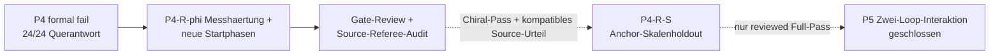

# Projektprioritaeten

Stand: 2026-08-26.

Diese Seite ist ausschliesslich die prospektive Arbeitsliste. Befunde und
Grenzen stehen im [aktuellen Status](current_status.md), Paper-Sprache im
[Claim-Register](paper_claims.md). Die fruehere gemischte Arbeits- und
Statusliste ist im
[Archivstand vom 2026-08-21](../archive/status/project_priorities_through_2026-08-21.md)
vollstaendig erhalten.

Es gilt genau eine primaere wissenschaftliche Gate-Folge. Publikations-
Hardening darf parallel laufen, aber weder ein gescheitertes Gate ersetzen
noch Modellparameter veraendern.

## Gemeinsames Ziel

Die bisher getrennten Schleifen- und Center-Aeste sollen an **demselben
eingefrorenen finite-memory Kandidaten** zusammengefuehrt werden. Dafuer reicht
nicht, dass beide Reduktionen einzeln plausibel sind. Die gemeinsamen
Koordinaten und ihre Antwort muessen einen prospektiven Kompatibilitaetstest
bestehen.

Bis dahin gelten zwei strikte Grenzen:

- Ein Schleifenbefund beweist weder Center-Mechanik noch Masse.
- Eine positive Center-Filtertraegheit beweist weder stabile Rotation noch
  Formation.

Der erste prospektive P2-Versuch bleibt formal `fail`; die outcome-informierte
P2-R-Reconciliation benennt ihn nicht um. P3 besteht danach ohne Retuning fuer
alle zehn registrierten nichtkreisfoermigen Arme und wird im
[aktuellen Status](current_status.md) eng als finite-ensemble attraction
gefuehrt. Der eingefrorene P4-Lauf endet formal als
`p4-source-write-architecture-fail`. Sein exakter Arbeitsledger ist
aufgeloest, aber die vorregistrierte Gesamtmechanik besteht nicht. P5,
Masse und Zwei-Loop-Interaktion bleiben geschlossen.

## P4: abgeschlossenes Primaergate

Der historische P4-Lauf bleibt formal `p4-source-write-architecture-fail`.
Er darf weder umbenannt noch mit nachtraeglich gelockerten Toleranzen neu
bewertet werden. Belastbar sind der exakte finite-H-Write-/Age-Ledger und die
vollstaendige schwache Antworttafel. Nicht bestanden sind die registrierte
Gesamtmechanik und insbesondere die Geradeausantwort: Center und Aktuator
zeigen in allen 24 Armen eine chirality-odd Querkomponente von etwa
`0.15..0.21 delta` statt hoechstens `0.05 delta`.

## Primaere Folge: P4-R-phi-Messhaertung und Phasendiskriminator

P4-R ist eine neue outcome-informierte Reconciliation, keine Rettung oder
Wiederholung von P4. Vor neuem Targetzugriff muss ein eigenes Protokoll:

- das algebraisch identische Single-Slot-Residuum oder eine explizite
  Rundungsenvelope anstelle einer cancellation-dominierten Differenz zweier
  2400-Term-Summen registrieren;
- die vorhandenen P4-Arme ausschliesslich als Discovery-Daten fuer eine
  startphasenabhaengige chirality-odd \(2\times2\)-Suszeptibilitaet behandeln;
- acht neue, gleichmaessig versetzte Startphasen bei einer bisher
  ungeoeffneten Zwischenamplitude als unangetasteten Holdout reservieren und
  die **diskret phasengemittelte** skalare gegen eine
  longitudinal-plus-antisymmetrische Antwort entscheiden;
- unveraendertes natives L3, Source-/Write-Gleichungen, \(k\), Laufzeit und
  Claim-Grenzen beibehalten, soweit der neue Diskriminator keine vorab
  begruendete Aenderung verlangt.

Jedes P4-R-phi-Ergebnis erhaelt ein Gate-Review und danach das separat
vorregistrierte Referee-/Source-Readiness-Audit. Ein P4-R-phi-Pass allein
oeffnet nichts. Nur ein upheld Chiral-Pass zusammen mit einem kompatiblen
Source-Urteil oeffnet den Anchor-Skalenholdout P4-R-S. Erst dessen reviewed
Full-Pass kann die Single-Loop-Mechanik weitertragen.
Ein explizit eingesetzter Massenterm oder eine zweite Zeitordnung bleibt
untersagt; beides darf nur aus einer unabhaengig identifizierten
Transferantwort folgen.

## P5: Kontrollierte Zwei-Loop-Interaktion

**Status: geschlossen. Frage erst nach P4-R-phi, Referee-Audit und P4-R-S:** Tauschen zwei unabhaengig erzeugte, einzeln zugelassene Schleifen
ueber die in P4 gepruefte Architektur reziprok Impuls und Arbeit aus?

Das Protokoll muss mindestens Single-Loop-, `channel-off`-, Vorzeichen-/
Chiralitaets- und Distanzkontrollen enthalten. Primaer sind gemeinsame
Centerbilanz, gleiche und entgegengesetzte Portarbeit, Formtreue beider
Relativzustaende und ein vorregistriertes Distanzgesetz. Ein Pass stuetzt nur
die getestete Interaktion; Ladung, Feldtheorie, intrinsischer Spin oder
Quantisierung folgen daraus nicht.

## Paralleles Publikations-Hardening

Diese Arbeiten duerfen P4--P5 begleiten, sind aber kein Ersatz fuer sie:

- mindestens einen Root mit einem unabhaengigen outward-rounded
  Intervallbackend reproduzieren;
- den Kontinuumsroot intervallmaessig einschliessen oder die verbleibende
  numerische Vertrauensbasis explizit begrenzen;
- Claim-Texte erst nach einer Gate-Entscheidung gemaess
  [Paper-Claims](paper_claims.md) aktualisieren.

## Globale Stopregeln

- Kein Parameter-, Seed-, Fenster- oder Schwellen-Retuning nach Oeffnung der
  primaeren Ausgabe.
- `fail` bleibt `fail`; ein anderer Ast darf ihn nicht semantisch retten.
- `inconclusive` autorisiert nur eine vorab begruendete Messhaertung, keinen
  Mechanismenwechsel unter demselben Gate-Namen.
- Ambienter Kreis, Torus oder Persistent Homology ersetzen weder interne
  Topologie noch Mechanik.
- Jedes Gate erzeugt Protokoll, maschinenlesbares Ergebnis, Review und eine
  explizite Claim-Grenze, bevor das naechste Gate geoeffnet wird.
