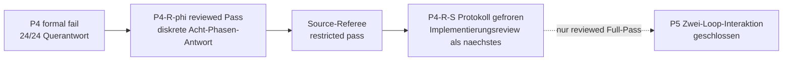

# Projektprioritaeten

Stand: 2026-08-30.

Diese Seite ist ausschliesslich die prospektive Arbeitsliste. Befunde und
Grenzen stehen im [aktuellen Status](current_status.md), Paper-Sprache im
[Claim-Register](paper_claims.md). Die fruehere gemischte Arbeits- und
Statusliste ist im
[Archivstand vom 2026-08-21](../archive/status/project_priorities_through_2026-08-21.md)
vollstaendig erhalten.

Es gilt genau eine primaere wissenschaftliche Gate-Folge. Publikations-
Hardening darf parallel laufen, aber weder ein gescheitertes Gate ersetzen
noch Modellparameter veraendern.

## Gemeinsames Ziel

Die bisher getrennten Schleifen- und Center-Aeste sollen an **demselben
eingefrorenen finite-memory Kandidaten** zusammengefuehrt werden. Dafuer reicht
nicht, dass beide Reduktionen einzeln plausibel sind. Die gemeinsamen
Koordinaten und ihre Antwort muessen einen prospektiven Kompatibilitaetstest
bestehen.

Bis dahin gelten zwei strikte Grenzen:

- Ein Schleifenbefund beweist weder Center-Mechanik noch Masse.
- Eine positive Center-Filtertraegheit beweist weder stabile Rotation noch
  Formation.

Der erste prospektive P2-Versuch bleibt formal `fail`; die outcome-informierte
P2-R-Reconciliation benennt ihn nicht um. P3 besteht danach ohne Retuning fuer
alle zehn registrierten nichtkreisfoermigen Arme und wird im
[aktuellen Status](current_status.md) eng als finite-ensemble attraction
gefuehrt. Der eingefrorene P4-Lauf endet formal als
`p4-source-write-architecture-fail`. Sein exakter Arbeitsledger ist
aufgeloest, aber die vorregistrierte Gesamtmechanik besteht nicht. P5,
Masse und Zwei-Loop-Interaktion bleiben geschlossen. Der nachgelagerte
P4-R-phi-Holdout besteht seine diskrete Chiral-Klassifikation; das kritische
Review haelt den engen Befund aufrecht. Das interne Source-Referee-Audit
urteilt `referee-source-ready-with-major-claim-restrictions`. Der targetfreie
P4-R-S-Designaudit und das prospektive Anchor-Protokoll sind daraufhin
separat eingefroren; das Target bleibt geschlossen.

## P4: abgeschlossenes Primaergate

Der historische P4-Lauf bleibt formal `p4-source-write-architecture-fail`.
Er darf weder umbenannt noch mit nachtraeglich gelockerten Toleranzen neu
bewertet werden. Belastbar sind der exakte finite-H-Write-/Age-Ledger und die
vollstaendige schwache Antworttafel. Nicht bestanden sind die registrierte
Gesamtmechanik und insbesondere die Geradeausantwort: Center und Aktuator
zeigen in allen 24 Armen eine chirality-odd Querkomponente von etwa
`0.15..0.21 delta` statt hoechstens `0.05 delta`.

## Abgeschlossen: P4-R-phi-Messhaertung und Phasendiskriminator

P4-R ist eine outcome-informierte Reconciliation, keine Rettung oder
Wiederholung von P4. Das vor Targetzugriff eingefrorene Protokoll hat:

- das algebraisch identische Single-Slot-Residuum und konservative
  Full-dot-Rundungsenvelopes anstelle einer cancellation-dominierten
  Differenz zweier 2400-Term-Summen registriert;
- die vorhandenen P4-Arme ausschliesslich als Discovery-Daten fuer eine
  startphasenabhaengige chirality-odd \(2\times2\)-Suszeptibilitaet behandelt;
- acht neue, gleichmaessig versetzte Startphasen bei einer ungeoeffneten
  Zwischenamplitude als Holdout reserviert und die **diskret
  phasengemittelte** skalare gegen eine longitudinal-plus-antisymmetrische
  Antwort entschieden;
- natives L3, Source-/Write-Gleichungen, \(k\), Laufzeit und Claim-Grenzen
  unveraendert gehalten.

Der unveraenderliche Lauf endet
`p4r-phase-averaged-chiral-response-pass`: lokale Metrologie, Full-dot-
Envelopes, Ledger, Loop-Erhalt, Spiegelung und Halbdrehung bestehen; die
diskreten Mittel sind `B_C=0.2084215772` und `B_Q=0.1537530855` mit 8/8
positivem Phasensupport. Das Gate-Review haelt genau diesen Befund aufrecht.
Die 32 Arme sind keine Replikationen, sondern eine Acht-Knoten-Quadratur mit
vier spiegelverschiedenen Phasenpaaren, gesetzten Chiralitaeten und
Vorzeichenkontrollen.

Das nachgelagerte Source-Audit reproduziert alle wissenschaftlichen Felder in
zwei NumPy/SciPy-Stacks exakt und stimmt mit einer separat implementierten
Standardbibliothek-Neuberechnung ueberein. Wegen nur eines Intervallbackends,
fehlendem vollstaendigen Hash-Lock und fehlender Citation/Release lautet das
Urteil eingeschraenkt `referee-source-ready-with-major-claim-restrictions`.
Diese Restriktionen begrenzen Paper-Sprache, untergraben aber nicht den
getesteten Port, Ledger oder diskreten Antwortbefund.

## Primaeres naechstes Gate: P4-R-S Implementierung und Pre-target-Review

Der targetfreie Designaudit
`reports/project/meta/reviews/scalar_memory_loop_p4rs_anchor_scale_design_audit_2026-08-30.md`
und das prospektive Protokoll
`reports/project/meta/preregistration/scalar_memory_loop_p4rs_anchor_scale_protocol_2026-08-30.md`
sind eingefroren. Sie legen vor jedem Anchor-Targetzugriff fest:

- den lokal existenzzertifizierten und numerisch stabil getesteten Anchor ohne
  Nachfitten;
- dieselben Source-/Write-Gleichungen, kandidatenspezifisches
  `nu=G=|a0|^2`, `k=0.25` und `delta/R=0.0015`;
- gleiche Memory-Zeit `tau=alpha*n`: Anchor `N=2000`, Stride 5 gegen L3
  `N=4000`, Stride 10, jeweils 401 Samples bis `tau=20`;
- 16 channel-off- und 32 aktive Anchor-Arme sowie alle lokalen
  Increment-, Full-dot-, Ledger-, omitted-age-, raw-center-, Spiegel-,
  Halbdrehungs- und diskreten Phasenkontrollen;
- `epsilon_scale=0.05` fuer die vier komponentenweisen Volltraces, vier
  finalen Phasenprofile und vier Endmittel;
- vollstaendige Pass/Scalar/Directional-Fail/Cross-scale-Mismatch/
  Metrology-Fail/Inconclusive-Praezedenz bei unveraendertem P4-Fail.

Als naechstes darf ausschliesslich der Runner samt synthetischen
Falsifikatoren implementiert, in einem sauberen Commit gepusht und separat
auf Targetbereitschaft reviewed werden. Vor diesem Review bleiben alle 48
Anchor-Arme versiegelt.

Erst ein reviewed P4-R-S-Full-Pass kann die Single-Loop-Portantwort ueber eine
zweite Skala tragen und P5 zur Protokollierung oeffnen. Ein explizit
eingesetzter Massenterm oder eine zweite Zeitordnung bleibt untersagt; beides
darf nur aus einer unabhaengig identifizierten Transferantwort folgen.

## P5: Kontrollierte Zwei-Loop-Interaktion

**Status: geschlossen bis zu einem reviewed P4-R-S-Full-Pass:** Tauschen zwei unabhaengig erzeugte, einzeln zugelassene Schleifen
ueber die in P4 gepruefte Architektur reziprok Impuls und Arbeit aus?

Das Protokoll muss mindestens Single-Loop-, `channel-off`-, Vorzeichen-/
Chiralitaets- und Distanzkontrollen enthalten. Primaer sind gemeinsame
Centerbilanz, gleiche und entgegengesetzte Portarbeit, Formtreue beider
Relativzustaende und ein vorregistriertes Distanzgesetz. Ein Pass stuetzt nur
die getestete Interaktion; Ladung, Feldtheorie, intrinsischer Spin oder
Quantisierung folgen daraus nicht.

## Paralleles Publikations-Hardening

Diese Arbeiten duerfen P4--P5 begleiten, sind aber kein Ersatz fuer sie:

- mindestens einen Root mit einem unabhaengigen outward-rounded
  Intervallbackend reproduzieren;
- den Kontinuumsroot intervallmaessig einschliessen oder die verbleibende
  numerische Vertrauensbasis explizit begrenzen;
- einen sauberen Wheel-/Hash-Lock, `CITATION.cff` und eine zitierbare
  Release/Archivierung erzeugen;
- Claim-Texte erst nach einer Gate-Entscheidung gemaess
  [Paper-Claims](paper_claims.md) aktualisieren.

## Globale Stopregeln

- Kein Parameter-, Seed-, Fenster- oder Schwellen-Retuning nach Oeffnung der
  primaeren Ausgabe.
- `fail` bleibt `fail`; ein anderer Ast darf ihn nicht semantisch retten.
- `inconclusive` autorisiert nur eine vorab begruendete Messhaertung, keinen
  Mechanismenwechsel unter demselben Gate-Namen.
- Ambienter Kreis, Torus oder Persistent Homology ersetzen weder interne
  Topologie noch Mechanik.
- Jedes Gate erzeugt Protokoll, maschinenlesbares Ergebnis, Review und eine
  explizite Claim-Grenze, bevor das naechste Gate geoeffnet wird.
