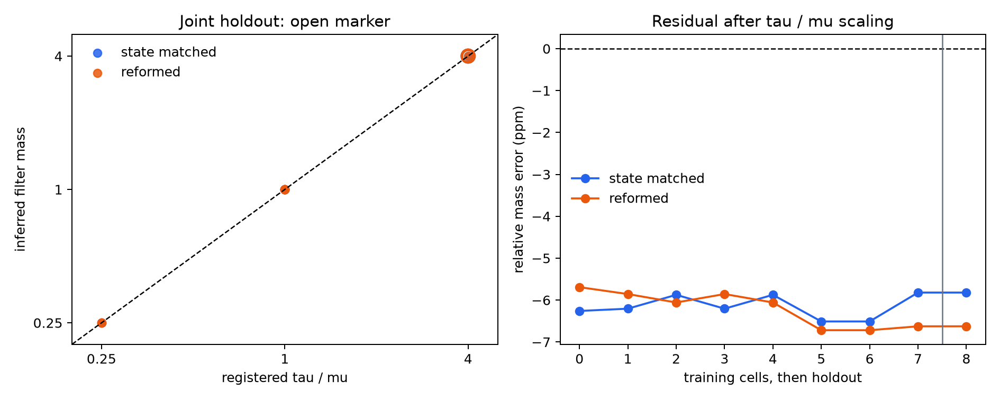

# Scalar-memory center filter scaling B-star

Generated: 2026-08-16T10:40:28.765397+00:00.

Decision: **bstar-filter-scaling-pass**.

This is a nonphysical system-identification branch. The run does not
count as physical Gate B and does not open the S1 branch.

## Registered cells

| cell | split | tau | mu | M0 | filter mass | exact finite-H | state-matched | reformed |
|---|:---:|---:|---:|---:|---:|---:|---:|---:|
| tau_1_mu_1_M0_1 | train | 1 | 1 | 1 | 1 | 0.999994 | 0.999994 | 0.999994 |
| tau_0p5_mu_0p5_M0_0p5 | train | 0.5 | 0.5 | 0.5 | 1 | 0.999995 | 0.999994 | 0.999994 |
| tau_0p5_mu_0p5_M0_2 | train | 0.5 | 0.5 | 2 | 1 | 0.999995 | 0.999994 | 0.999994 |
| tau_0p5_mu_2_M0_0p5 | train | 0.5 | 2 | 0.5 | 0.25 | 0.249999 | 0.249998 | 0.249999 |
| tau_0p5_mu_2_M0_2 | train | 0.5 | 2 | 2 | 0.25 | 0.249999 | 0.249999 | 0.249998 |
| tau_2_mu_0p5_M0_0p5 | train | 2 | 0.5 | 0.5 | 4 | 3.99998 | 3.99997 | 3.99997 |
| tau_2_mu_2_M0_0p5 | train | 2 | 2 | 0.5 | 1 | 0.999994 | 0.999993 | 0.999993 |
| tau_2_mu_2_M0_2 | train | 2 | 2 | 2 | 1 | 0.999994 | 0.999994 | 0.999993 |
| tau_2_mu_0p5_M0_2 | holdout | 2 | 0.5 | 2 | 4 | 3.99998 | 3.99998 | 3.99997 |

The applied physical-force profile, eta and center readout scale
are fixed across cells. M0 changes the local damping because eta
is not retuned; the filter prediction still assigns no M0 factor
to the inertial coefficient.

## Common training law

| estimand | intercept | tau exponent | mu exponent | M0 exponent | filter log-RMSE |
|---|---:|---:|---:|---:|---:|
| reformed | -6.2464e-06 | 0.999999 | -1 | -4.04925e-08 | 6.21055e-06 |
| state_matched | -6.1432e-06 | 1 | -1 | 3.30391e-07 | 6.16295e-06 |

## Joint holdout

- reformed: observed mass 3.99997, filter prediction 4, relative error 6.62614e-06, filter-to-best-rival log-error ratio 9.55962e-06.
- state_matched: observed mass 3.99998, filter prediction 4, relative error 5.82049e-06, filter-to-best-rival log-error ratio 8.39729e-06.

## Gate summary

- validity: True;
- nonlinear finite-H embedding: True;
- held-out scaling: True.

## Registered visualization

## Claim boundary

A pass shows that the registered local nonlinear finite-memory
filter follows m_filter=tau/mu under the engineered effective
center port. It does not identify material mass or a natural
microscopic force recipient. Physical B remains blocked by Gate A,
and D0--D5 remain sealed because no S1 candidate exists.
