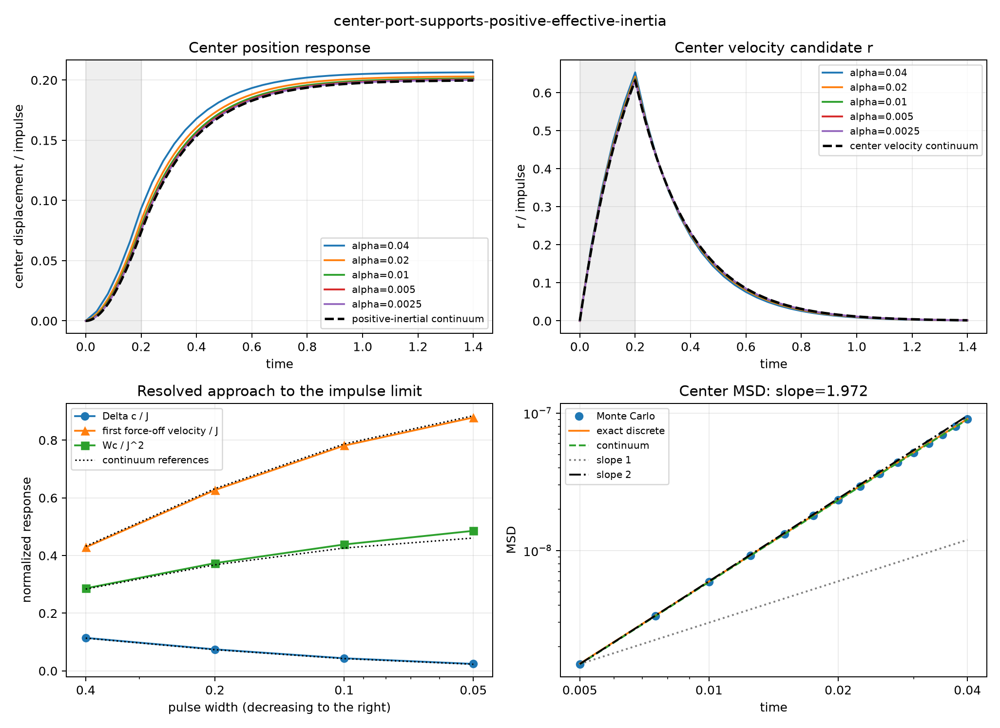

# Scalar-memory center inertial-port gate

Date: 2026-08-16.

## Verdict

Decision: **center-port-supports-positive-effective-inertia**.

| gate | status |
|---|:---:|
| port and experimental validity | pass |
| center response, work and reference closure | pass |
| positive center-inertial signature | pass |
| competing overdamped-center signature | fail |

The microscopic input remains x_next += alpha f. The new output is
the normalized finite-H memory center c, and supplied center work is
the mirrored even average of sum f dot (c_next-c). No response-fitted
coefficient rescales the force.

## Fixed-width alpha family

| alpha | H | exact center error | exact velocity error | continuum center error | continuum velocity error | inferred m | inferred gamma | Wc/J^2 | nonlinear ledger/work |
|---:|---:|---:|---:|---:|---:|---:|---:|---:|---:|
| 0.040000 | 300 | 2.2415e-05 | 2.0901e-05 | 0.064219 | 0.039624 | 0.937218 | 5.041794 | 0.465924 | 0.172160 |
| 0.020000 | 600 | 2.1222e-05 | 1.9811e-05 | 0.031650 | 0.018986 | 0.969335 | 5.020534 | 0.415595 | 0.097006 |
| 0.010000 | 1200 | 2.0684e-05 | 1.9271e-05 | 0.015715 | 0.009308 | 0.984836 | 5.010226 | 0.391424 | 0.051607 |
| 0.005000 | 2400 | 2.0426e-05 | 1.9020e-05 | 0.007828 | 0.004612 | 0.992459 | 5.005149 | 0.379575 | 0.026644 |
| 0.002500 | 4800 | 2.0301e-05 | 1.8912e-05 | 0.003904 | 0.002297 | 0.996239 | 5.002630 | 0.373708 | 0.013551 |

## Holdout pulse-width ladder

| delta | native steps | Delta c/J | pulse-end velocity/J | first force-off velocity/J | Wc/J^2 | inferred m | inferred gamma |
|---:|---:|---:|---:|---:|---:|---:|---:|
| 0.400000 | 160 | 0.114556 | 0.432686 | 0.428362 | 0.286389 | 0.996237 | 5.002618 |
| 0.200000 | 80 | 0.074742 | 0.633368 | 0.627038 | 0.373708 | 0.996239 | 5.002630 |
| 0.100000 | 40 | 0.043839 | 0.789131 | 0.781245 | 0.438392 | 0.996239 | 5.002617 |
| 0.050000 | 20 | 0.024288 | 0.887680 | 0.878808 | 0.485756 | 0.996239 | 5.002616 |

## Validity and discrimination diagnostics

- Maximum force-off clone residual: 0.
- Maximum analytic forced-recurrence residual: 2.6021e-16.
- Maximum raw/odd center-work identity error: 1.3996e-13.
- Maximum local radius R/sigma_rep: 0.009444.
- Simultaneous forced/control radius range: 0.998762..1.001241.
- Holdout inferred mass and damping: 0.996239, 5.002630.
- Center-MSD slope: 1.972302 (exact discrete 1.970784, continuum 1.971683).
- Monte Carlo center-MSD error to exact discrete reference: 0.003347.

## Figure

## Interpretation boundary

Evidence: the nonlinear finite-H center and relative responses close
against their exact discrete references; resolved center work closes
against the positive kinetic-storage ledger; the fixed-width alpha
family and the independent pulse-width ladder select one registered
input/output signature.

Inference if the positive-inertial signature is selected: the
normalized memory center is a dimensionless effective inertial
coordinate with r as its velocity under this mathematical port.
This does not reverse the preceding visible-x result because
x=c+r mixes center position and center velocity.

Not established: SI mass, uniqueness or physical observability of c,
uniformity of the double limit, nonlinear long-run transfer, or a
microscopic principle selecting f dc as physical work.

## Provenance

- Protocol: [scalar_memory_center_inertial_port_protocol_2026-08-16.md](../../project/meta/preregistration/scalar_memory_center_inertial_port_protocol_2026-08-16.md).
- Referee-level claim audit: [scalar_memory_center_mass_referee_audit_2026-08-16.md](../../project/meta/reviews/scalar_memory_center_mass_referee_audit_2026-08-16.md).
- Preceding visible-port result: [scalar_memory_force_work_port_gate_2026-08-16.md](scalar_memory_force_work_port_gate_2026-08-16.md).
- Simulation revision: f2bfa4b402a52a5082dc4cd5644f5e7822eac064.
- Git status at execution: clean.
- Formation seeds: 16,17,18,19,20; Brownian-coarsened common noise.
- Main pulse width: 0.2; free response: 1.2 memory times.
- Runtime: 28.348 s for 279850 dynamic path updates (9871.9/s).
- Machine-readable summary: [scalar_memory_center_inertial_port_gate_2026-08-16.json](scalar_memory_center_inertial_port_gate_2026-08-16.json).
