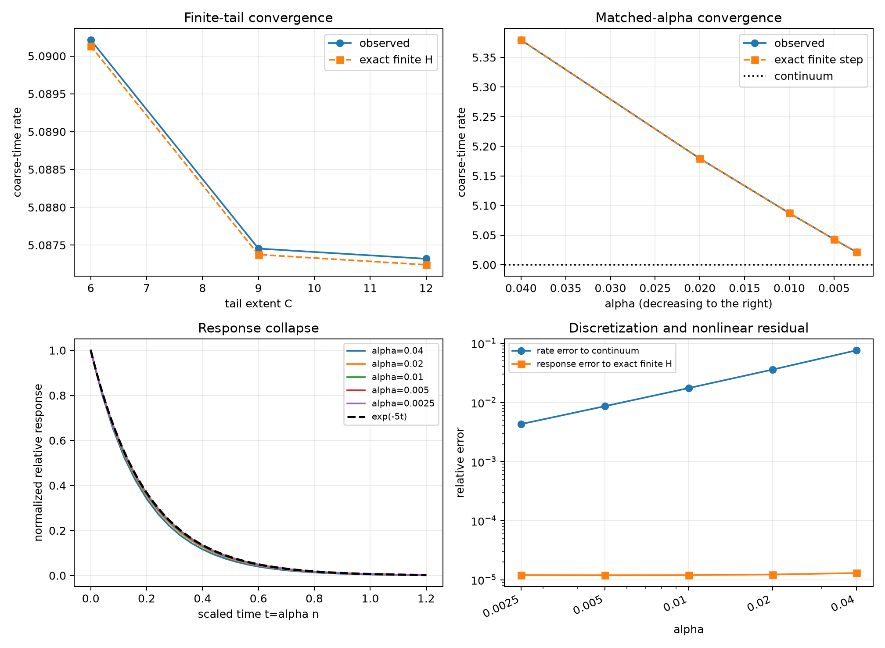

# Scalar-memory continuum-limit gate

Date: 2026-08-15.

## Verdict

Decision: **`experiment-inadequate`**.

| gate | status |
|---|:---:|
| experimental validity | fail |
| finite-tail convergence | blocked |
| matched-alpha convergence | blocked |

The test uses a mirrored visible-coordinate displacement of a complete
formed Markov state. It is an initial-condition response, not an external
force or canonical write-port experiment.

The downstream finite-tail and matched-alpha component checks all
satisfy their registered numerical thresholds, but they are formally
blocked because G0 failed its control-radius endpoint bounds. Those
component values are reported diagnostically and are not promoted to a
registered pass.

## Registered matched family

| alpha | C | H | tail mass | eta | epsilon | exact rate | observed rate | exact response error | continuum response error |
|---:|---:|---:|---:|---:|---:|---:|---:|---:|---:|
| 0.010000 | 6.000000 | 600 | 0.002405 | 0.013880 | 0.001414 | 5.090134 | 5.090213 | 1.1898e-05 | 0.012342 |
| 0.010000 | 9.000000 | 900 | 1.1794e-04 | 0.013848 | 0.001414 | 5.087375 | 5.087454 | 1.1965e-05 | 0.011910 |
| 0.040000 | 12.000000 | 300 | 4.8014e-06 | 0.055385 | 0.002828 | 5.379390 | 5.379490 | 1.2984e-05 | 0.046098 |
| 0.020000 | 12.000000 | 600 | 5.4406e-06 | 0.027692 | 0.002000 | 5.179222 | 5.179308 | 1.2273e-05 | 0.023506 |
| 0.010000 | 12.000000 | 1200 | 5.7841e-06 | 0.013846 | 0.001414 | 5.087240 | 5.087320 | 1.1967e-05 | 0.011889 |
| 0.005000 | 12.000000 | 2400 | 5.9620e-06 | 0.006923 | 0.001000 | 5.043057 | 5.043135 | 1.1946e-05 | 0.005986 |
| 0.002500 | 12.000000 | 4800 | 6.0526e-06 | 0.003462 | 7.0711e-04 | 5.021394 | 5.021471 | 1.1980e-05 | 0.003008 |

## Validity diagnostics

| case | mirror-even max | strength max | radius range | force-closure RMS median |
|---|---:|---:|---:|---:|
| alpha=0.01, C=6 | 2.3400e-08 | 8.1239e-11 | 0.800970..1.139997 | 1.9894e-05 |
| alpha=0.01, C=9 | 2.3411e-08 | 8.1250e-11 | 0.801491..1.139324 | 1.9978e-05 |
| alpha=0.04, C=12 | 3.0338e-08 | 9.7845e-11 | 0.802589..1.131765 | 2.1835e-05 |
| alpha=0.02, C=12 | 2.5044e-08 | 8.6177e-11 | 0.797653..1.138053 | 2.0615e-05 |
| alpha=0.01, C=12 | 2.3412e-08 | 8.1205e-11 | 0.801540..1.139297 | 1.9981e-05 |
| alpha=0.005, C=12 | 2.2615e-08 | 7.9055e-11 | 0.802753..1.137443 | 1.9920e-05 |
| alpha=0.0025, C=12 | 2.2109e-08 | 7.7902e-11 | 0.803274..1.133066 | 2.0019e-05 |

## Figure

## Interpretation boundary

Evidence: the table and gates compare the nonlinear finite-memory
simulation first with its exact finite-H local-linear reference and
then with the registered continuum exponential.

Inference, if all gates pass: the tested local scalar memory-centre
response has a controlled joint tail and small-alpha limit when chi,
D and alpha*H are matched.

Not established: physical inertial mass, a force-work normalization,
momentum, an underdamped mode, nonlinear knot existence, or a physical
continuum time.

## Provenance

- Preregistration: [scalar_memory_continuum_limit_protocol_2026-08-15.md](../../project/meta/preregistration/scalar_memory_continuum_limit_protocol_2026-08-15.md).
- Simulation revision: `11180fe01408b7744281231797f8aee8a3d55dfe`.
- Git status at execution: `clean`.
- Five registered formation seeds and Brownian-coarsened common noise.
