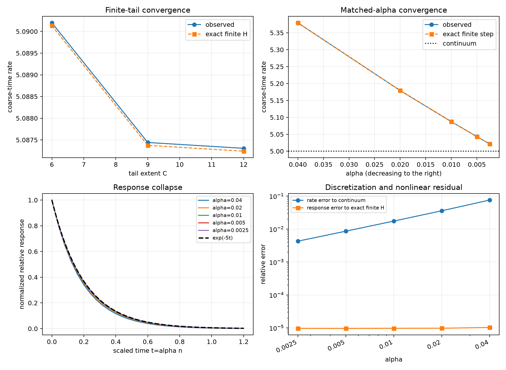

# Scalar-memory continuum-limit reconciliation

Date: 2026-08-15.

## Verdict

Decision: **`continuum-limit-supported-in-prospective-reconciliation`**.

| gate | status |
|---|:---:|
| corrected experimental validity | pass |
| finite-tail convergence | pass |
| matched-alpha convergence | pass |

This prospective reconciliation preserves the original
`experiment-inadequate` decision. It changes only the invalid
across-time radius comparator: every displaced branch is now compared
with its simultaneous common-noise control at every response sample.
Seeds 6--10 were fixed before the corrected diagnostic was implemented.

## Corrected validity diagnostics

| case | mirror-even max | strength max | max R/sigma_rep | simultaneous branch/control range | descriptive control endpoint range |
|---|---:|---:|---:|---:|---:|
| alpha=0.01, C=6 | 3.6677e-08 | 8.1183e-11 | 0.010200 | 0.999626..1.000378 | 0.874398..1.299273 |
| alpha=0.01, C=9 | 3.6665e-08 | 8.1261e-11 | 0.010213 | 0.999628..1.000376 | 0.876180..1.297453 |
| alpha=0.01, C=12 | 3.6665e-08 | 8.1227e-11 | 0.010214 | 0.999628..1.000376 | 0.876242..1.297400 |
| alpha=0.04, C=12 | 4.6805e-08 | 9.7867e-11 | 0.010524 | 0.999645..1.000361 | 0.901047..1.291749 |
| alpha=0.02, C=12 | 3.9642e-08 | 8.6205e-11 | 0.010335 | 0.999648..1.000359 | 0.882711..1.290082 |
| alpha=0.005, C=12 | 3.5733e-08 | 7.8982e-11 | 0.010141 | 0.999611..1.000393 | 0.873257..1.300034 |
| alpha=0.0025, C=12 | 3.5348e-08 | 7.7846e-11 | 0.010123 | 0.999606..1.000398 | 0.872943..1.300464 |

The last column is retained only to demonstrate why the original
endpoint gate was non-discriminating; it has no gate role here.

## Registered matched family

| alpha | C | H | tail mass | exact-response fitted rate | observed rate | exact response error | continuum response error |
|---:|---:|---:|---:|---:|---:|---:|---:|
| 0.010000 | 6.000000 | 600 | 0.002405 | 5.090134 | 5.090199 | 9.6878e-06 | 0.012339 |
| 0.010000 | 9.000000 | 900 | 1.1794e-04 | 5.087375 | 5.087441 | 9.7279e-06 | 0.011908 |
| 0.010000 | 12.000000 | 1200 | 5.7841e-06 | 5.087240 | 5.087306 | 9.7293e-06 | 0.011887 |
| 0.040000 | 12.000000 | 300 | 4.8014e-06 | 5.379390 | 5.379476 | 1.0317e-05 | 0.046095 |
| 0.020000 | 12.000000 | 600 | 5.4406e-06 | 5.179222 | 5.179293 | 9.7768e-06 | 0.023504 |
| 0.005000 | 12.000000 | 2400 | 5.9620e-06 | 5.043057 | 5.043121 | 9.6515e-06 | 0.005984 |
| 0.002500 | 12.000000 | 4800 | 6.0526e-06 | 5.021394 | 5.021457 | 9.6834e-06 | 0.003006 |

## Figure

## Interpretation boundary

Evidence: the prospective common-noise branches remain locally
perturbative, the nonlinear finite-memory simulation agrees with
the exact finite-H response, tail sensitivity contracts, and the
matched-alpha family approaches the registered exponential.

Inference conditional on a complete pass: this constructed local
scalar memory-centre family has a controlled finite-tail and
small-alpha limit under fixed chi, D and alpha*H.

Not established: emergence or uniqueness of the scaling, physical
mass, momentum, underdamped inertia, a force-work normalization,
nonlinear knot persistence, or physical continuum time.

## Provenance

- Reconciliation protocol: [scalar_memory_continuum_limit_reconciliation_protocol_2026-08-15.md](../../project/meta/preregistration/scalar_memory_continuum_limit_reconciliation_protocol_2026-08-15.md).
- Original audit: [scalar_memory_continuum_limit_gate_2026-08-15.md](scalar_memory_continuum_limit_gate_2026-08-15.md).
- Simulation revision: `3f2e6d3ad646f0f0a301e8f5f868ac52884167e1`.
- First prospective seed-6--10 execution revision: `2c660d85bb3cc3b607f7aa5bc5282845c4911a35`.
- Git status at execution: `clean`.
- Five prospective formation seeds and Brownian-coarsened common noise.
- Formation: `20` memory times; response: `1.2` memory times sampled at native cadence.
- Runtime: `9.116 s` for `126750` dynamic path updates (`13904.5/s`).
- Machine-readable summary: [scalar_memory_continuum_limit_reconciliation_2026-08-15.json](scalar_memory_continuum_limit_reconciliation_2026-08-15.json).
