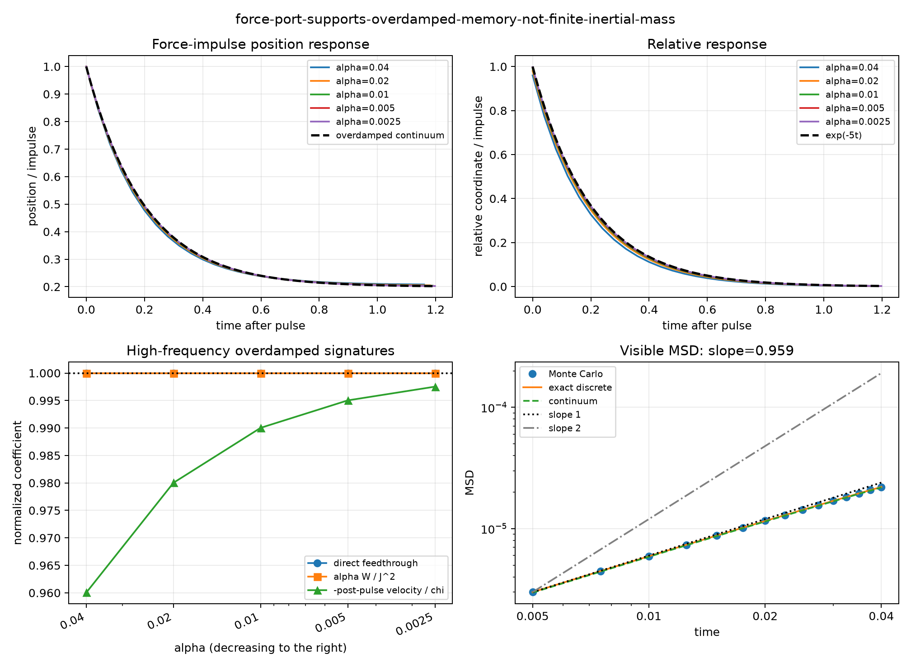

# Scalar-memory force/work-port gate

Date: 2026-08-16.

## Verdict

Decision: **`force-port-supports-overdamped-memory-not-finite-inertial-mass`**.

| gate | status |
|---|:---:|
| port and experimental validity | pass |
| force-response and ledger closure | pass |
| overdamped-memory signature | pass |
| regular finite-inertial signature | fail |

The generalized force normalization is fixed by `x_next += alpha*f`;
the supplied work is `sum f dot (x_next-x)`. No fitted response
coefficient or mass rescales the input.

## Registered alpha family

| alpha | H | exact position error | exact relative error | continuum position error | continuum relative error | feedthrough | post-pulse velocity/J | alpha W/J^2 | ledger residual/work |
|---:|---:|---:|---:|---:|---:|---:|---:|---:|---:|
| 0.040000 | 300 | 2.0174e-05 | 1.7928e-05 | 0.021836 | 0.076427 | 1.000000 | -3.840125 | 1.000000 | 0.085763 |
| 0.020000 | 600 | 1.8785e-05 | 1.6534e-05 | 0.010879 | 0.039428 | 1.000000 | -3.920098 | 1.000000 | 0.041400 |
| 0.010000 | 1200 | 1.8416e-05 | 1.6147e-05 | 0.005438 | 0.020041 | 1.000000 | -3.960118 | 1.000000 | 0.020345 |
| 0.005000 | 2400 | 1.8156e-05 | 1.5888e-05 | 0.002723 | 0.010110 | 1.000000 | -3.980109 | 1.000000 | 0.010086 |
| 0.002500 | 4800 | 1.8058e-05 | 1.5790e-05 | 0.001367 | 0.005083 | 1.000000 | -3.990101 | 1.000000 | 0.005021 |

## Validity and discrimination diagnostics

- Maximum force-off clone residual: `0`.
- Maximum analytic forced-recurrence residual: `2.2204e-16`.
- Maximum work-normalization error: `7.0499e-14`.
- Maximum local radius `R/sigma_rep`: `0.010712`.
- Simultaneous forced/control radius range: `0.998677..1.001329`.
- Holdout direct feedthrough: `1.000000`.
- Holdout first post-pulse velocity per impulse: `-3.990101`.
- Visible-MSD slope on the fixed window: `0.959048` (exact discrete `0.959136`, continuum `0.959317`).
- Monte Carlo MSD error to exact discrete reference: `0.001523`.

## Figure

## Interpretation boundary

Evidence: the native nonlinear force response closes against its
exact finite-H reference, the work ledger approaches its continuum
balance, and the fixed high-frequency diagnostics select one of the
two registered port signatures.

Inference if the overdamped signature is selected: this canonical
additive-force port exposes finite mobility rather than a regular
finite inertial mass. Its impulse displacement is direct and its
short-time visible MSD is diffusive.

Not established: an SI force or energy scale, a no-go for every
coarse graining, or the absence of an explicitly added or separately
derived momentum field. Force placement is part of the tested model.

Post-hoc analytic check (not a gate): expanding the measured
overdamped transfer gives `(s+1)/(s+5)=1/5+(4/25)s+...`.
Matching a free inertial mobility `1/(gamma+m s)` at low frequency
would require `gamma=5` and `m=-4`, not a positive passive mass.

## Provenance

- Protocol: [scalar_memory_force_work_port_protocol_2026-08-16.md](../../project/meta/preregistration/scalar_memory_force_work_port_protocol_2026-08-16.md).
- Preceding continuum review: [scalar_memory_continuum_limit_review_2026-08-15.md](../../project/meta/reviews/scalar_memory_continuum_limit_review_2026-08-15.md).
- Simulation revision: `52bef2d985bb53c2cd4cc04529a396edd5436072`.
- First prospective seed-11--15 execution revision: `e6a034b5ad08b862b041e60311c2cb92501178a2`.
- Git status at execution: `clean`.
- Formation seeds: `11,12,13,14,15`; Brownian-coarsened common noise.
- Formation: `20` memory times; response: `1.2` memory times at native cadence.
- Runtime: `8.351 s` for `105400` dynamic path updates (`12621.4/s`).
- Machine-readable summary: [scalar_memory_force_work_port_gate_2026-08-16.json](scalar_memory_force_work_port_gate_2026-08-16.json).
