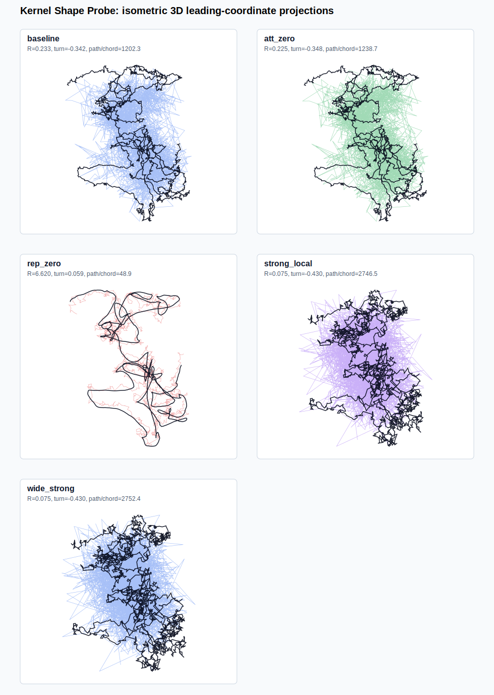
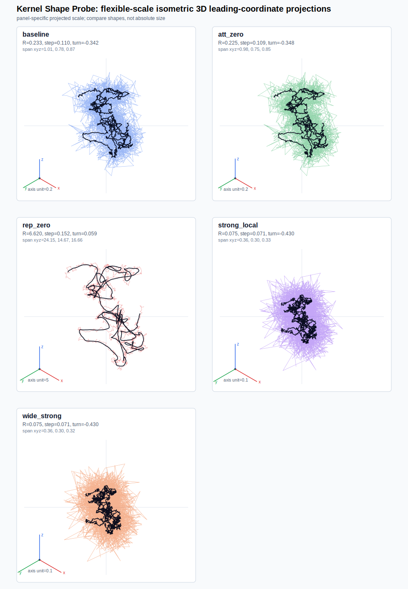
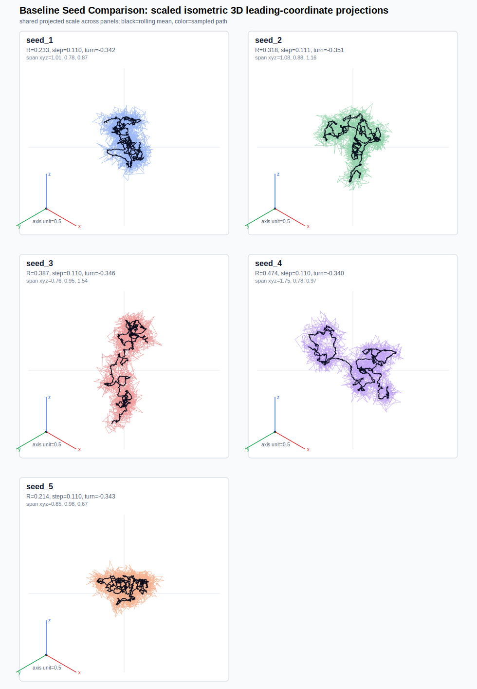
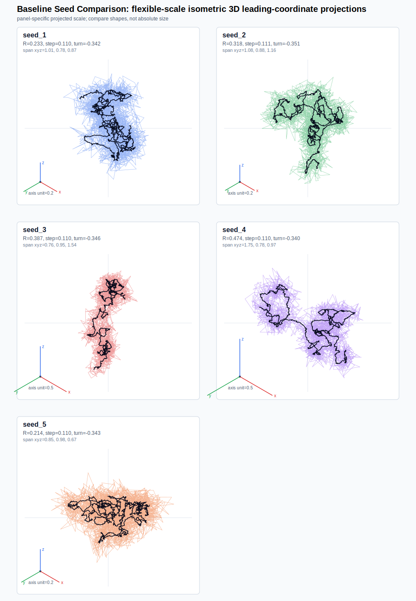

# Kernel Shape Probe

Date: 2026-07-02T03:04:47Z.

## Scope

This is a targeted visual probe for smoother or rounder 3D trajectories.
It varies only kernel widths/amplitudes across a few motivated cases.
It also compares baseline seeds to test whether the visible course is seed-specific.
It is not a broad parameter sweep and not Paper-I evidence by itself.

Important sign convention: in the current Euler update, the kernel
contributes a deterministic drift term `-eta (rep - att)`. With the
package convention, `A_rep` is locally restoring and `A_att` weakens
that restoring scale. The labels therefore name kernel components,
not directly the sign of the realized Euler displacement.

The kernel does not impose a hard minimum step length; without inertia
or correlated noise the path can remain jagged even when it is
spatially confined.

## Figures

The standard SVGs use a shared projected scale within the figure. The
flexible SVGs use panel-specific scales and should be read for shape rather
than absolute size. The black line is a rolling mean of the same trajectory;
the colored line is the raw sampled path. Axis triads show the coordinate
unit used in each projection.

## Kernel Cases

| case | sigma_rep | sigma_att | A_rep | A_att | k_eff | mean radius | median step | turn mean | path/chord | PCA energy first 3 |
| --- | ---: | ---: | ---: | ---: | ---: | ---: | ---: | ---: | ---: | --- |
| `baseline` | `1` | `3` | `1` | `0.35` | `0.1442` | `0.233` | `0.1099` | `-0.342` | `1202.3` | `0.60, 0.24, 0.16` |
| `att_zero` | `1` | `3` | `1` | `0` | `0.1500` | `0.225` | `0.1090` | `-0.348` | `1238.7` | `0.59, 0.24, 0.16` |
| `rep_zero` | `1` | `3` | `0` | `0.35` | `-0.0058` | `6.620` | `0.1519` | `0.059` | `48.9` | `0.66, 0.23, 0.11` |
| `strong_local` | `1` | `3` | `4` | `0.35` | `0.5942` | `0.075` | `0.0707` | `-0.430` | `2746.5` | `0.49, 0.28, 0.23` |
| `wide_strong` | `2` | `6` | `16` | `1.4` | `0.5942` | `0.075` | `0.0707` | `-0.430` | `2752.4` | `0.49, 0.28, 0.23` |

## Seed Comparison

| seed | mean radius | median step | turn mean | path/chord | span xyz |
| ---: | ---: | ---: | ---: | ---: | --- |
| `1` | `0.233` | `0.1099` | `-0.342` | `1202.3` | `1.01, 0.78, 0.87` |
| `2` | `0.318` | `0.1113` | `-0.351` | `1224.8` | `1.08, 0.88, 1.16` |
| `3` | `0.387` | `0.1100` | `-0.346` | `733.5` | `0.76, 0.95, 1.54` |
| `4` | `0.474` | `0.1095` | `-0.340` | `642.8` | `1.75, 0.78, 0.97` |
| `5` | `0.214` | `0.1099` | `-0.343` | `13023.9` | `0.85, 0.98, 0.67` |

## Reading

- In this implementation, `A_att=0` removes the broad counter-term
  and can remain compact because the `A_rep` component is the
  locally restoring part of the Euler update.
- `A_rep=0` leaves only the broad counter-term and is therefore the
  sharper ablation for dispersal in this convention. It can look rounder
  because the restoring feedback is weak and the path is closer to ordinary
  isotropic diffusion; roundness here is not knot stability.
- Increasing local restoring scale changes confinement, but it does
  not automatically create directionally persistent, round paths.
- Co-scaling amplitudes with kernel width can leave the local
  stiffness scale A/sigma^2 almost unchanged in compact regimes.
- Truly round trajectories in the visible path likely need an added
  persistence mechanism: correlated noise, a velocity/inertial variable,
  rotational/tangential drift, or a smoother center-of-knot observable.
