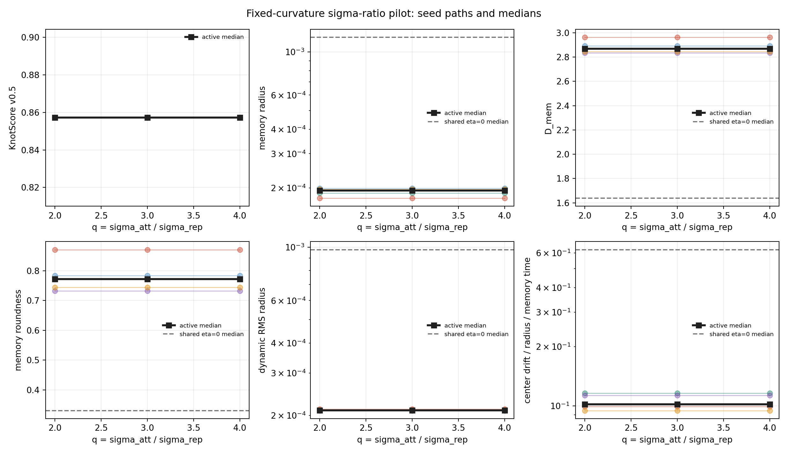

# Fixed-Curvature Sigma Pilot

Date: 2026-07-18T06:02:24Z.

## Scope

This mechanism pilot varies only `q=sigma_att/sigma_rep` while holding
the local curvature ratio fixed at `chi=3.8888889`. It uses
`N=1,000,000`, seeds `1,2,3,4,5`,
`d=3`, `epsilon=0.0001`, `eta=0.15`,
`lambda=0.01`, `M0=1`, delta deposition,
`sigma_rep=1`, `burn_in=0`, and 100 logarithmic center traces.

The five `eta=0` cases are shared across q: with `eta=0` the kernel
term vanishes exactly, so rerunning an identical random walk for every
kernel geometry would add no independent control information.

## Results

| q | A_att | curvature | score | memory radius | radius/sigma_rep | D_mem | roundness | dynamic radius | drift/r | D_cov | D_occ win | residence |
| ---: | ---: | ---: | ---: | ---: | ---: | ---: | ---: | ---: | ---: | ---: | ---: | ---: |
| 2.0000 | 15.5556 | 2.8889 | 0.8571 | 1.9416e-04 | 1.9416e-04 | 2.8675 | 0.7719 | 2.1028e-04 | 0.1019 | 1.9599 | 1.8069 | 119.6296 |
| 3.0000 | 35.0000 | 2.8889 | 0.8571 | 1.9416e-04 | 1.9416e-04 | 2.8675 | 0.7719 | 2.1028e-04 | 0.1019 | 1.9599 | 1.8069 | 119.6296 |
| 4.0000 | 62.2222 | 2.8889 | 0.8571 | 1.9416e-04 | 1.9416e-04 | 2.8675 | 0.7719 | 2.1028e-04 | 0.1019 | 1.9599 | 1.8069 | 119.6296 |

## Seed-Paired q Sensitivity

| KPI | seeds | median relative q span | maximum relative q span |
| --- | ---: | ---: | ---: |
| memory radius | 5 | 6.9463e-09 | 7.6302e-09 |
| D_mem | 5 | 1.3032e-09 | 2.1023e-09 |
| memory roundness | 5 | 3.6668e-09 | 5.8479e-09 |
| dynamic RMS radius | 5 | 6.8900e-09 | 7.4009e-09 |
| center drift / radius / memory time | 5 | 1.1112e-08 | 1.6456e-08 |
| D_cov | 5 | 8.7333e-10 | 1.7471e-09 |
| D_occ window | 5 | 2.2473e-15 | 3.8557e-15 |

## Interpretation

- Across the reported continuous KPIs, the largest seed-paired q span is only `1.6456e-08` relative.
- The largest observed final memory radius is `1.9955e-04`
  times `sigma_rep`. The trajectories therefore sample only the local
  Taylor region of every tested kernel.
- Within this regime, q=2, 3, and 4 are numerically indistinguishable
  once local curvature is matched. The compact branch identifies local
  stiffness, not the two nominal Gaussian scales separately.
- A further unconstrained two-scale sigma sweep is not informative at
  this noise/radius scale. Resolving nonlocal shape would require a
  deliberately larger sampled radius and a separate stability question.
- This `N=1M` slice is a mechanism result, not new long-run knot evidence.
- Zero integral is not tested here. The justified next step is one exact
  broad third-scale compensation pilot with local and far-field checks.

## Provenance

- Git revision: `a86509461608481fedf50c7ba2e400a6c8a8c481`
- Git status at report generation: `clean`
- Raw cases: `data/processed/kernel_compensation/` (ignored bulk data)
- Script: `experiments/current/kernels/fixed_curvature_sigma_pilot.py`
