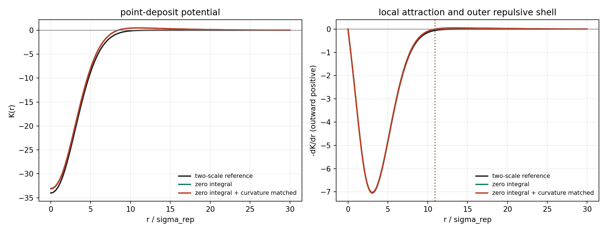
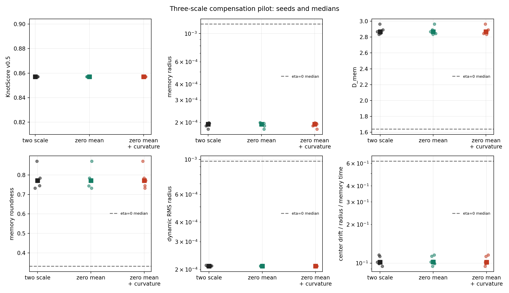

# Three-Scale Zero-Integral Pilot

Date: 2026-07-18T06:34:58Z.

## Scope

This is one controlled extension of the corrected q=3 scalar kernel,
not a new parameter sweep. It compares the two-scale reference with
an exact zero-integral broad compensator and a second zero-integral
variant whose local point-deposit curvature is matched exactly.

Fixed simulation parameters: `N=1,000,000`, seeds `1,2,3,4,5`,
`d=3`, `epsilon=0.0001`, `eta=0.15`,
`lambda=0.01`, `M0=1`, delta deposition,
`sigma_rep=1`, `sigma_att=3`,
`sigma_comp=10`, `burn_in=0`. 5
seed-matched `eta=0` paths provide the shared null control.

## Analytic Kernel Checks

| variant | A_att | A_comp | integral coefficient | curvature | retention | force crossing |
| --- | ---: | ---: | ---: | ---: | ---: | ---: |
| two-scale reference | 35.00000 | 0 | -944.00000 | 2.88889 | 1.00000 | n/a |
| zero integral | 35.00000 | 0.94400 | 0 | 2.87945 | 0.99673 | 10.91307 |
| zero integral + curvature matched | 35.08517 | 0.94630 | 0 | 2.88889 | 1.00000 | 10.91307 |

The compensated kernels retain inward drift on knot scales but add
an outer repulsive shell beyond the listed crossing. `integral K=0`
is exact in the current unnormalized d-dimensional Gaussian convention.

## Simulation KPIs

| variant | score | memory radius | D_mem | roundness | dynamic radius | drift/r | D_cov | D_occ win | residence |
| --- | ---: | ---: | ---: | ---: | ---: | ---: | ---: | ---: | ---: |
| two-scale reference | 0.85714 | 1.94163e-04 | 2.86749 | 0.77189 | 2.10276e-04 | 0.10186 | 1.95993 | 1.80693 | 119.62963 |
| zero integral | 0.85714 | 1.94403e-04 | 2.86697 | 0.77154 | 2.10524e-04 | 0.10210 | 1.95980 | 1.80931 | 119.62963 |
| zero integral + curvature matched | 0.85714 | 1.94163e-04 | 2.86749 | 0.77189 | 2.10276e-04 | 0.10186 | 1.95993 | 1.80693 | 119.62963 |

## Paired Difference from Two-Scale Reference

| variant | KPI | seeds | median relative difference | maximum relative difference |
| --- | --- | ---: | ---: | ---: |
| zero_mean_raw | KnotScore v0.5 | 5 | 0 | 0 |
| zero_mean_raw | memory radius | 5 | 0.00124 | 0.00132 |
| zero_mean_raw | D_mem | 5 | 1.60949e-04 | 2.65716e-04 |
| zero_mean_raw | memory roundness | 5 | 4.45868e-04 | 7.16894e-04 |
| zero_mean_raw | dynamic RMS radius | 5 | 0.00118 | 0.00129 |
| zero_mean_raw | center drift / radius / memory time | 5 | 0.00211 | 0.00238 |
| zero_mean_curvature_matched | KnotScore v0.5 | 5 | 0 | 0 |
| zero_mean_curvature_matched | memory radius | 5 | 9.11460e-12 | 1.00115e-11 |
| zero_mean_curvature_matched | D_mem | 5 | 1.70999e-12 | 2.75799e-12 |
| zero_mean_curvature_matched | memory roundness | 5 | 4.81068e-12 | 7.67297e-12 |
| zero_mean_curvature_matched | dynamic RMS radius | 5 | 9.04136e-12 | 9.71265e-12 |
| zero_mean_curvature_matched | center drift / radius / memory time | 5 | 1.45810e-11 | 2.15778e-11 |

## Decision

- Exact zero integral: `True`.
- Outer force-sign crossing present: `True`.
- All reported local KPIs remain within 5% of the paired two-scale reference: `True`.
- Controlled compensation mechanism gate: `True`.
- Passing this gate means only that a broad third scale can preserve
  the current local compact branch while changing its static outer field.
  It is not evidence for electric charge, physical screening, or a
  reciprocal two-knot force law.
- The zero-integral amplitude depends strongly on ambient dimension
  under the current unnormalized Gaussian convention. Paper-II use
  requires either explicit dimension-dependent calibration or normalized
  component kernels before cross-dimension universality is discussed.
- Next: use the compensated field in the signed scalar cross-channel
  with null, label-flip, common-noise, distance, and reciprocity controls.

## Provenance

- Git revision: `0e1dff52253027c43c56917a237d4e24a58cacb3`
- Git status at report generation: `clean`
- Raw cases: `data/processed/kernel_compensation/` (ignored bulk data)
- Script: `experiments/current/kernels/three_scale_compensation_pilot.py`
