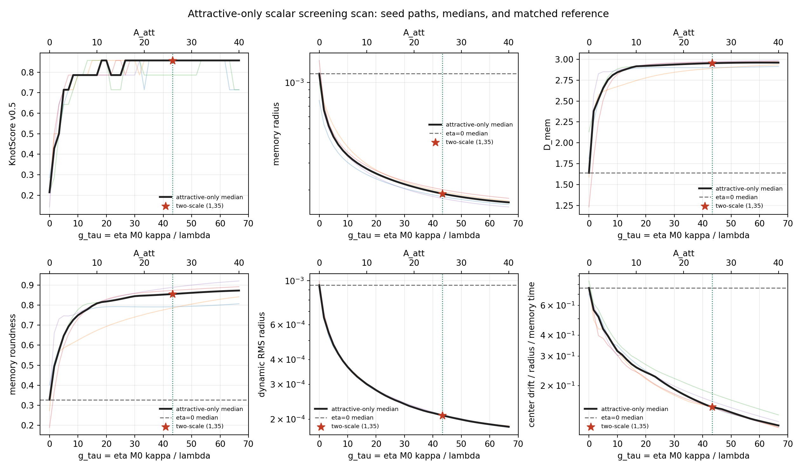

# Attractive-Only Scalar Regime Scan

Date: 2026-07-18T22:45:30Z.

## Scope

Screening run with `N=300,000`, seeds `1,2,3,4,5`,
`d=3`, `epsilon=0.0001`, `eta=0.15`,
`lambda=0.01`, `M0=1`, delta deposition,
`A_rep=0`, `sigma_att=3`, and `A_att=0..40`.
`A_att=0` is an implementation null; the requested physical scan is
`1..40`. This is a screening run, not long-run phase evidence.

Without `A_rep`, every `A_att>0` has positive local restoring curvature.
The former sign boundary near `A_att=9` is therefore absent analytically.
Intervals below are ranked empirical KPI changes, not pre-labelled phase
transitions.

## Aggregate

| A_att | kappa | g/update | g/tau_mem | score | compact gain | R_mem/L_att | D_mem | roundness | dyn R | drift/R |
| ---: | ---: | ---: | ---: | ---: | ---: | ---: | ---: | ---: | ---: | ---: |
| 0 | 0 | 0 | 0 | 0.2143 | 1.0000 | 3.8059e-04 | 1.6406 | 0.3274 | 9.5007e-04 | 0.7625 |
| 1.0000 | 0.1111 | 0.0167 | 1.6667 | 0.4286 | 1.5405 | 2.2064e-04 | 2.3800 | 0.4939 | 6.5201e-04 | 0.5641 |
| 2.0000 | 0.2222 | 0.0333 | 3.3333 | 0.5000 | 1.8873 | 1.7421e-04 | 2.5204 | 0.5733 | 5.4674e-04 | 0.5143 |
| 3.0000 | 0.3333 | 0.0500 | 5.0000 | 0.7143 | 2.2177 | 1.4826e-04 | 2.6539 | 0.6470 | 4.7519e-04 | 0.4348 |
| 4.0000 | 0.4444 | 0.0667 | 6.6667 | 0.7143 | 2.4943 | 1.3181e-04 | 2.7519 | 0.6931 | 4.2932e-04 | 0.3958 |
| 5.0000 | 0.5556 | 0.0833 | 8.3333 | 0.7857 | 2.7499 | 1.2042e-04 | 2.8094 | 0.7263 | 3.9419e-04 | 0.3554 |
| 6.0000 | 0.6667 | 0.1000 | 10.0000 | 0.7857 | 3.0075 | 1.1196e-04 | 2.8439 | 0.7495 | 3.6766e-04 | 0.3216 |
| 7.0000 | 0.7778 | 0.1167 | 11.6667 | 0.7857 | 3.2480 | 1.0533e-04 | 2.8651 | 0.7655 | 3.4635e-04 | 0.3058 |
| 8.0000 | 0.8889 | 0.1333 | 13.3333 | 0.7857 | 3.4729 | 9.9943e-05 | 2.8835 | 0.7792 | 3.2846e-04 | 0.2857 |
| 9.0000 | 1.0000 | 0.1500 | 15.0000 | 0.7857 | 3.6841 | 9.5443e-05 | 2.9022 | 0.7959 | 3.1441e-04 | 0.2690 |
| 10.0000 | 1.1111 | 0.1667 | 16.6667 | 0.7857 | 3.8825 | 9.1598e-05 | 2.9157 | 0.8088 | 3.0123e-04 | 0.2571 |
| 11.0000 | 1.2222 | 0.1833 | 18.3333 | 0.8571 | 4.0682 | 8.8248e-05 | 2.9181 | 0.8154 | 2.9098e-04 | 0.2481 |
| 12.0000 | 1.3333 | 0.2000 | 20.0000 | 0.8571 | 4.2412 | 8.5288e-05 | 2.9205 | 0.8184 | 2.8066e-04 | 0.2405 |
| 13.0000 | 1.4444 | 0.2167 | 21.6667 | 0.7857 | 4.4036 | 8.2644e-05 | 2.9230 | 0.8220 | 2.7143e-04 | 0.2337 |
| 14.0000 | 1.5556 | 0.2333 | 23.3333 | 0.7857 | 4.5562 | 8.0264e-05 | 2.9256 | 0.8261 | 2.6326e-04 | 0.2262 |
| 15.0000 | 1.6667 | 0.2500 | 25.0000 | 0.7857 | 4.6999 | 7.8105e-05 | 2.9282 | 0.8306 | 2.5631e-04 | 0.2158 |
| 16.0000 | 1.7778 | 0.2667 | 26.6667 | 0.8571 | 4.8356 | 7.6135e-05 | 2.9309 | 0.8355 | 2.5001e-04 | 0.2065 |
| 17.0000 | 1.8889 | 0.2833 | 28.3333 | 0.8571 | 4.9641 | 7.4331e-05 | 2.9336 | 0.8406 | 2.4462e-04 | 0.1982 |
| 18.0000 | 2.0000 | 0.3000 | 30.0000 | 0.8571 | 5.0859 | 7.2672e-05 | 2.9362 | 0.8450 | 2.3889e-04 | 0.1906 |
| 19.0000 | 2.1111 | 0.3167 | 31.6667 | 0.8571 | 5.2017 | 7.1138e-05 | 2.9387 | 0.8468 | 2.3352e-04 | 0.1837 |
| 20.0000 | 2.2222 | 0.3333 | 33.3333 | 0.8571 | 5.3118 | 6.9717e-05 | 2.9411 | 0.8478 | 2.2927e-04 | 0.1775 |
| 21.0000 | 2.3333 | 0.3500 | 35.0000 | 0.8571 | 5.4167 | 6.8395e-05 | 2.9434 | 0.8489 | 2.2518e-04 | 0.1717 |
| 22.0000 | 2.4444 | 0.3667 | 36.6667 | 0.8571 | 5.5170 | 6.7165e-05 | 2.9456 | 0.8501 | 2.2129e-04 | 0.1664 |
| 23.0000 | 2.5556 | 0.3833 | 38.3333 | 0.8571 | 5.6129 | 6.6020e-05 | 2.9476 | 0.8514 | 2.1799e-04 | 0.1615 |
| 24.0000 | 2.6667 | 0.4000 | 40.0000 | 0.8571 | 5.7048 | 6.4952e-05 | 2.9494 | 0.8528 | 2.1527e-04 | 0.1570 |
| 25.0000 | 2.7778 | 0.4167 | 41.6667 | 0.8571 | 5.7929 | 6.3960e-05 | 2.9511 | 0.8542 | 2.1231e-04 | 0.1527 |
| 26.0000 | 2.8889 | 0.4333 | 43.3333 | 0.8571 | 5.8775 | 6.3044e-05 | 2.9527 | 0.8557 | 2.0934e-04 | 0.1494 |
| 27.0000 | 3.0000 | 0.4500 | 45.0000 | 0.8571 | 5.9588 | 6.2199e-05 | 2.9540 | 0.8572 | 2.0659e-04 | 0.1474 |
| 28.0000 | 3.1111 | 0.4667 | 46.6667 | 0.8571 | 6.0368 | 6.1416e-05 | 2.9553 | 0.8588 | 2.0403e-04 | 0.1453 |
| 29.0000 | 3.2222 | 0.4833 | 48.3333 | 0.8571 | 6.1117 | 6.0689e-05 | 2.9563 | 0.8603 | 2.0164e-04 | 0.1421 |
| 30.0000 | 3.3333 | 0.5000 | 50.0000 | 0.8571 | 6.1835 | 6.0013e-05 | 2.9573 | 0.8617 | 1.9935e-04 | 0.1390 |
| 31.0000 | 3.4444 | 0.5167 | 51.6667 | 0.8571 | 6.2522 | 5.9383e-05 | 2.9580 | 0.8632 | 1.9710e-04 | 0.1359 |
| 32.0000 | 3.5556 | 0.5333 | 53.3333 | 0.8571 | 6.3178 | 5.8797e-05 | 2.9587 | 0.8646 | 1.9509e-04 | 0.1330 |
| 33.0000 | 3.6667 | 0.5500 | 55.0000 | 0.8571 | 6.3805 | 5.8251e-05 | 2.9592 | 0.8659 | 1.9331e-04 | 0.1302 |
| 34.0000 | 3.7778 | 0.5667 | 56.6667 | 0.8571 | 6.4405 | 5.7741e-05 | 2.9595 | 0.8672 | 1.9166e-04 | 0.1276 |
| 35.0000 | 3.8889 | 0.5833 | 58.3333 | 0.8571 | 6.4978 | 5.7266e-05 | 2.9598 | 0.8684 | 1.9012e-04 | 0.1253 |
| 36.0000 | 4.0000 | 0.6000 | 60.0000 | 0.8571 | 6.5526 | 5.6823e-05 | 2.9599 | 0.8695 | 1.8867e-04 | 0.1234 |
| 37.0000 | 4.1111 | 0.6167 | 61.6667 | 0.8571 | 6.6050 | 5.6411e-05 | 2.9599 | 0.8705 | 1.8725e-04 | 0.1215 |
| 38.0000 | 4.2222 | 0.6333 | 63.3333 | 0.8571 | 6.6548 | 5.6028e-05 | 2.9597 | 0.8714 | 1.8584e-04 | 0.1197 |
| 39.0000 | 4.3333 | 0.6500 | 65.0000 | 0.8571 | 6.7023 | 5.5672e-05 | 2.9595 | 0.8723 | 1.8464e-04 | 0.1178 |
| 40.0000 | 4.4444 | 0.6667 | 66.6667 | 0.8571 | 6.7474 | 5.5341e-05 | 2.9591 | 0.8730 | 1.8333e-04 | 0.1161 |

## Matched ablation

The attractive-only `A_att=26` branch and
the two-scale `(A_rep,A_att)=(1,35)`
reference have equal point-deposit curvature and share seed-matched
noise and controls.

| KPI | seeds | median relative difference | max relative difference |
| --- | ---: | ---: | ---: |
| memory radius | 5 | 7.3554e-09 | 9.2376e-09 |
| D_mem | 5 | 2.5391e-10 | 8.8739e-10 |
| roundness | 5 | 1.6181e-09 | 4.4527e-09 |
| dynamic radius | 5 | 8.1682e-09 | 8.8971e-09 |
| drift/r | 5 | 1.2344e-08 | 1.4351e-08 |
| D_cov | 5 | 6.7773e-10 | 1.2853e-09 |
| D_occ window | 5 | 2.4880e-15 | 5.9474e-15 |

## Highest empirical change intervals

| rank | A_att interval | normalized change score | dominant KPI | contribution |
| ---: | --- | ---: | --- | ---: |
| 1 | [0, 1.0000] | 1.5531 | memory_dimension_median | 3.5617 |
| 2 | [1.0000, 2.0000] | 0.3729 | memory_dimension_median | 0.6759 |
| 3 | [2.0000, 3.0000] | 0.3423 | memory_dimension_median | 0.6432 |
| 4 | [3.0000, 4.0000] | 0.2405 | memory_dimension_median | 0.4720 |
| 5 | [4.0000, 5.0000] | 0.1598 | memory_dimension_median | 0.2771 |
| 6 | [5.0000, 6.0000] | 0.1122 | memory_dimension_median | 0.1659 |
| 7 | [6.0000, 7.0000] | 0.0789 | memory_dimension_median | 0.1020 |
| 8 | [7.0000, 8.0000] | 0.0708 | memory_dimension_median | 0.0887 |

## Decision gate

- `A_att=0` baseline is bitwise equal to shared `eta=0`: `True`.
- Only an interval with a seed-consistent raw-KPI change, not merely a
  KnotScore threshold crossing, qualifies for a denser `N=1M` retest.
- If the curves are smooth, the correct conclusion is a continuous
  stiffness/noise response and no detected finite-A phase transition.
- The matched `A_att=26` comparison decides whether `A_rep` is
  dynamically identifiable in the currently sampled Taylor regime.

## Provenance

- Runtime: `2353.89 s`
- Git revision: `77f2112af7d770946e296c0c2d6e53e20b31e7ef`
- Git status: `clean`
- Raw cases: `data/processed/kernel_core/` (ignored bulk data)
- Script: `experiments/current/kernels/attractive_only_regime_scan.py`
