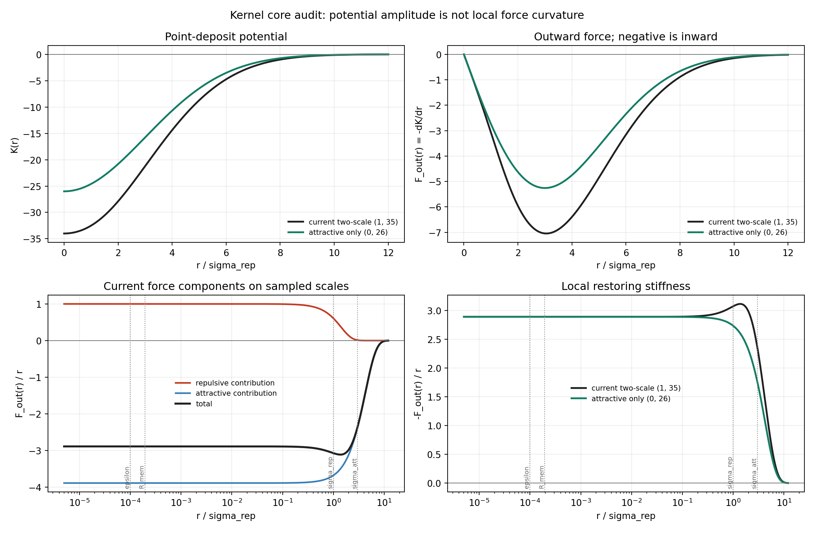

# Kernel Core Audit

Date: 2026-07-18T22:04:33Z.

## Question

Does the current `A_rep=1`, `A_att=35`, `sigma_rep=1`,
`sigma_att=3` kernel implement the intended narrow self-avoidance core?
The comparison removes the repulsive component while preserving the
point-deposit restoring curvature exactly.

## Analytic comparison

| kernel | A_rep | A_att | K(0) | restoring curvature | g/update | g/memory time |
| --- | ---: | ---: | ---: | ---: | ---: | ---: |
| current two-scale (1, 35) | 1.000000 | 35.000000 | -34.000000 | 2.888889 | 0.433333 | 43.333333 |
| attractive only (0, 26) | 0.000000e+00 | 26.000000 | -26.000000 | 2.888889 | 0.433333 | 43.333333 |

- `A_rep/A_att = 0.028571` in potential amplitude.
- `(A_rep/sigma_rep^2)/(A_att/sigma_att^2) = 0.257143` in local force curvature.
- Current near-origin force is repulsive: `False`.
- The sampled memory radius is only `1.941630e-04 sigma_rep`.
- Curvature-matched attractive-only amplitude: `26.000000`.

## Decision

The narrow positive Gaussian is not an active repulsive core in the
current compact branch. It subtracts about 26% of the attractive local
curvature, while the trajectory samples only the common Taylor regime.
`A_rep=0, A_att=26` is therefore the correct matched ablation. This
analytic result does not yet establish dynamical equivalence; that is
the purpose of the seed-matched regime scan.

## Provenance

- Git revision: `99d91cd11cad5791a54321941bf389c94c7ab8c0`
- Git status: `clean`
- Script: `experiments/current/kernels/kernel_core_audit.py`
