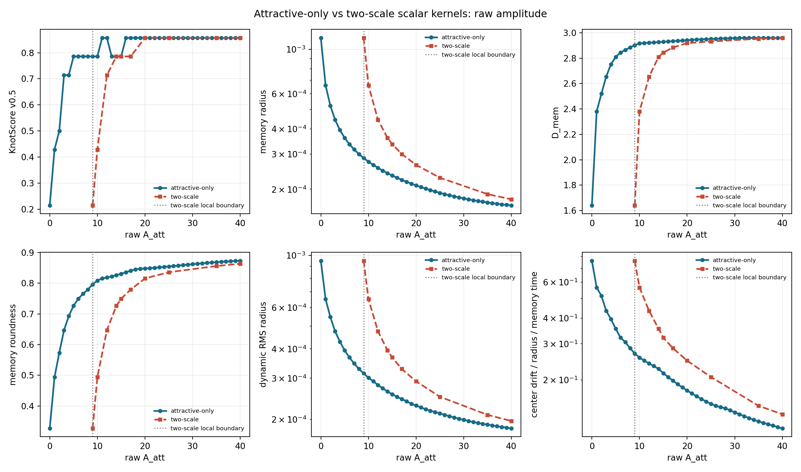
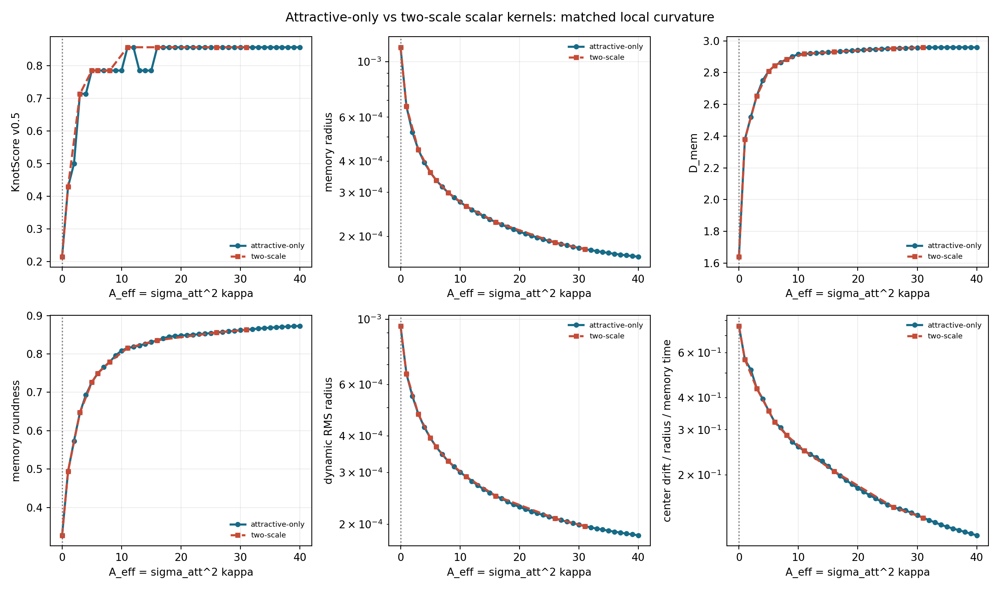

# Scalar Kernel Family Comparison

Date: 2026-07-19T09:25:36Z.

## Scope

Seed-matched comparison at `N=300,000`, `d=3`,
`epsilon=0.0001`, `eta=0.15`, `lambda=0.01`,
`M0=1`, delta deposition, and seeds
`1,2,3,4,5`.

The attractive-only family uses `A_rep=0`. The two-scale family uses
`A_rep=1`, `sigma_rep=1`, and
`sigma_att=3`. Local-curvature matching gives

```text
A_eff = sigma_att^2 kappa
      = A_att - 9
```

for the two-scale branch. The raw-amplitude plot shows the horizontal
offset; the effective-amplitude plot tests curve collapse at equal local
restoring curvature.





## Matched support points

| A_eff | A_att one-scale | A_att two-scale | score one | score two | dyn R one | dyn R two | D_mem one | D_mem two |
| ---: | ---: | ---: | ---: | ---: | ---: | ---: | ---: | ---: |
| 0 | 0 | 9.0000 | 0.2143 | 0.2143 | 9.5007e-04 | 9.5005e-04 | 1.6406 | 1.6406 |
| 1.0000 | 1.0000 | 10.0000 | 0.4286 | 0.4286 | 6.5201e-04 | 6.5200e-04 | 2.3800 | 2.3800 |
| 3.0000 | 3.0000 | 12.0000 | 0.7143 | 0.7143 | 4.7519e-04 | 4.7519e-04 | 2.6539 | 2.6539 |
| 5.0000 | 5.0000 | 14.0000 | 0.7857 | 0.7857 | 3.9419e-04 | 3.9419e-04 | 2.8094 | 2.8094 |
| 6.0000 | 6.0000 | 15.0000 | 0.7857 | 0.7857 | 3.6766e-04 | 3.6766e-04 | 2.8439 | 2.8439 |
| 8.0000 | 8.0000 | 17.0000 | 0.7857 | 0.7857 | 3.2846e-04 | 3.2846e-04 | 2.8835 | 2.8835 |
| 11.0000 | 11.0000 | 20.0000 | 0.8571 | 0.8571 | 2.9098e-04 | 2.9098e-04 | 2.9181 | 2.9181 |
| 16.0000 | 16.0000 | 25.0000 | 0.8571 | 0.8571 | 2.5001e-04 | 2.5001e-04 | 2.9309 | 2.9309 |
| 26.0000 | 26.0000 | 35.0000 | 0.8571 | 0.8571 | 2.0934e-04 | 2.0934e-04 | 2.9527 | 2.9527 |
| 31.0000 | 31.0000 | 40.0000 | 0.8571 | 0.8571 | 1.9710e-04 | 1.9710e-04 | 2.9580 | 2.9580 |

## Seed-paired collapse for A_eff >= 1

| KPI | pairs | median relative difference | max relative difference |
| --- | ---: | ---: | ---: |
| KnotScore v0.5 | 45 | 0 | 0 |
| memory radius | 45 | 7.3957e-08 | 4.5197e-06 |
| D_mem | 45 | 6.0292e-09 | 4.8478e-06 |
| memory roundness | 45 | 2.0495e-08 | 6.3725e-06 |
| dynamic RMS radius | 45 | 7.1458e-08 | 3.3674e-06 |
| center drift / radius / memory time | 45 | 6.8528e-08 | 3.9015e-06 |

## Threshold reading

The first sampled `KnotScore >= 0.75` crossing is
raw `A_att=5` (`A_eff=5`) for the attractive-only curve and
raw `A_att=14` (`A_eff=5`) for the two-scale support points. This is a
descriptive score crossing, not a phase transition or force-sign
boundary.

The analytic local restoring boundary is `A_att=0` for the
attractive-only family and `A_att=9` for the two-scale
family. The historical `A_att~=7.9` drift flip was measured at
`epsilon=0.03` with force-direction observables. It must not be
translated into an attractive-only threshold near six.

## Decision

- Compare scalar families on `A_eff` or `kappa`, not raw `A_att`.
- Keep `A_rep` available as an ablation, but do not treat it as
  identified by the current compact branch.
- Do not launch another raw-amplitude threshold search from this
  comparison. Continue with the fixed-`g`, variable-`R/L` gate.

## Provenance

- Active family cases represented: `100`
- Summed active per-case compute time: `1197.08 s`
- Current invocation: `0.35 s`
- Git revision: `3eb0352496969c6f0592fa02a02ee07665e871e7`
- Git status: `clean`
- Single-family source revision: `8ef72230353a421a603f1aa8b5555ce4dcdd0df7`
