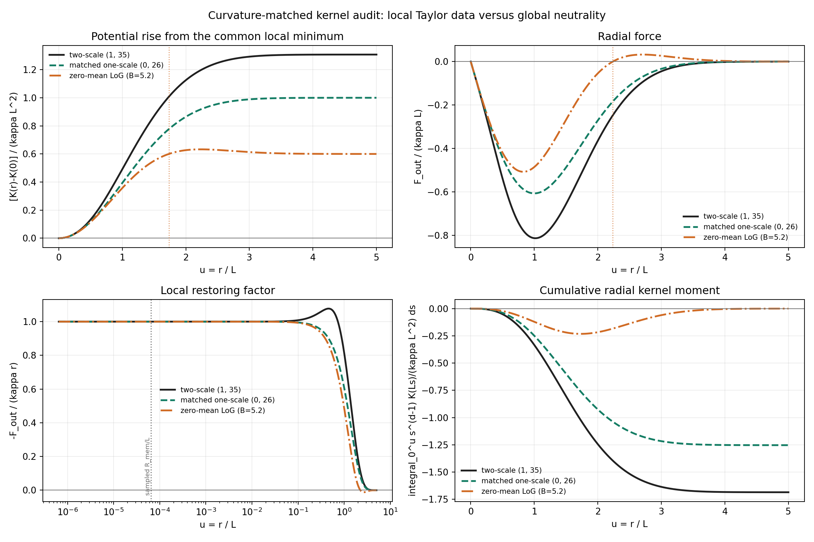

# LoG / Taylor Kernel Audit

Date: 2026-07-28T21:28:11Z.

## Question

Can a Laplacian-of-Gaussian (LoG) provide a minimal decaying,
exactly zero-mean completion of the local Taylor data, and does that
construction determine the previously used amplitudes?

The comparison is analytic. It fixes the local restoring curvature of
the current `(A_rep,A_att)=(1,35)`,
`(sigma_rep,sigma_att)=(1,3)` kernel
and uses `L=sigma_att`. No trajectory is fitted and no amplitude is swept.



## What LoG means here

For `u=r/L`, the tested radial kernel is

```text
K_LoG(r) = B (u^2-d) exp(-u^2/2)
B = kappa L^2/(d+2).
```

It is proportional to the Laplacian of a Gaussian. Therefore it decays,
has `int K_LoG dx=0` exactly, and has the same local Hessian `kappa I`
as the two reference kernels. It is a global regularized completion of
local Taylor information, not a derivation of the fundamental kernel.

## Matched invariants

For `F_out=-kappa r+c3 r^3+O(r^5)`, the table reports
`c3 L^2/kappa`. The radial integral omits the common unit-sphere area;
zero versus nonzero is unchanged.

| family | kappa | c3 L^2/kappa | total radial integral |
| --- | ---: | ---: | ---: |
| two-scale (1, 35) | 2.888889 | -0.884615 | -1.685368 |
| matched one-scale (0, 26) | 2.888889 | 0.500000 | -1.253314 |
| zero-mean LoG (B=5.2) | 2.888889 | 0.700000 | 0 |

All three families agree only through the linear restoring term.
The two-scale kernel has the opposite first nonlinear force correction
from the matched one-scale and LoG kernels. The historical compact
branch samples only `R_mem/L=6.472100e-05`;
at that radius these higher-order differences are not identifiable.

## Where 26, 27, and 36 come from

| quantity | formula | value | interpretation |
| --- | --- | ---: | --- |
| current effective amplitude | `A_att-A_rep q^2` | 26.000000 | exact local-curvature mapping of `(1,35)` to `(0,26)` |
| volume ratio | `q^d` | 27.000000 | geometry of `q=3` in `d=3`; not a fitted coupling |
| raw amplitude if one additionally sets `A_eff=q^d` | `q^d+A_rep q^2` | 36.000000 | gives 36, but the extra equality has no present dynamical derivation |
| zero-mean two-scale attractive amplitude | `A_rep q^(-d)` | 0.037037 | note the inverse 27; incompatible with the current restoring branch |
| LoG polynomial amplitude | `A_eff/(d+2)` | 5.200000 | normalization-dependent coefficient, not 26/27/35/36 |
| LoG central depth | `d A_eff/(d+2)` | 15.600000 | also normalization-dependent |

No invariant in this construction singles out 29. The pair `27/36`
does occur algebraically because `3^3=27` and the q=3 curvature offset
is `3^2=9`, but adding them becomes a model hypothesis, not a result.
The existing amplitude scan found a smooth relaxation branch rather
than a sharp selector at 26, 27, 35, or 36.

## Decision

LoG is worth retaining as one fixed zero-mean null family. It combines
decay, exact global compensation, and a prescribed local curvature in
one scale. It does not explain the historical amplitudes, select d=3,
or add phase, spin, or propagation. A dynamic comparison is justified
only after a trajectory samples radii large enough for the predeclared
cubic-force differences to exceed measurement uncertainty.

## Provenance

- Git revision: `97e559f15d3f447bb73a8e1829fee667e6f8263c`
- Git status before generation: `clean`
- Script: `experiments/current/kernels/log_taylor_kernel_audit.py`
