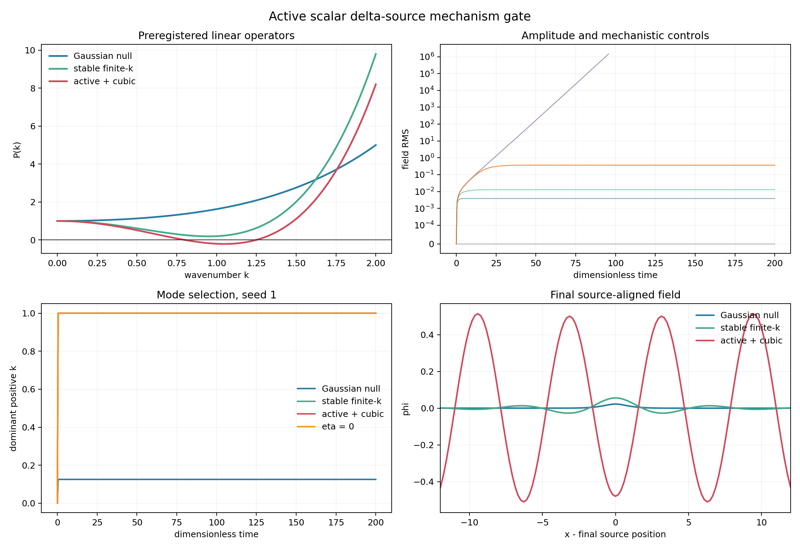

# Active scalar delta-source field pilot

Generated: `2026-07-30T22:58:25.733642+00:00`

## Question

Can the preregistered local scalar delta-source field produce a numerically converged, bounded finite-wavenumber pattern that separates from cubic-off and source-off controls?

## Fixed model

`d_t phi = -[1+a2(-d_x^2)+a4 d_x^4]phi - u phi^3 + s delta_L(x-X_t); dX_t = -eta d_x phi(X_t)dt + epsilon dW_t`

Periodic 1D pseudo-spectral ETD1; the delta source uses every retained Fourier mode and has no fitted deposition width.

The six arms were fixed before execution: Gaussian-null, stable
finite-k, active finite-k with positive cubic saturation, cubic-off,
source-off, and eta-zero. No coefficient was fit to these outputs.

## Numerical gate

- time-step low-mode error (`dt=0.05` versus `0.025`): `6.121e-07`;
- grid low-mode error (`N_x=256` versus `512`): `8.540e-11`;
- Gaussian/stable linear stationary errors: `1.773e-15` / `6.799e-15`;
- active steady-equation residual: `4.412e-05`.

Numerical pass: `True`. The explicit Hermitian projection is part of the real-field integrator; without it an unstable mode can amplify floating-point asymmetry.

## Three-seed comparison

| case | completed | late RMS | late relative change | peak k | half-power width | late source excursion |
|---|---:|---:|---:|---:|---:|---:|
| `gaussian_null` | 3/3 | 0.003825 | 6.436e-09 | 0.125 | 0.625 | 0.01251 |
| `stable_finite_k` | 3/3 | 0.01292 | 9.268e-08 | 1 | 0.125 | 0.01269 |
| `active_finite_k` | 3/3 | 0.3617 | 4.559e-06 | 1 | 0 | 0.01005 |
| `cubic_off` | 0/3 | 1.5e+05 | 116.1 | 1 | 0 | 151.6 |
| `source_off` | 3/3 | 0 | n/a | 0 | 0 | 0.01249 |
| `eta_zero` | 3/3 | 0.3687 | 7.528e-06 | 1 | 0 | 0.01249 |

## Decision

- bounded active amplitude: `True`;
- cubic-off discrimination: `True`;
- source-off null: `True`;
- finite-wavenumber peak: `True`;
- late visible-source bound: `True`;
- eta-zero field-pattern similarity: `True`;
- exploratory feedback phase relocation: `True`;
- classical finite-wavenumber mechanism gate: `True`.

The active operator produces a bounded peak near the predicted
finite wavenumber, while the same unstable linear operator without
the cubic term grows until the safety stop. Source-off remains
exactly zero. This is a positive result for the proposed classical
pattern-forming mechanism.

The eta-zero arm forms essentially the same field amplitude and
wavenumber, so the finite-k pattern does not require visible trajectory
readout. Exploratorily, readout changes the source-field phase from
approximately zero to approximately pi and relocates the source by
about half a wavelength before late-time pinning. This was not a
preregistered gate and is neither an oscillation nor a metastable
multidimensional knot.

## Claim boundary

- Evidence: numerically converged classical finite-k pattern
  formation with a delta source and cubic saturation.
- Inference: the local field law is a viable mechanism candidate
  for later coupled-node tests.
- Not established: ambient 3D selection, quantized states, spin,
  QFT, particle identity, or a physical field law.

## Provenance

- Git revision before generation: `a63e52a6f93db4d90e307114186a10e686348b65`
- Git status before generation: `M docs/reference/experiment_catalog.md
 M docs/reference/repository_map.md
 M docs/status/current_status.md
 M docs/status/paper_claims.md
 M docs/status/project_priorities.md
 M experiments/current/dimensions/dimension_over_n_reproduction.py
 M figures/README.md
 M reports/README.md
 M reports/dimensions/n_scaling/dimension_over_n_d10_A35_2026-07-30.md
 M reports/dimensions/n_scaling/dimension_over_n_d10_A35_summary_2026-07-30.json
 M src/emergenz_knoten/__init__.py
 M tests/test_dimension_over_n_reproduction.py
?? experiments/current/kernels/field/active_scalar_delta_field_pilot.py
?? figures/draft/kernels/field_2026-07-31/
?? reports/kernels/field/active_scalar_delta_field_pilot_2026-07-31.json
?? reports/kernels/field/active_scalar_delta_field_pilot_2026-07-31.md
?? src/emergenz_knoten/active_scalar_field.py
?? src/emergenz_knoten/measurement_stability.py
?? tests/test_active_scalar_delta_field_pilot.py
?? tests/test_active_scalar_field.py
?? tests/test_measurement_stability.py`
- Script: `experiments/current/kernels/field/active_scalar_delta_field_pilot.py`
- Machine-readable summary: [active_scalar_delta_field_pilot_2026-07-31.json](active_scalar_delta_field_pilot_2026-07-31.json)
