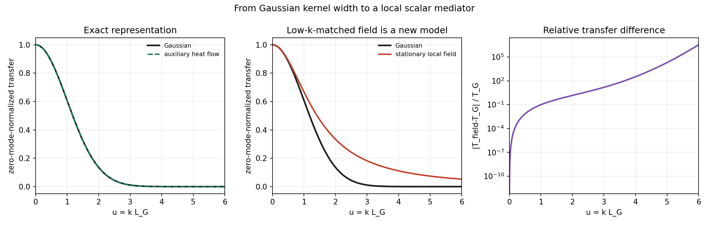

# Field-Equation Bridge

Date: 2026-07-18T22:05:17Z.

## Exact statement for the current Gaussian

A Gaussian convolution of width `L_G` is exactly the heat-semigroup
snapshot

```text
partial_s u = D Delta u,    u(0)=rho,
phi = u(s_G),               s_G=L_G^2/(2D).
```

This auxiliary coordinate `s` is a mathematical kernel construction,
not yet physical update time or finite-speed propagation.



## Candidate local mediator

```text
tau_phi partial_t phi = D_phi Delta phi - mu_phi phi + g_phi rho.
```

Its stationary Fourier-space Green transfer is
`g_phi/(mu_phi+D_phi k^2)` and its correlation length is
`L_phi=sqrt(D_phi/mu_phi)`. Matching the Gaussian only through order
`k^2` gives `L_phi=L_G/sqrt(2)`.

| quantity | value |
| --- | ---: |
| Gaussian width L_G | 3 |
| exact heat time s_G | 4.5 |
| matched field length L_phi | 2.1213203 |
| exact heat representation max error | 1.665e-16 |
| field/Gaussian max abs error, kL<=0.5 | 6.392e-03 |
| field/Gaussian max abs error, kL<=1 | 6.014e-02 |
| field/Gaussian max abs error, kL<=3 | 2.036e-01 |

## Decision

The current Gaussian already has an exact local heat-flow generator
in an auxiliary smoothing coordinate. Promoting the interaction to a
physical relaxation-diffusion field is nevertheless a model change:
the stationary Green transfer agrees only at long wavelengths. The
field state must therefore be added to the Markov state and validated
against knot and response controls before replacing the kernel.
A hyperbolic/telegraph field is deferred until finite propagation is
actually tested.

## Provenance

- Git revision: `cc5fde949b7f263066e49e021fc4eb2a84e5b51b`
- Git status: `clean`
- Script: `experiments/current/kernels/field_equation_bridge.py`
