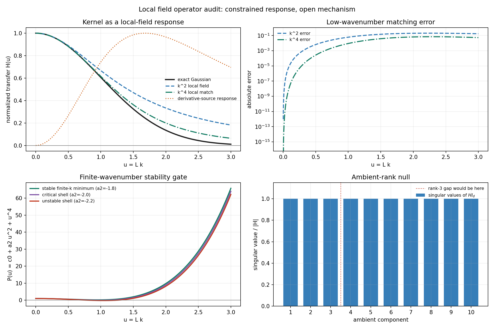

# Local Field Operator Audit

Date: 2026-07-28T22:23:12Z.

## Question

Can the arbitrary radial kernel be replaced by a systematic local
field expansion under the assumptions already used by the project,
and which coefficient would constitute the first genuinely new
pattern-forming mechanism?

This is a fixed analytic audit. It performs no parameter fit, stochastic
simulation, knot claim, or quantization step.



## Assumptions and restricted basis

The inherited assumptions are translation invariance, O(d) isotropy,
spatially parity-even scalar response, a local Markov field state, the
existing memory source rho, and gradient readout by the visible
trajectory. The restricted audit keeps the homogeneous linear operator
through four spatial derivatives, the first derivative-source correction,
and local powers through cubic order:

```text
tau d_t phi = -c0 phi + c2 Delta phi - c4 Delta^2 phi - v phi^2 - u phi^3 + s0 rho - s2 Delta rho
H(k,0) = (s0+s2 k^2)/(c0+c2 k^2+c4 k^4)
```

A Taylor expansion of a radial K(r) would only describe the near field.
This derivative expansion instead defines a local field law whose Green
response is the effective kernel.
It is not the complete EFT operator basis: higher source derivatives,
mixed field-gradient nonlinearities, and cross-component fields are
deliberately omitted until an observable requires them.
Spatial parity does not forbid v*phi^2. The symmetric subfamily v=0
would be an explicit extra null assumption, not a result of the current
model.

## What the current Gaussian already fixes

For u=Lk, the exact normalized Gaussian is
`exp(-u^2/2)=1-u^2/2+u^4/8+O(u^6)`. The current relaxation-diffusion
bridge matches only the quadratic term. Adding the lowest stabilizing
fourth derivative gives the rational match
`1/(1+u^2/2+u^4/8)`, which agrees through order u^4.

| range | k^2 field max error | k^4 field max error |
| --- | ---: | ---: |
| u<=0.5 | 0.006392 | 2.617181e-04 |
| u<=1 | 0.060136 | 0.008854 |

This fixes a low-k approximation, not the exact global kernel. A
derivative-only source sets s0=0 and therefore H(0)=0 exactly, showing
that zero mean is a source/operator constraint rather than an amplitude
selected by the random walk.

## First open mechanism

Write the dimensionless linear denominator as
`P(u)=1+a2 u^2+u^4`. For a2<0 its minimum occurs at
`u_*=sqrt(-a2/2)` and has value `1-a2^2/4`.

| case | u_* | minimum P | classification |
| --- | ---: | ---: | --- |
| a2=-1.8 | 0.948683 | 0.190000 | stable_finite_wavenumber_minimum |
| a2=-2.0 | 1.000000 | 0 | critical_finite_wavenumber |
| a2=-2.2 | 1.048809 | -0.210000 | finite_wavenumber_instability |

The sign change a2<0 is not implied by the Gaussian baseline. It is
the first explicit new mechanism: anti-diffusive growth around a
finite wave-number shell, stabilized in the ultraviolet by the
fourth derivative. Beyond the critical value a positive cubic term
can bound growth. A quadratic term is also allowed unless an internal
sign symmetry is added; neither term guarantees localized knots,
discrete branches, or quantized states.

## Ambient-rank null

Applying the same scalar transfer independently to every ambient
component gives `T=H I_d` and `S_out=|H|^2 S_in`. In the fixed
d=10 audit the input/output ranks are
`10/10` and all normalized
transfer singular values equal one. There is no eigengap after
component three. Thus this operator family cannot select three
directions without a cross-component order parameter or another
symmetry-breaking mechanism.

## Decision

1. Treat K_eff as the response of a local augmented field rather than
   as a freely scanned radial function.
2. Retain the k^2 and k^4 Gaussian matches as linear null families.
3. Do not infer the sign a2<0, either nonlinear coefficient, dimension
   three, or quantization from the random walk or existing compact
   branch.
4. If a new dynamic pilot is opened, vary no kernel amplitudes. Test
   exactly one finite-k field law with v=0 declared as a symmetric
   null, against positive-a2, cubic-off, source-off, and eta-zero
   controls with fixed coefficients across seeds. Primary observables
   must be the field spectral peak and
   width, branch/gap persistence, source-to-field closure, and knot
   shape bounds.

A positive pilot would establish classical pattern-forming branches,
not QFT or quantization. Quantized language remains blocked until
isolated seed-stable branches, spectral gaps, and controlled
transition rules are demonstrated.

## Provenance

- Git revision: `0d9aa63be7727770ce6527366df68dbcf8cec41b`
- Git status before generation: `clean`
- Script: `experiments/current/kernels/field/local_field_operator_audit.py`
