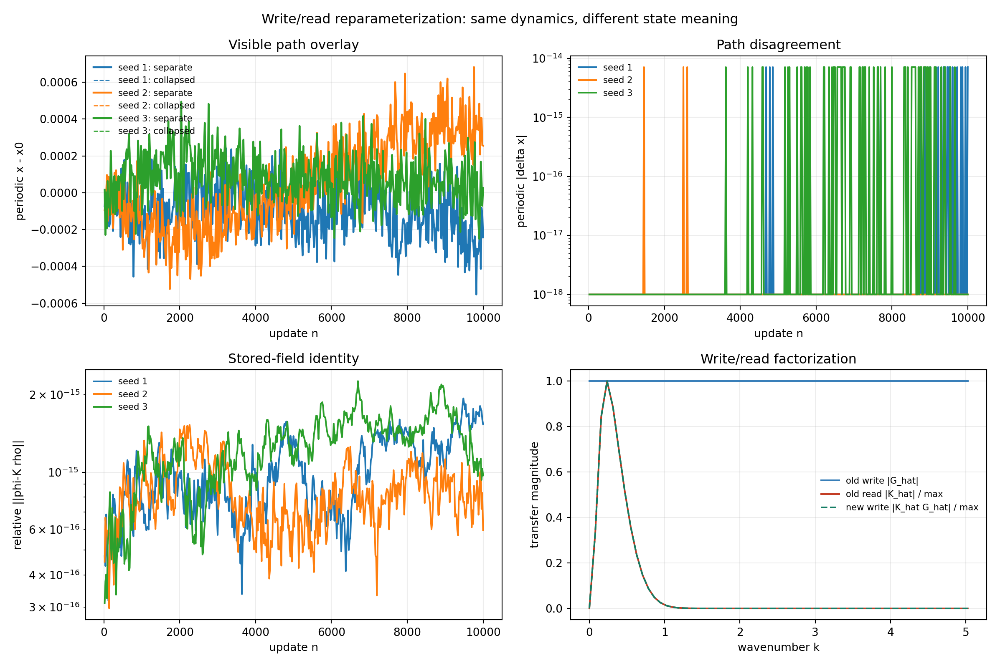

# Write/Read Reparameterization Audit

Date: 2026-07-29T23:41:30Z.

## Question

Can the separate linear interaction kernel be moved into the write
operation without changing the visible stochastic dynamics?



## Structural identity

For a translation-invariant linear write G and read K,

```text
rho_(n+1) = q rho_n + beta G_(x_(n+1)),
phi_n = K*rho_n.
```

Defining the signed stored field `phi=K*rho` gives

```text
phi_(n+1) = q phi_n + beta (K*G)_(x_(n+1)).
```

The read operation is then convolution with the Dirac delta, not with
the spatially constant function one. A constant kernel retains only the
zero Fourier mode and therefore has exactly zero spatial gradient.

## Fixed numerical audit

- status: **structural**
- seeds: `[1, 2, 3]`; updates per seed: `10000`
- maximum periodic path error: `7.105427e-15`
- maximum relative stored-field error: `2.254640e-15`
- maximum gradient error: `1.426669e-14`
- constant-kernel gradient: `0.000000e+00`
- preregistered numerical tolerance: `1.0e-10`

## Interpretation

The collapse is an exact linear reparameterization. It simplifies the
state semantics from a non-negative occupancy memory plus read kernel to
a generally signed potential memory with identity readout. It does not
make the field self-dynamic and does not create a new knot mechanism.

A genuinely active field is the next separate model extension: its
update must include a local field operator and, if tested, nonlinear
saturation. The deposition should begin as a delta source so that the
resolved field scale is selected by the field law rather than written in
by a broad source mollifier.

## Claim boundary

This audit proves factorization non-identifiability for the current
linear translation-invariant scalar model. It establishes neither
field self-organization, vector memory, chirality, strings, quantization,
nor dimension selection.

## Provenance

- Git revision: `44f8c3fa9d1828082923f493751b18d7228c4e5f`
- Git status before generation: `clean`
- Script: `experiments/current/kernels/write_read_reparameterization_audit.py`
