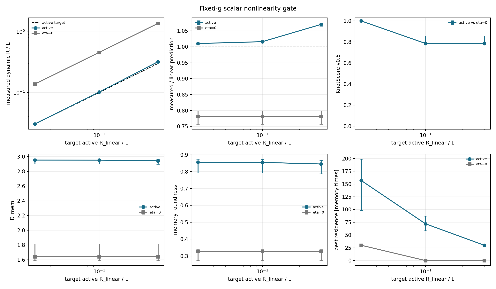

# Fixed-g Scalar Nonlinearity Gate

Date: 2026-07-19T09:55:59Z.

## Scope

Attractive-only scalar kernel with `A_att=26`,
`L=sigma_att=3`, `eta=0.15`,
`lambda=0.01`, `M0=1`, `d=3`,
`N=300,000`, delta deposition, and seeds
`1,2,3,4,5`. Only `epsilon` changes.
It is chosen by inverting the finite-memory linear radius so that
`R_linear/L` equals the pre-registered target.

Retained horizon `H=600`, retained mass
`M_stored=0.9975950`, and retained
restoring strength `g=0.4322912`.

## Pre-registered decision rule

A nonlinear candidate requires at least a 20% median endpoint change
in the seed-paired normalized active radius, the same sign in at least
80% of seeds, and one independent median change: KnotScore >=0.10,
D_mem >=0.25, roundness >=0.10, or residence by a factor >=2.
Linear-compatible requires median absolute radius departure <=10%,
at least 80% of seeds within 20%, and no independent threshold crossing.
Everything else is inconclusive.

## Active results

| target R/L | epsilon | force-curvature loss | measured R/L | measured/pred | score | D_mem | roundness | residence |
| ---: | ---: | ---: | ---: | ---: | ---: | ---: | ---: | ---: |
| 0.0300 | 0.0434 | 4.4990e-04 | 0.0303 | 1.0103 | 1.0000 | 2.9526 | 0.8556 | 156.8750 |
| 0.1000 | 0.1447 | 0.0050 | 0.1016 | 1.0161 | 0.7857 | 2.9518 | 0.8547 | 72.0000 |
| 0.3000 | 0.4341 | 0.0440 | 0.3211 | 1.0704 | 0.7857 | 2.9429 | 0.8450 | 30.0000 |

## Eta-zero controls

| target axis | epsilon | measured R/L | measured/pred | D_mem | roundness | residence |
| ---: | ---: | ---: | ---: | ---: | ---: | ---: |
| 0.0300 | 0.0434 | 0.1375 | 0.7816 | 1.6406 | 0.3274 | 30.0000 |
| 0.1000 | 0.1447 | 0.4583 | 0.7816 | 1.6406 | 0.3274 | 0 |
| 0.3000 | 0.4341 | 1.3748 | 0.7816 | 1.6406 | 0.3274 | 0 |

## Seed-paired endpoint scaling

| seed | active normalized departure | active exponent | control departure | control exponent | delta score | delta D_mem | delta roundness | log2 residence ratio |
| ---: | ---: | ---: | ---: | ---: | ---: | ---: | ---: | ---: |
| 1 | 0.0630 | 1.0265 | 2.2204e-16 | 1.0000 | -0.1429 | -0.0045 | -0.0046 | -2.3866 |
| 2 | 0.0542 | 1.0229 | -1.0103e-14 | 1.0000 | -0.1429 | -0.0340 | -0.0350 | -1.7137 |
| 3 | 0.0586 | 1.0247 | 2.2204e-16 | 1.0000 | 0 | -0.0097 | -0.0106 | -0.6215 |
| 4 | 0.0624 | 1.0263 | -1.1102e-16 | 1.0000 | -0.2143 | -0.0044 | -0.0068 | -2.7266 |
| 5 | 0.0682 | 1.0286 | -1.8874e-15 | 1.0000 | -0.2143 | -0.0059 | -0.0115 | -2.9449 |

## Decision

Classification: **inconclusive**.

Median signed endpoint radius departure: `0.0624`.
Median absolute endpoint radius departure: `0.0624`.
Same-sign seeds: `5`; seeds within 20%: `5`.

This gate tests departure from the local scalar reduction. It does
not by itself establish metastability, particle identity, or a
physical length calibration.

## Provenance

- Git revision: `3a6bb5b69e2a41732dec0689eedba8486ada305e`
- Git status: `clean`
- Invocation elapsed: `203.45 s`
