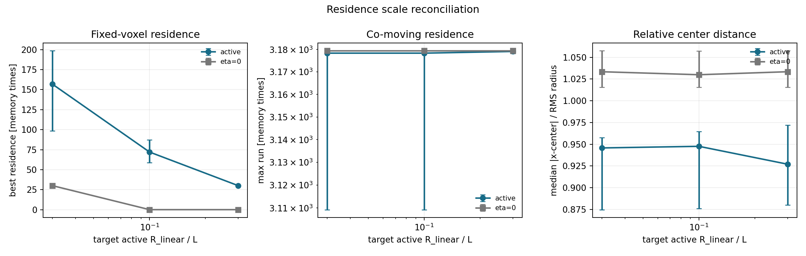

# Fixed-g Residence Scale Reconciliation

Date: 2026-07-19T10:05:02Z.

## Scope

This is a post-hoc measurement audit of the pre-registered fixed-g
run. It does not replace its `inconclusive` classification. It asks
whether the supporting KnotScore/residence changes are independent
of the deliberately changed trajectory radius.

## Voxel scale audit

| target R/L | predicted R | fixed voxel sizes / predicted R |
| ---: | ---: | --- |
| 0.0300 | 0.0900 | 5.5556, 11.1111, 22.2222 |
| 0.1000 | 0.3000 | 1.6667, 3.3333, 6.6667 |
| 0.3000 | 0.9000 | 0.5556, 1.1111, 2.2222 |

## Scale-aware observables

| condition | target R/L | fixed-voxel residence | co-moving max run | co-moving inside fraction | median distance/RMS radius |
| --- | ---: | ---: | ---: | ---: | ---: |
| baseline | 0.0300 | 156.8750 | 3178.3700 | 1.0000 | 0.9457 |
| baseline | 0.1000 | 72.0000 | 3178.3700 | 1.0000 | 0.9476 |
| baseline | 0.3000 | 30.0000 | 3179.1250 | 1.0000 | 0.9270 |
| eta_zero | 0.0300 | 30.0000 | 3179.4000 | 1.0000 | 1.0335 |
| eta_zero | 0.1000 | 0 | 3179.4000 | 1.0000 | 1.0300 |
| eta_zero | 0.3000 | 0 | 3179.4000 | 1.0000 | 1.0335 |

## Reading

Pre-registered classification: **inconclusive**.
Post-hoc reading: **weak_smooth_correction_without_metastable_transition**.

The endpoint radius departure is `0.0624`.
Median absolute D_mem and roundness changes are `0.0059` and `0.0106`.
The active co-moving max-run log2 change is `0`.

Fixed-voxel residence is strongly radius-dependent here. The
co-moving residence is stable, but it is equally saturated for
the eta=0 controls and is therefore not discriminating. KnotScore
v0.5 includes fixed-voxel residence and voxel-stability components;
its endpoint drop is not independent evidence for a new regime.
The seed-stable 6% superlinear radius growth is consistent with a
weak smooth finite-Gaussian correction; no shape transition or
metastable branch is isolated by this gate.

## Decision

Do not launch another scalar amplitude or epsilon sweep from this
result. Keep the attractive-only scalar model as a controlled
relaxation baseline and advance the separately defined dynamic-field
pilot. Future variable-scale scores must normalize spatial bins or
report their scale dependence explicitly.

## Provenance

- Git revision: `5c40d7bbd77faed6a96dcd4a7733df23704edecf`
- Git status: `clean`
- Source summary: `reports/kernels/nonlinearity/fixed_g_RL_d3_N300k_A26_2026-07-19.json`
