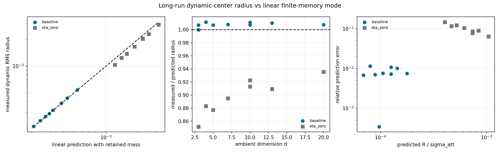

# Linear Long-Run Reconciliation

Date: 2026-07-19T09:34:48Z.

## Scope

Existing dynamic-center traces are compared with the scalar linear
relative-mode radius. No new long simulation is used. The active-force
prediction uses the actually retained finite memory mass
`M_stored=M0(1-(1-lambda)^H)` rather than silently assuming an infinite
memory buffer.

## Baseline slices

| N | d | A_att | seeds | H | M_stored | measured R | predicted R | measured/predicted | rel error | R/sigma_att |
| ---: | ---: | ---: | ---: | ---: | ---: | ---: | ---: | ---: | ---: | ---: |
| 30,000,000 | 3 | 20.0000 | 5 | 600 | 0.9975950 | 2.9157e-04 | 2.9167e-04 | 0.9997 | 3.4494e-04 | 9.7224e-05 |
| 30,000,000 | 3 | 35.0000 | 5 | 600 | 0.9975950 | 2.0874e-04 | 2.0731e-04 | 1.0069 | 0.0069 | 6.9105e-05 |
| 30,000,000 | 4 | 35.0000 | 5 | 600 | 0.9975950 | 2.4215e-04 | 2.3939e-04 | 1.0115 | 0.0115 | 7.9795e-05 |
| 30,000,000 | 5 | 35.0000 | 5 | 600 | 0.9975950 | 2.6952e-04 | 2.6764e-04 | 1.0070 | 0.0070 | 8.9214e-05 |
| 30,000,000 | 7 | 35.0000 | 5 | 600 | 0.9975950 | 3.1910e-04 | 3.1668e-04 | 1.0076 | 0.0076 | 1.0556e-04 |
| 30,000,000 | 10 | 35.0000 | 5 | 600 | 0.9975950 | 3.8258e-04 | 3.7850e-04 | 1.0108 | 0.0108 | 1.2617e-04 |
| 30,000,000 | 13 | 35.0000 | 5 | 600 | 0.9975950 | 4.3593e-04 | 4.3156e-04 | 1.0101 | 0.0101 | 1.4385e-04 |
| 30,000,000 | 20 | 35.0000 | 5 | 600 | 0.9975950 | 5.3933e-04 | 5.3528e-04 | 1.0076 | 0.0076 | 1.7843e-04 |
| 300,000,000 | 10 | 35.0000 | 5 | 600 | 0.9975950 | 3.8125e-04 | 3.7850e-04 | 1.0073 | 0.0073 | 1.2617e-04 |

## Eta-zero controls

| N | d | seeds | measured R | predicted R | measured/predicted | rel error |
| ---: | ---: | ---: | ---: | ---: | ---: | ---: |
| 30,000,000 | 3 | 5 | 0.0010 | 0.0012 | 0.8515 | 0.1485 |
| 30,000,000 | 4 | 5 | 0.0012 | 0.0014 | 0.8831 | 0.1169 |
| 30,000,000 | 5 | 5 | 0.0014 | 0.0016 | 0.8771 | 0.1229 |
| 30,000,000 | 7 | 5 | 0.0017 | 0.0019 | 0.8948 | 0.1052 |
| 30,000,000 | 10 | 5 | 0.0020 | 0.0022 | 0.9224 | 0.0776 |
| 30,000,000 | 13 | 5 | 0.0023 | 0.0025 | 0.9091 | 0.0909 |
| 30,000,000 | 20 | 5 | 0.0029 | 0.0031 | 0.9355 | 0.0645 |
| 300,000,000 | 10 | 5 | 0.0020 | 0.0022 | 0.9128 | 0.0872 |

## Reading

Across `9` active long-run slices the median
relative radius error is `0.0076`
and the maximum is `0.0115`.
The retained-mass correction is reported explicitly, although it is
small for the stored horizons used here.

The eta-zero controls have a median relative error of
`0.0981` and a
maximum of `0.1485`.
The formula is therefore an accurate active-branch benchmark, not an
exact implementation identity for every trace estimator and finite
memory condition. The next gate must also test seed-paired scaling
ratios rather than relying on absolute radius error alone.

The old `N=300M`, `d=3`, `epsilon=0.03` campaign is not included in
the numerical radius test: its committed report has no compatible
dynamic-center RMS radius and the raw source paths were external.
This is a provenance gap, not evidence for or against nonlinearity.

## Decision

- The available small-radius long runs remain consistent with the
  linear finite-memory relative mode across N and ambient dimension.
- Their duration does not by itself upgrade compactness to nonlinear
  metastability.
- Proceed to the pre-registered fixed-g, variable-R/sigma test. A
  nonlinear claim requires systematic radius, shape, residence, or
  mode deviations there.

## Provenance

- Git revision: `429c7e03ac6d2ccacefe80f779e04b347a0f3c00`
- Git status: `clean`
- Source directories: `9`
