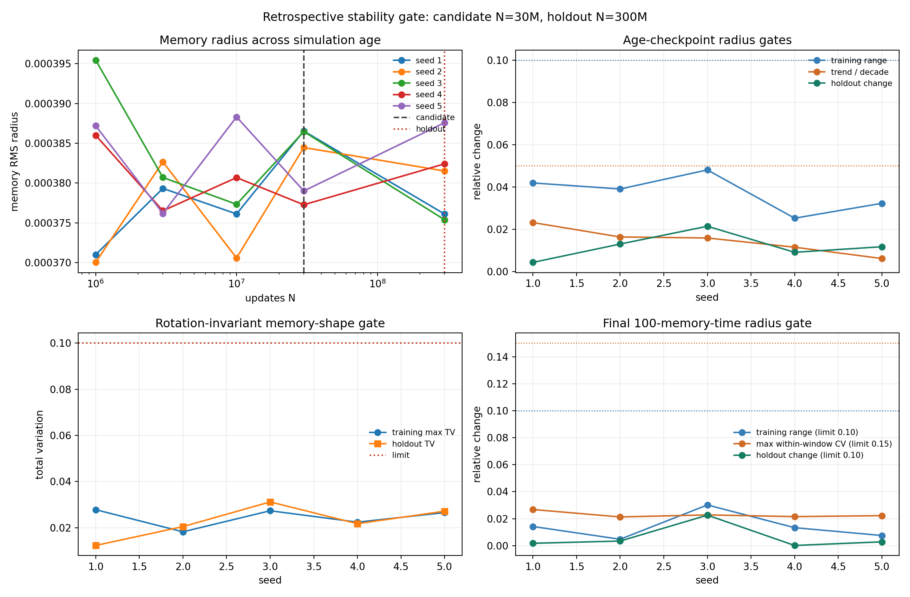

# Checkpoint Stability Gate: d=10, A_att=35

Date: 2026-07-30T20:49:32Z.

## Question

Do four age checkpoints through N=30M predict a stable radius and rotation-invariant memory shape at an untouched N=300M holdout?

## Preregistered-style gate

- Four age checkpoints: `N={1M,3M,10M,30M}`.
- Untouched late holdout: `N=300M`.
- Radius training range `<=0.10`; radius CV `<=0.15`.
- Absolute radius trend per decade `<=0.05`.
- Rotation-invariant shape-spectrum TV `<=0.10`.
- Final local trace: four 20-memory-time windows plus one holdout.

The numerical tolerances reuse the existing v0.6 radius and shape limits;
the per-decade trend and separated holdout prevent a slow monotone drift
or a short terminal plateau from being accepted as convergence.

## Result

- status: **supported_method_conditional**
- checkpoint gate: `5/5` seeds
- local radius gate: `5/5` seeds
- provisional combined gate: `5/5` seeds

| seed | train radius range | trend/decade | holdout radius | train shape TV | holdout shape TV | local range | local max CV | pass |
| ---: | ---: | ---: | ---: | ---: | ---: | ---: | ---: | --- |
| 1 | 0.0419 | 0.0231 | 0.0043 | 0.0278 | 0.0123 | 0.0142 | 0.0268 | True |
| 2 | 0.0390 | 0.0163 | 0.0130 | 0.0182 | 0.0205 | 0.0047 | 0.0213 | True |
| 3 | 0.0480 | 0.0158 | 0.0214 | 0.0273 | 0.0312 | 0.0301 | 0.0228 | True |
| 4 | 0.0252 | 0.0115 | 0.0091 | 0.0224 | 0.0217 | 0.0133 | 0.0215 | True |
| 5 | 0.0323 | 0.0061 | 0.0117 | 0.0265 | 0.0272 | 0.0075 | 0.0222 | True |

## Interpretation

The existing five-seed slice supports a **retrospective provisional**
statement: a candidate accepted at N=30M remains within the fixed
radius and rotation-invariant endpoint-shape limits at N=300M.
This does not show that formation first occurs at N=30M; it is only
the first fully testable candidate under the available checkpoint
schedule.

The final contiguous trace spans only 100 memory times and contains
time-resolved radius but no time-resolved shape tensor. It therefore
cannot exclude slower breathing or shape cycles. The result is not yet
an automatic stopping rule and is not evidence for a physical particle.

## Forward stopping rule

1. Save resumable states at a geometric schedule such as
   `N0*{1,3,10,30,100,...}` without changing parameters.
2. At every checkpoint record a contiguous monitoring block with
   radius and normalized shape eigenvalues.
3. Declare a candidate only after four checkpoints spanning at least
   one decade pass the fixed radius, trend, and shape limits.
4. Continue the same seed to a holdout at least three times later.
5. Stop that seed only if both the age holdout and a local
   radius-plus-shape window gate pass; otherwise extend it.
6. Report every planned seed. A parameter-set claim requires the rule
   to pass seedwise, not only after pooling.

## Claim boundary

- No first-formation time is identified.
- No time-resolved shape stationarity is established by the legacy data.
- No metastable attractor, particle stability, or dimension selection
  follows from this gate.

## Provenance

- Git revision: `737ef47c4aa74921bb41431f7a5d845f2a0d62ce`
- Git status before generation: `clean`
- Script: `experiments/current/dynamics/stability_gate_audit.py`
