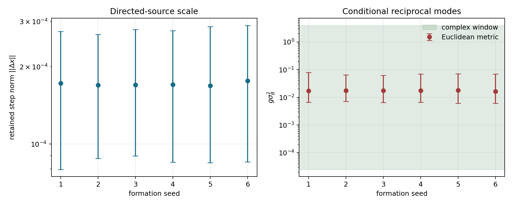

# Adjoint-reciprocity eligibility audit

Generated: 2026-08-07T09:24:49.572257+00:00

Status: **eligibility pass; physical closure unresolved**.

## Question

Can the already implemented normalized directed deposition support complex
local modes if one adds a metric-adjoint reciprocal backchannel? This is an
eligibility test of a new closure, not evidence that the passive model already
contains that backchannel.

## Proposed discrete closure

\[x_{n+1}=x_n-\sqrt g B^\dagger h_n,\qquad h_{n+1}=q h_n+\sqrt g B x_{n+1}.\]

For each metric singular value \(\sigma_B\),

\[\mu^2-(1+q-g\sigma_B^2)\mu+q=0.\]

The mode is complex exactly when

\[(1-\sqrt q)^2<g\sigma_B^2<(1+\sqrt q)^2.\]

For the normalized step direction, the tested local forward Jacobian is

\[B=\frac{\kappa}{\|\Delta x\|}(I-u u^\top).\]

It has one longitudinal zero mode and d-1 degenerate transverse modes. That
degeneracy permits a rotational plane but does not select ambient d=3.

## Fixed inputs

- lambda = `0.01`; q = `0.99`
- kappa = `0.01`
- inherited coupling = `5.079e-06`
- exact dimensionless complex window = `2.51258e-05..3.97997`
- baseline visible and memory metrics are Euclidean

The coupling was fixed in an earlier one-way response calibration. It is not
independently calibrated for this new reciprocal closure.

## Seed results

| seed | median step | q10..q90 step | median g sigma_B^2 | complex fraction | stable fraction |
|---:|---:|---:|---:|---:|---:|
| 1 | 0.000172542 | 7.96678e-05..0.000274641 | 0.0170603 | 1.0000 | 1.0000 |
| 2 | 0.00016939 | 8.80326e-05..0.000267331 | 0.0177012 | 1.0000 | 1.0000 |
| 3 | 0.000169817 | 8.99158e-05..0.000279118 | 0.0176123 | 1.0000 | 1.0000 |
| 4 | 0.000170366 | 8.50853e-05..0.000276542 | 0.0174989 | 1.0000 | 1.0000 |
| 5 | 0.000168574 | 8.45102e-05..0.000286927 | 0.017873 | 0.9983 | 0.9983 |
| 6 | 0.000176232 | 8.52867e-05..0.000289657 | 0.0163534 | 1.0000 | 1.0000 |

## Controls and interpretation

- Seed-median step ratio: `1.0454` against `<= 1.1`.
- Minimum Euclidean complex fraction: `0.9983` against `>= 0.95`.
- Replacing normalized direction by a raw linear step source is outside the complex window for every seed.
- Rescaling the memory metric by 1e-3 or 1e3 moves the median mode below or above the complex window.
- The Euclidean calculation is therefore kinematically eligible but not metric-identifiable.

## Claim boundary

**Evidence:** mature snapshots have a reproducible step scale; under the fixed
Euclidean candidate closure almost all transverse local modes lie in the exact
complex window.

**Inference:** reciprocal memory can generate a damped second-order mode without
adding an independent angular-frequency parameter once B, its metric and one
overall gain are specified.

**Not established:** the passive model does not determine the adjoint backchannel,
the memory metric or its relative normalization. No oscillation, inertia, angular
momentum, spin, d=3 selection or physical parameter has been observed here.

## Next falsifying gate

Derive or preregister one memory metric from an independent field energy or noise
covariance, with no seedwise normalization. Then linearize the complete update on
held-out time segments and require its predicted frequency and damping to match a
closed nonlinear pilot. Without that metric closure, a reciprocal simulation would
be a tunable model demonstration rather than parameter self-selection.

## Provenance

- Git revision before generated outputs: `94b4cdc61094cfeb6bbaeba6507744022766e480`
- Git status before generated outputs: `clean`
- Seed 1: `data/processed/long_run_metastability/raw_memory_snapshot_retest_Aatt35_N3M_d3_seed1-5_2026-07-16/case_baseline_seed1_steps3000000.json`, SHA-256 `10c8650d40d1fff01c2bc7aa6d4661f271acff35fe9395dfc101e6448d746614`
- Seed 2: `data/processed/long_run_metastability/raw_memory_snapshot_retest_Aatt35_N3M_d3_seed1-5_2026-07-16/case_baseline_seed2_steps3000000.json`, SHA-256 `41e5def5bee92feebd204ac89ab2566ac2960af0d6933f09129251f12e361188`
- Seed 3: `data/processed/long_run_metastability/raw_memory_snapshot_retest_Aatt35_N3M_d3_seed1-5_2026-07-16/case_baseline_seed3_steps3000000.json`, SHA-256 `882721c56e67ed90e3c937d54223c1bdb6e4dcb970877edf3a267e9ab9919816`
- Seed 4: `data/processed/long_run_metastability/raw_memory_snapshot_retest_Aatt35_N3M_d3_seed1-5_2026-07-16/case_baseline_seed4_steps3000000.json`, SHA-256 `7e7b0949b45e14413ee6901fe5e3a9a657e4a30e2b1401679d3f7e1e08b9bc6e`
- Seed 5: `data/processed/long_run_metastability/raw_memory_snapshot_retest_Aatt35_N3M_d3_seed1-5_2026-07-16/case_baseline_seed5_steps3000000.json`, SHA-256 `a3f41aebf2673c3cbffc38d163f0e448d505565605a730f41bddf269382730f1`
- Seed 6: `data/processed/long_run_metastability/raw_memory_snapshot_retest_Aatt35_N3M_d3_seed6_2026-07-22/case_baseline_seed6_steps3000000.json`, SHA-256 `ecdec2a7324bba2b2047c224b15e6ec80414b29503c927b9a94f7da73b408217`
