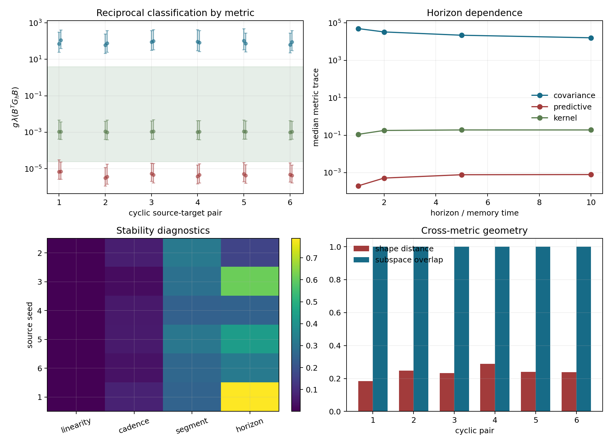

# Carrier memory metric comparison

Generated: 2026-08-07T22:56:27.744560+00:00

Status: **metric reconciliation fail** (0/6 pairs; 5 required).

## Scope

This audit compares three metrics on the same reduced carrier feature
\(h=p_n\in\mathbb R^3\). It does not claim a metric on the complete
Markov state \((x,\rho,p,m)\). The predictive metric uses an independent
probe knot and the already fixed one-way readout, so it does not assume the
new reciprocal backchannel that it is intended to constrain.

## Metrics

\[G_{\rm cov}=\operatorname{Cov}(p)^+,\]
\[G_{\rm pred}(T)=\sum_{\tau\le T}w_\tau J_\tau^T J_\tau/R_T^2,\]
\[G_{\rm kernel}(T)=\sum_{\tau\le T}w_\tau\|\delta m_\tau\|_{\mathcal H_K}^2 I.\]

Here \(J_\tau=\partial x^{(T)}_{n+\tau}/\partial p_n\) is measured by
central finite differences. Covariance null directions are retained as null
through a truncated pseudoinverse; no ridge is allowed to create stiffness.

## Fixed design

- cyclic pairs: `[(1, 2), (2, 3), (3, 4), (4, 5), (5, 6), (6, 1)]`
- horizons in memory times: `[1.0, 2.0, 5.0, 10.0]`
- cadences: `[1, 5, 10]` updates
- segments: `2`
- inherited gain: `5.079e-06`; no retuning
- distance: `2.5 R_pair`; sigma: `2.5 R_source`

## Pair decisions

| target<-source | linearity | cadence scale | segment shape | horizon scale | cross shape | subspace | min dominance | metric signatures | pass |
|---|---:|---:|---:|---:|---:|---:|---:|---|---|
| 1<-2 | 7.03e-10 | 0.0649 | 0.32 | 0.163 | 0.184 | 1 | 0.872 | `unstable; mixed; complex` | fail |
| 2<-3 | 1.16e-09 | 0.0261 | 0.292 | 0.611 | 0.247 | 1 | 0.931 | `unstable; overdamped; complex` | fail |
| 3<-4 | 2.15e-09 | 0.0539 | 0.244 | 0.247 | 0.233 | 1 | 0.925 | `unstable; overdamped; complex` | fail |
| 4<-5 | 2.18e-09 | 0.0558 | 0.313 | 0.436 | 0.289 | 1 | 0.929 | `unstable; overdamped; complex` | fail |
| 5<-6 | 5.11e-10 | 0.0396 | 0.264 | 0.323 | 0.24 | 1 | 0.92 | `unstable; overdamped; complex` | fail |
| 6<-1 | 2.1e-09 | 0.0748 | 0.25 | 0.789 | 0.238 | 1 | 0.925 | `unstable; overdamped; complex` | fail |

## Observed separation

At the final horizon and base cadence, across both segments: covariance=unstable 12/12; predictive=mixed 1/12, overdamped 11/12; kernel=complex 12/12.
The finite-difference linearity and predictive cadence gates pass in all pairs,
but the cross-metric classification gate fails in all pairs. This separates a
numerically resolved probe response from the unresolved absolute metric scale.

## Interpretation

A common transverse support is partly structural because the normalized-direction
Jacobian has rank two in d=3. Subspace overlap alone is therefore not evidence for
an emergent metric. Scale, anisotropy, segment stability and held-out classification
must agree as well.

A reconciliation pass would nominate a reduced effective metric for a nonlinear
holdout pilot; it would not establish microscopic geometry. A fail means that the
Euclidean reciprocal eligibility result is representation- or normalization-sensitive
and must not be promoted to an inertia or oscillation result.

## Claim boundary

The one-way readout, its Gaussian width and the carrier update remain model inputs.
The covariance metric is observational, the predictive metric is probe-conditional,
and the RKHS metric inherits the chosen Gaussian kernel. None is fundamental by itself.

## Provenance

- Analysis revision: `2bd08981ad8b0e7a3bcefe4848b0b7998a9a3455`
- Worktree at start: `clean`
- target 1 <- source 2: `data/processed/long_run_metastability/raw_memory_snapshot_retest_Aatt35_N3M_d3_seed1-5_2026-07-16/case_baseline_seed2_steps3000000.json` and `data/processed/long_run_metastability/raw_memory_snapshot_retest_Aatt35_N3M_d3_seed1-5_2026-07-16/case_baseline_seed1_steps3000000.json`
- target 2 <- source 3: `data/processed/long_run_metastability/raw_memory_snapshot_retest_Aatt35_N3M_d3_seed1-5_2026-07-16/case_baseline_seed3_steps3000000.json` and `data/processed/long_run_metastability/raw_memory_snapshot_retest_Aatt35_N3M_d3_seed1-5_2026-07-16/case_baseline_seed2_steps3000000.json`
- target 3 <- source 4: `data/processed/long_run_metastability/raw_memory_snapshot_retest_Aatt35_N3M_d3_seed1-5_2026-07-16/case_baseline_seed4_steps3000000.json` and `data/processed/long_run_metastability/raw_memory_snapshot_retest_Aatt35_N3M_d3_seed1-5_2026-07-16/case_baseline_seed3_steps3000000.json`
- target 4 <- source 5: `data/processed/long_run_metastability/raw_memory_snapshot_retest_Aatt35_N3M_d3_seed1-5_2026-07-16/case_baseline_seed5_steps3000000.json` and `data/processed/long_run_metastability/raw_memory_snapshot_retest_Aatt35_N3M_d3_seed1-5_2026-07-16/case_baseline_seed4_steps3000000.json`
- target 5 <- source 6: `data/processed/long_run_metastability/raw_memory_snapshot_retest_Aatt35_N3M_d3_seed6_2026-07-22/case_baseline_seed6_steps3000000.json` and `data/processed/long_run_metastability/raw_memory_snapshot_retest_Aatt35_N3M_d3_seed1-5_2026-07-16/case_baseline_seed5_steps3000000.json`
- target 6 <- source 1: `data/processed/long_run_metastability/raw_memory_snapshot_retest_Aatt35_N3M_d3_seed1-5_2026-07-16/case_baseline_seed1_steps3000000.json` and `data/processed/long_run_metastability/raw_memory_snapshot_retest_Aatt35_N3M_d3_seed6_2026-07-22/case_baseline_seed6_steps3000000.json`
