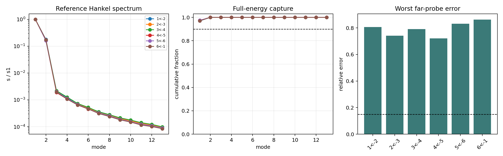

# Balanced full-memory feature gate

Date: 2026-08-10.

**Decision: `fail`.**

This is a balanced reduction test of the passive deposited oriented memory, not an oscillation search.

## Pair gates

| target<-source | rank | internal cosine | far error | tail SE | flat equivalent | shuffled equivalent | geometry-specific | pass |
|---|---:|---:|---:|---:|---|---|---|---|
| 1<-2 | 1 | 0.999 | 0.807 | 2.24e-09 | True | True | False | False |
| 2<-3 | 1 | 0.999 | 0.741 | 2.33e-09 | True | True | False | False |
| 3<-4 | 1 | 0.999 | 0.79 | 2.58e-09 | True | True | False | False |
| 4<-5 | 1 | 1.000 | 0.721 | 1.84e-09 | True | True | False | False |
| 5<-6 | 1 | 1.000 | 0.831 | 2.11e-09 | True | True | False | False |
| 6<-1 | 1 | 1.000 | 0.862 | 2.16e-09 | True | True | False | False |

## Ensemble

- passing pairs: `0/6`;
- geometry-specific pairs: `0/6`;
- common rank: `None`;
- minimum cross-pair principal cosine: `0`;
- descriptive actual-geometry rank across all pairs: `1`;
- descriptive minimum cross-pair cosine: `0.9997`;
- actual energy-fraction range: `0.9657..0.9779`;
- actual gap-ratio range: `5.309..6.653`;
- far-holdout error range: `0.5013..0.8622`;
- minimum actual/control cosine: `0.9999`.

## Interpretation boundary

The near readout has a highly reproducible rank-one mode, but the same mode is reproduced by both controls and fails the independent far readout. It is generic exponential delay/readout compression, not a spatially transferable knot mode. Gain, lambda and oscillation optimization remain blocked.

Complex values in the earlier eligibility calculation remain algebraic pole classifications under a chosen metric. This report does not call them observed temporal oscillations.

## Reproducibility

- revision: `5505331492f28c089b1154a4b4b34eca397e056a`;
- schema: `emergenz-knoten.balanced-full-memory-feature-gate.v1`;
- JSON: `reports/memory/closure/balanced_full_memory_feature_gate_2026-08-10.json`.
