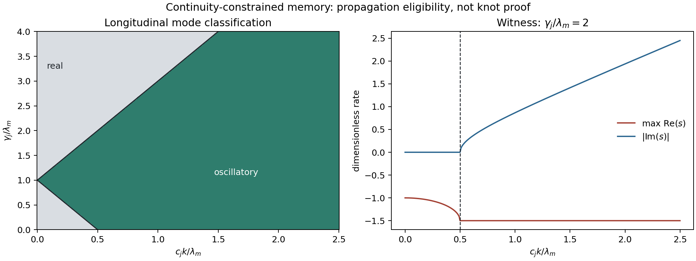

# Continuity-constrained memory gate

Date: 2026-08-11. Status: **structural pass with unresolved force balance**.

## Question

Can the scalar memory acquire a phase-bearing local transport mechanism without
assigning a charge label, a preferred direction, or separate self/cross
kernels?

## Proposed minimal extension

The canonical deposition remains

\[
\rho_{n+1}-\rho_n=\lambda_m\left[M_0G_\sigma(\cdot-x_{n+1})-\rho_n\right].
\]

At stationary total memory mass its innovation has zero monopole and the first
moment

\[
\int y\,(\rho_{n+1}-\rho_n)(y)\,dy
=\lambda_mM_0(x_{n+1}-\bar x_n^\rho).
\]

This signed innovation is derived from the existing update; it is not a new
charge. Its block sum telescopes to \(\rho_{n+B}-\rho_n\), so a bounded
stationary memory has no persistent DC source.

The new proposal is a local memory flux \(\mathbf j\):

\[
\partial_t\rho=-\lambda_m\rho-\nabla\!\cdot\mathbf j+S_x,
\qquad
\partial_t\mathbf j=-\gamma_j\mathbf j-c_j^2\nabla\rho.
\]

For one longitudinal Fourier mode,

\[
(s+\lambda_m)(s+\gamma_j)+c_j^2k^2=0.
\]

It is oscillatory exactly when

\[
2c_jk>|\lambda_m-\gamma_j|.
\]

The current direction is constrained by transport and O(d) covariance rather
than assigned per knot. Nevertheless \(\mathbf j\), \(\gamma_j\), and \(c_j\)
are new model content and are not derived from the scalar long runs.

## Registered identities

| Gate | Result |
|---|---|
| `stationary_innovation_zero_monopole` | pass |
| `innovation_first_moment_identity` | pass |
| `block_innovation_telescopes` | pass |
| `dispersion_roots_match_operator` | pass |
| `threshold_separates_real_and_complex` | pass |
| `zero_stiffness_remains_real` | pass |

Maximum root error: `0.000e+00`. Telescoping error:
`8.882e-16`.

## Decision

This is the preferred **P3.8a analytic extension** because it introduces no
external sign, handedness, node species, boundary, or separate cross geometry.
It supplies a falsifiable propagation/phase threshold and a compulsory
first-order null control (`c_j=0`).

It does **not** yet authorize a coupled simulation:

1. continuity does not cancel the nonzero affine pair force found in P3.7b;
2. the minimal law couples only the longitudinal current; transverse current
   decays and therefore supplies no spin mode;
3. it remains O(d)-covariant and cannot select three dimensions;
4. a common source/readout energy must still make deposition and trajectory
   backreaction reciprocal without independently tuned gains.

The next calculation is therefore an energy-consistent density-current
coupling and its affine equilibrium/limit-cycle gate. Only a simultaneous
force-balance and stable-mode pass permits one short pilot. A kernel, gain,
lambda, or noise sweep remains blocked.

## Reproducibility

- Script: `experiments/current/memory/closure/continuity_constrained_memory_gate.py`
- Package: `src/emergenz_knoten/continuity_memory.py`
- Git revision before generated changes: `4835da6762dabdb19a34e85faaf32a2c9a7b40d9`
- Generated: `2026-08-11T20:34:49.404910+00:00`
