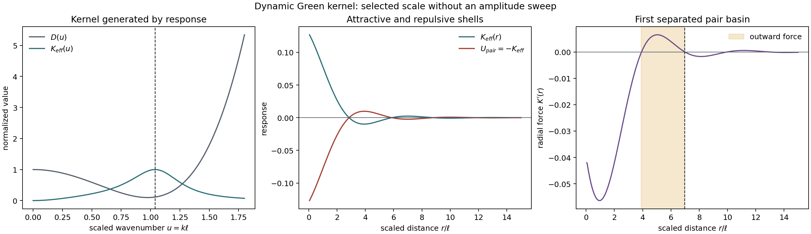

# Dynamic Green-kernel selection gate

Date: 2026-08-11. Status: **structural pass, model candidate only**.

## Correction and question

An attractive near field and repulsive outer shell can preserve individual
nodes while preventing sufficiently separated identical nodes from merging.
It does not by itself guarantee one finite pair distance: a static two-scale
law commonly gives merger on one side of a force crossing and unbounded
separation on the other. The earlier compensated three-scale pilot already
constructed an outer repulsive shell at about `10.91 sigma_rep`, but did not
test reciprocal two-node dynamics.

Can the shell shape and its scale instead arise as the response of the
continuity-constrained memory field, with one common write/read coupling?

## Common-energy response

Let the longitudinal constitutive stiffness be

\[
D(k)=a+b k^2+c k^4,
\qquad a,c>0.
\]

For reciprocal gradient coupling, eliminating the linear memory field gives

\[
\widehat K_{\rm eff}(k,\omega)
=\frac{g^2 k^2}
{(-i\omega+\lambda_m)(-i\omega+\gamma_j)+k^2D(k)}.
\]

The same `g` writes and reads the field, hence `g^2`; independent source and
readout amplitudes are absent. The gradient pair supplies
`K_eff(0,omega)=0`, so the spatial integral vanishes without balancing raw
Gaussian amplitudes.

With

\[
\ell=(c/a)^{1/4},\quad
u=k\ell,\quad
\delta=\frac b{\sqrt{ac}},\quad
\mu=\frac{\lambda_m\gamma_j\sqrt c}{a^{3/2}},\quad
r_\gamma=\frac{\gamma_j}{\lambda_m},
\]

the static denominator is

\[
P(u)=\mu+u^2+\delta u^4+u^6.
\]

Thus five dimensional coefficients reduce to a length/rate normalization and
three dimensionless shape groups. The response-selected scale is not supplied:
for `y_*=u_*^2` it solves

\[
2y_*^3+\delta y_*^2-\mu=0.
\]

## Fixed existence witness

The fixed witness `delta=-1.9`, `mu=0.3`, `r_gamma=1` is an analytic existence
point, not a fit to knot data. Its constitutive minimum is
`0.0975>0`, so no anti-diffusive or indefinite
quadratic energy was used.

- selected `u_*=1.03869`;
- selected wavelength `2 pi/u_*=6.04916`;
- first point-source pair barrier at `r/ell=3.8812`;
- first finite separated minimum of `U_pair=-K_eff` at
  `r/ell=6.96281`.

## Registered gates

| Gate | Result |
|---|---|
| `dimensionless_reduction_exact` | pass |
| `constitutive_energy_positive` | pass |
| `static_denominator_positive` | pass |
| `selected_mode_oscillatory` | pass |
| `analytic_peak_matches_grid` | pass |
| `gain_free_peak_inference_recovers_groups` | pass |
| `gradient_channel_zero_mode` | pass |
| `direct_channel_nonzero_mode_control` | pass |
| `common_gain_sign_invariant` | pass |
| `real_space_sign_changing_shells` | pass |
| `shell_signs_cutoff_robust` | pass |
| `finite_separation_energy_minimum_exists` | pass |

## What is and is not self-selected

Selected by the field response: effective kernel shape, zero integral,
preferred wavelength, shell positions and the linear point-source pair
landscape.

Not selected: `delta`, `mu`, `r_gamma`, the absolute length/time units and the
overall coupling. A simulation cannot determine constants that do not have an
update law. Promoting them to arbitrary adaptive variables would only move the
kernel choice into an adaptation rule.

The defensible coarse-graining route is identification rather than tuning.
Let `kappa_y=-d_y^2 log H(y)|_* > 0` for `y=u^2`. Then the unknown overall
gain cancels and

\[
\delta
=\frac{y_*[6-\kappa_y(1+3y_*^2)]}{2(\kappa_y y_*^2-1)},
\qquad
\mu=2y_*^3+\delta y_*^2.
\]

Consequently:

1. peak position and local log curvature estimate `delta,mu` jointly;
2. temporal damping and frequency at the same peak estimate
   `gamma_j/lambda_m` and test the dispersion relation;
3. a calibrated weak response fixes the remaining gain;
4. estimates must agree across seeds, blocks, resolutions and independent
   pair response before they are called effective parameters.

## Decision and next test

P3.8b passes as an analytic candidate. It gives a single-law route to local
attraction, outer repulsive shells, a finite separated linear pair basin and
phase-bearing temporal modes. It does not establish nonlinear knot formation,
basin accessibility, stability under noise, parameter universality, or `d=3`.

Next, and only next, run one matched two-node pilot using mature frozen states:

- arm A: the already fixed compensated static outer-shell kernel;
- arm B: this fixed dynamic Green field;
- controls: cross-off, reversible/flux-off and direct non-gradient source;
- fixed separations below the barrier, in the outward-force interval, at the
  predicted finite minimum and beyond it;
- primary outcomes: signed centre acceleration, bounded separation, source
  and target shape bounds, energy/work balance and agreement with the
  independently predicted shell radii.

No kernel-amplitude sweep or adaptive coefficient law is authorized.

## Reproducibility

- Script: `experiments/current/memory/closure/dynamic_green_kernel_selection_gate.py`
- Package: `src/emergenz_knoten/continuity_memory.py`
- Git revision before generated changes: `902c7ad4b9e925431df1689fd7f0bdcef000a873`
- Generated: `2026-08-11T21:38:40.068219+00:00`
