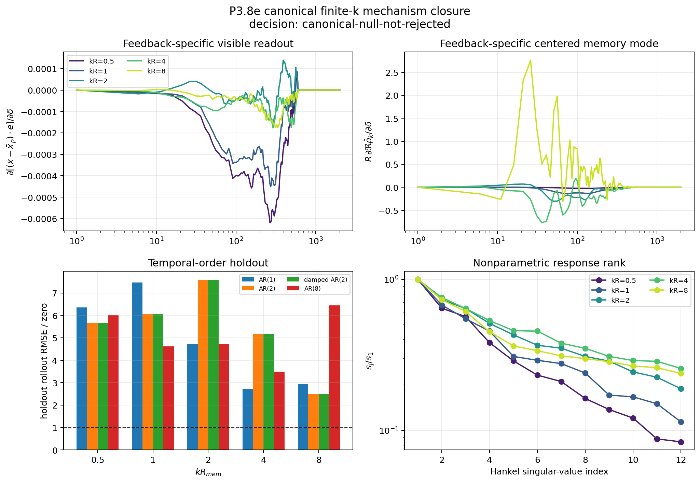

# P3.8e canonical finite-k mechanism-closure gate

Date: 2026-08-13.

## Verdict

The canonical null is not rejected. The feedback-specific finite-`k`
responses do not yet require a stable underdamped second temporal state
on held-out times. P3.8d therefore remains a constructed extension, not
an emergent reduction of the tested scalar `(x,rho)` dynamics.

## Registered intervention and readout

For a mature retained path `r_j`, fixed direction `e` and registered
wavenumber `kR_mem`, the paired initial states use

\[r_j^{\pm}=r_j\pm\delta\,e\,f_k(r_j),\qquad \sum_jw_jf_k(r_j)=0,\qquad f_k(r_0)=0.\]

Thus mass, memory weights, visible state `x=r_0`, and the weighted memory
centroid are unchanged at intervention. The branches then follow the
unchanged canonical simulator with common random numbers. The fixed
projection contains `(x-xbar_rho).e` and the real and imaginary parts of
the centered scalar-memory Fourier coefficient at the same `k`. No target
frequency, P3.8d pole, inertia, or cross-node law enters the experiment.

The primary response is `active - eta_zero`. Five `kR_mem` values are
measured; `kR=2` is withheld from any later dispersion fit. The two paired
strengths test central-difference linearity. `k=0` remains only the uniform
identity-pipeline control.

## Controls

| diagnostic | value | registered gate | pass |
|---|---:|---:|:---:|
| uniform immediate identity error | 2.949e-13 | <=1e-10 | yes |
| eta-zero final modal response | 0.000e+00 | <=1e-8 | yes |
| strength-linearity error, median / max | 0.001 / 0.001 | <=0.10 / <=0.25 | yes |
| feedback-specific norm / active norm, median | 1.162 | >=0.05 | yes |
| maximum branch radius-ratio change | 0.006 | <=0.10 | yes |
| cross-k diagonal response fraction, median | 0.921 | diagnostic | -- |

## Temporal-order holdout

Every recurrence is fitted to the same standardized panel of five formation
seeds, three fixed coordinate directions and three predeclared readouts.
The score below is recursive chronological holdout RMSE divided by the
zero-response null; it is not a teacher-forced one-step score.

| kR | AR(1) | AR(2) | damped AR(2) | delay | AR(2) poles | gate |
|---:|---:|---:|---:|---:|---|:---:|
| 0.5 | 6.360 | 5.652 | 5.652 | 6.015 | 0.954+0i, 0.723+0i | fail |
| 1 | 7.463 | 6.057 | 6.057 | 4.616 | 0.857+0.0347i, 0.857-0.0347i | fail |
| 2 | 4.726 | 7.592 | 7.592 | 4.711 | 0.835+0.159i, 0.835-0.159i | fail |
| 4 | 2.728 | 5.175 | 5.175 | 3.487 | 0.708+0.197i, 0.708-0.197i | fail |
| 8 | 2.928 | 2.499 | 2.499 | 6.450 | 0.739+0i, 0.167+0i | fail |

Temporal channels passing all necessary conditions: **0/5**; registered requirement: at least 4/5.

The damped AR(2) restriction is only a necessary temporal condition for a
passive reciprocal realization. A positive storage metric and collocated
power-conjugate write/read ports would still have to be established after
a temporal pass.

## Formation-age check

The same seed is evaluated at `N=3e6` and `N=1e8`. These rows are an
age-stationarity diagnostic, not independent seed replication.

| case | kR | response norm | AR(2) rollout / zero | poles |
|---|---:|---:|---:|---|
| N3000000_seed1 | 0.5 | 4.849e-01 | 4.974 | 0.93+0i, 0.703+0i |
| N3000000_seed1 | 1 | 1.898e+00 | 6.487 | 0.854+0.113i, 0.854-0.113i |
| N3000000_seed1 | 2 | 6.846e+00 | 6.389 | 0.795+0.166i, 0.795-0.166i |
| N3000000_seed1 | 4 | 1.817e+01 | 1.871 | 0.623+0.133i, 0.623-0.133i |
| N3000000_seed1 | 8 | 3.835e+01 | 1.496 | 0.806+0i, -0.133+0i |
| N100000000_seed1 | 0.5 | 4.495e-01 | 7.075 | 0.954+0i, 0.635+0i |
| N100000000_seed1 | 1 | 2.013e+00 | 9.359 | 0.844+0.041i, 0.844-0.041i |
| N100000000_seed1 | 2 | 6.248e+00 | 9.060 | 0.86+0.205i, 0.86-0.205i |
| N100000000_seed1 | 4 | 1.562e+01 | 5.259 | 0.712+0.31i, 0.712-0.31i |
| N100000000_seed1 | 8 | 3.497e+01 | 2.537 | 0.774+0i, -0.0348+0i |

## Figure

## Interpretation boundary

- **Evidence:** paired responses, exact passive-memory extinction, strength
  linearity, recursive holdout errors and Hankel spectra from the canonical
  scalar simulator.
- **Inference allowed only after a pass:** a second predictive effective
  state may be useful up to similarity transformation.
- **Not established here:** microscopic momentum, an `(m,p)` field, a
  cross-node mediator, passivity, quantization, spin, particle identity or
  dimension selection.

## Provenance

- Git revision: `2ecc081aa5e361e2af5452584d664044056e3e42`.
- Git status at execution: `clean`.
- Command: `python experiments/current/memory/closure/emergent_modal_state_gate.py`.
- Machine-readable summary: [emergent_modal_state_gate_2026-08-13.json](emergent_modal_state_gate_2026-08-13.json)
- Lossless response archive: [emergent_modal_state_gate_2026-08-13.responses.npz](emergent_modal_state_gate_2026-08-13.responses.npz) (`6ac46eb4d1c12a0f3a8fd6e6211ea57491d1d0b36259a227a6ca13b9028881e1`).
- Source checkpoints and SHA-256 digests are recorded in the JSON summary.
