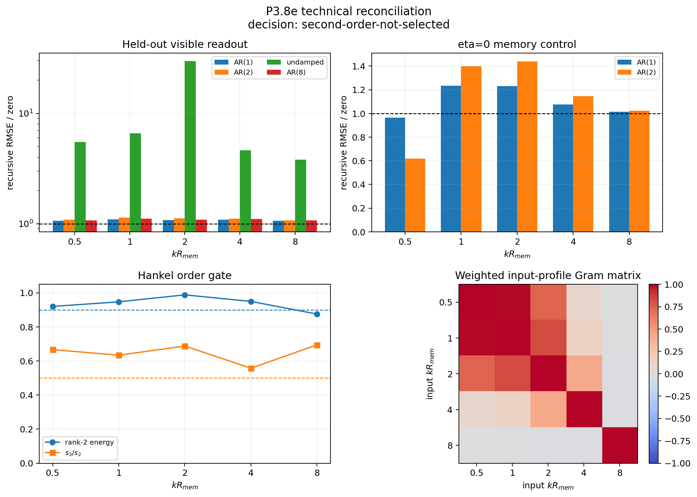

# P3.8e technical reconciliation

Date: 2026-08-14.

## Verdict

Historical composite decision: **`second-order-not-selected`**.
Scientific classification: **`null-not-rejected-memory-holdout-limited`**.

The historical P3.8e decision is superseded as
`superseded-methodologically-inconclusive`. Its raw simulation was not
shown to be wrong; its temporal identification did not implement all review
requirements consistently. This reconciliation does not select an emergent
`(m,p)` state unless at least four of five channels pass every corrected gate.
The result is not a scalar-memory no-go: only 0/5 channels retain both
memory and visible signal under the fixed holdout-energy criterion.

## Split evidence gates

This is a retrospective decomposition of the registered composite gate,
not a post-hoc replacement decision. A failed adequacy check is reported as
`inconclusive`; downstream physical claims are then `blocked` rather than
silently counted as failures.

| gate | status | failed checks | blocked by |
|---|---|---|---|
| `experimental-validity` | **`pass`** | - | - |
| `input-output-identifiability` | **`inconclusive`** | informative_holdout_channels | - |
| `second-state-selection` | **`blocked`** | - | input-output-identifiability |
| `oscillatory-phase-mode` | **`blocked`** | - | second-state-selection |
| `two-node-transfer-channel` | **`not-run`** | - | - |
| `multi-mode-dispersion` | **`blocked`** | - | two-node-transfer-channel |

Diagnostic second-state channels before hierarchy blocking: **0/5**.
Diagnostic oscillatory channels: **0/5**.
The present experiment is therefore measurement-limited before either
physical claim can be decided. P3.8f must first repair the canonical write
port and holdout support; it must not weaken the pole criterion.

## Why AR(2) and 'damped AR(2)' were identical

For an underdamped continuous equation sampled every `Delta`,

\[a_1=2e^{-\gamma\Delta}\cos(\omega_d\Delta),\qquad a_2=-e^{-2\gamma\Delta}.\]

Every stable conjugate-pole real AR(2) has this representation. The old
'damped' fit therefore reparameterized the same two free coefficients and
was not an independent model. The corrected table compares free AR(2) with
the genuinely different undamped constraint `a2=-1`; damping/frequency are
now labels inferred from free poles, not a second fit or pass criterion.

## Review corrections executed

- active and `eta=0` responses are fitted separately; their difference is
  not treated as a transfer function;
- every order uses targets starting at sample 8 and the same 60/40 split;
- the analysis ends at the known 600-update memory horizon, placing held-out
  targets inside the signal-bearing transient; update 800 is extinction-only;
- coefficients are learned from real/imaginary memory Fourier readouts; the
  visible relative coordinate is scored without contributing to the fit;
- rank-two Hankel energy/gap and 4/5 seed replication are decision gates;
- the Hankel matrix now stacks all panel readouts into one output vector;
  only chronological shifts form columns, preventing residue-induced rank;
- the `N=3M` and `N=100M` age pair uses the same future-noise realization;
- the weighted Gram matrix tests whether nominal `kR` inputs are independent;
- full cross-`k` responses remain archived; diagonal leakage is a separate
  diagnostic rather than being silently discarded.

## Numerical controls

| diagnostic | value | pass |
|---|---:|:---:|
| uniform identity error | 2.949e-13 | yes |
| eta-zero extinction at update 800 | 0.000e+00 | yes |
| active strength linearity, median / max | 0.001 / 0.001 | yes |
| active full-mode linearity, median / max | 0.001 / 0.001 | yes |
| eta-zero strength linearity, median / max | 0.001 / 0.001 | yes |
| eta-zero full-mode linearity, median / max | 0.001 / 0.001 | yes |
| maximum radius-ratio disturbance | 0.006 | yes |
| active / feedback cross-k diagonal fraction | 0.904 / 0.929 | diagnostic |

## Corrected temporal comparison

Ratios are recursive held-out visible RMSE divided by its zero null. AR(2)
coefficients are fitted only on memory readouts. `eta0 AR2/AR1` uses the
memory-fit rollout because its visible response is exactly zero.

| kR | AR(1) | AR(2) | undamped | AR(8) | eta0 AR2/AR1 | mem holdout E | vis holdout E | rank-2 energy | s3/s2 | state seeds | osc seeds | poles | state | osc |
|---:|---:|---:|---:|---:|---:|---:|---:|---:|---:|---:|---:|---|:---:|:---:|
| 0.5 | 1.062 | 1.089 | 5.517 | 1.074 | 0.642 | 0.008 | 0.374 | 0.920 | 0.667 | 0/5 | 0/5 | 0.942+0i, 0.2+0i | fail | fail |
| 1 | 1.092 | 1.138 | 6.618 | 1.110 | 1.134 | 0.005 | 0.385 | 0.947 | 0.634 | 0/5 | 0/5 | 0.945+0i, 0.222+0i | fail | fail |
| 2 | 1.080 | 1.119 | 29.756 | 1.085 | 1.168 | 0.002 | 0.422 | 0.988 | 0.688 | 0/5 | 0/5 | 0.949+0i, 0.151+0i | fail | fail |
| 4 | 1.088 | 1.109 | 4.636 | 1.103 | 1.067 | 0.002 | 0.430 | 0.949 | 0.557 | 0/5 | 0/5 | 0.938+0i, 0.221+0i | fail | fail |
| 8 | 1.061 | 1.069 | 3.814 | 1.068 | 1.008 | 0.002 | 0.407 | 0.875 | 0.695 | 0/5 | 0/5 | 0.918+0i, 0.148+0i | fail | fail |

Second-state channels: **0/5**; diagnostic requirement: at least 4/5.
Oscillatory channels: **0/5**; diagnostic requirement: at least 4/5.
Channels with informative memory and visible holdout: **0/5**.
The eta-zero AR(2)/AR(1) ratio is diagnostic only. The passive finite
memory shift can itself have multi-lag structure; feedback specificity
instead requires a predictive visible response, which is identically zero
in the eta-zero arm.

## Spatial-input audit

Weighted profile condition number min/median/max: `28.2` / `15867.1` / `165244.7`.
Maximum absolute off-diagonal Gram entry: `0.9964`.
Independent-mode gate: **fail**.
Robust rank after the eigenvalue and per-sample condition gates: **4**.
Mean-supported rank before the per-sample condition gate: **5**.
Maximum transformed condition at retained rank: `30.5`.
Relative Gram eigenvalues: `1, 0.444, 0.42, 0.23, 0.0259`.

A failed Gram gate does not invalidate each state perturbation, but it
blocks treating the five responses as independent spatial modes or fitting
the P3.8d dispersion polynomial from them.

## Formation-age comparison

Seed 1 at `N=3M` and `N=100M` now shares the identical future-noise
array. This remains one paired seed, not population evidence.
Age-consistent channels relative to the five-seed formation spread: **5/5**.
The formation-seed pole spread is large (`0.368..0.470` at maximum),
so 5/5 age passes mean only that the paired age shift is not the dominant
source of variation; they do not establish a formation-age invariant pole.

| kR | age pole distance | max seed pole distance | N100M/N3M norm | seed norm range | pass |
|---:|---:|---:|---:|---:|:---:|
| 0.5 | 0.072 | 0.381 | 1.010 | 0.989--1.014 | pass |
| 1 | 0.040 | 0.434 | 1.102 | 0.788--1.119 | pass |
| 2 | 0.221 | 0.470 | 1.007 | 0.977--1.074 | pass |
| 4 | 0.057 | 0.368 | 0.996 | 0.961--1.000 | pass |
| 8 | 0.145 | 0.446 | 1.012 | 0.995--1.014 | pass |

## Figure

## Scientific boundary

This reconciliation can reject or retain a two-pole *effective temporal
closure* for the tested state intervention. It still does not establish
power-conjugate ports, a positive storage metric, a canonical deposition
write channel, cross-node mediation or microscopic momentum. P3.8f remains
the separate write-port test if the corrected temporal result warrants it.

## Provenance

- Git revision: `da8e99f23b58b4e9332a4006988aa0835e3d32bc`.
- Git status: `clean`.
- Protocol revision: `da8e99f23b58b4e9332a4006988aa0835e3d32bc`.
- Summary: [emergent_modal_state_reconciliation_2026-08-13.json](emergent_modal_state_reconciliation_2026-08-13.json)
- Response archive: [emergent_modal_state_reconciliation_2026-08-13.responses.npz](emergent_modal_state_reconciliation_2026-08-13.responses.npz) (`d9b988cbe2e4ff84144572d6de122628f60d46f628f022c997a51df6c911753c`).
