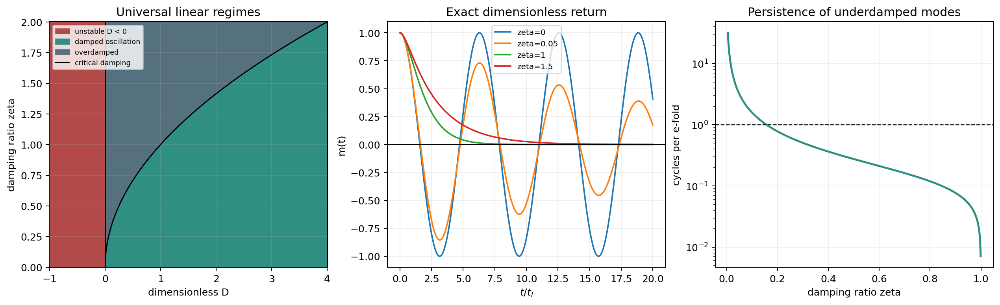

# Inertial reversible vector-field analytic gate

Date: 2026-08-11.

**Decision: `structural-pass`.**

The existing reactive pair placeholder is now reconciled with the spatial vector-field energy through a conjugate momentum field.

## Linear result

For each longitudinal or transverse mode,

\[ I s^2+\gamma s+D_q(k)=0. \]

A damped oscillation is asymptotically stable exactly when \(D_q(k)>0\), \(\gamma>0\), and \(4ID_q(k)>\gamma^2\). The reversible term does not stabilize negative curvature.

## Audit

| gate | maximum/error | pass |
|---|---:|---|
| root_error | 8.93e-16 | True |
| covariance_error | 1.18e-13 | True |
| reversible_energy_error | 0 | True |
| dissipative_energy_rate_error | 2.28e-14 | True |
| negative_curvature_control | positive root retained | True |
| classification_boundaries | exact | True |

## Dimensionless witnesses

| zeta | classification | decay | omega | Q | cycles/e-fold |
|---:|---|---:|---:|---:|---:|
| 0 | conservative_oscillation | 0 | 1 | inf | inf |
| 0.05 | damped_oscillation | 0.05 | 0.999 | 10 | 3.18 |
| 1 | critical_damping | 1 | 0 | 0.5 | 0 |
| 1.5 | overdamped_relaxation | 1.5 | 0 | 0.333 | 0 |

## Interpretation boundary

The pass is structural and partly constructive: adding a conjugate momentum was designed to permit oscillation. It establishes mathematical consistency, not emergence or empirical support.

Positive field curvature and damping provide stability; the reversible exchange provides phase. Long-lived oscillation additionally requires small damping ratio. None of these coefficients is selected by the current passive memory.

The operator is O(d)-covariant and acts identically on ambient components. It does not select d=3. No knot, spin, charge, photon, quantum or particle claim follows.

## Next gate

Specify one trajectory source J[x], derive the reciprocal trajectory force from the same coupling energy, and preregister discrete energy accounting plus source-off, reversible-off and first-order controls. Only then is one model-conditional knot pilot admissible.

## Reproducibility

- revision: `8de8dfe69e76877351464d9afd3be73e407aa558`;
- schema: `emergenz-knoten.inertial-vector-field-analytic-gate.v1`;
- JSON: `reports/memory/closure/inertial_vector_field_analytic_gate_2026-08-11.json`.
