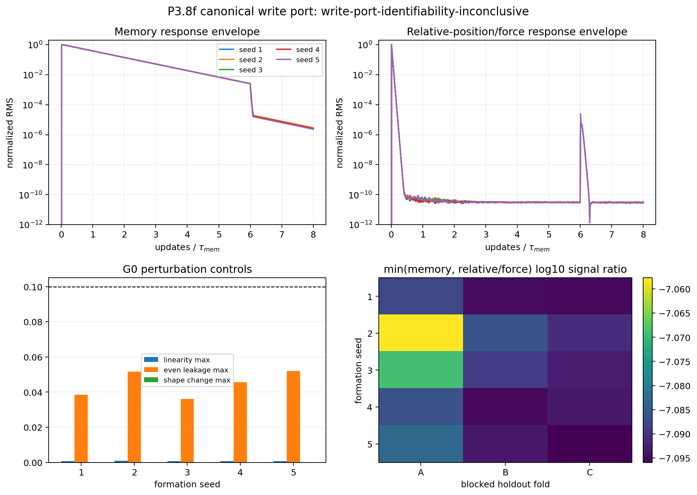

# P3.8f canonical trajectory write port

Date: 2026-08-15.

## Verdict

Decision: **`write-port-identifiability-inconclusive`**.

The intervention is written by mirrored visible kicks `(+delta,-delta)`
and `(-delta,+delta)`. Both arms have zero direct net kick; every visited
point enters the unchanged scalar-memory deposition update.

| gate | status | failed checks | blocked by |
|---|---|---|---|
| `experimental-validity` | **`pass`** | - | - |
| `input-output-identifiability` | **`inconclusive`** | four_of_five_informative_seeds | - |
| `second-state-selection` | **`blocked`** | - | input-output-identifiability |
| `oscillatory-phase-mode` | **`blocked`** | - | second-state-selection |

G0 seed passes: **5/5**.
G1 seed passes: **0/5**.
G2 is intentionally not evaluated here. A G1 pass only licenses the
blocked model-order comparison; it does not select a second state.

## Seed controls and signal support

| seed | G0 | G1 | linearity max | even max | shape max | response lifetime / tau | memory folds | relative/force folds | max relative/force holdout |
|---:|:---:|:---:|---:|---:|---:|---:|---:|---:|---:|
| 1 | pass | inconclusive | 7.201e-04 | 3.839e-02 | 8.514e-05 | 0.120 | 3/3 | 0/3 | 8.173e-08 |
| 2 | pass | inconclusive | 9.425e-04 | 5.160e-02 | 5.645e-05 | 0.120 | 3/3 | 0/3 | 8.755e-08 |
| 3 | pass | inconclusive | 6.975e-04 | 3.600e-02 | 1.452e-04 | 0.120 | 3/3 | 0/3 | 8.529e-08 |
| 4 | pass | inconclusive | 7.637e-04 | 4.569e-02 | 4.742e-05 | 0.120 | 3/3 | 0/3 | 8.196e-08 |
| 5 | pass | inconclusive | 7.927e-04 | 5.199e-02 | 1.761e-04 | 0.120 | 3/3 | 0/3 | 8.261e-08 |

The response lifetime is descriptive, not an extra gate: it is the last
sample at or above the registered `1e-3` fraction of the full
relative-position/force envelope peak.

## Readout audit

The laboratory position contains a global translation-neutral mode.
It is excluded from G1. The independent readout is the co-moving
coordinate `x-m_rho` together with the self-force. An uncommitted draft
that used absolute position was discarded before this evidence artifact
was generated.

## Figure

## Interpretation boundary

G0 establishes only a valid weak canonical intervention. G1 establishes
only whether memory and an independent relative-position/force readout remain
measurable in fixed chronological holdouts. Neither gate identifies
`(m,p)`, complex poles, momentum, phase, energy, a second knot or a
field law.

## Provenance

- Simulation revision: `31e11e7dffdec8e8720136f1dc3b7da314b6aa57`.
- Analysis revision: `79f0ec7feb395151588f3c61f492903dbaa90666`.
- State bundle: `data/processed/reference_states/p38f_scalar_Aatt35_N3M_d3_seed1-5_2026-08-15/bundle_manifest.json` (`505bd05c7518a62c8f3b3dbeaae20c7ff7b03c876b6e373c01e86ac6b39a2579`).
