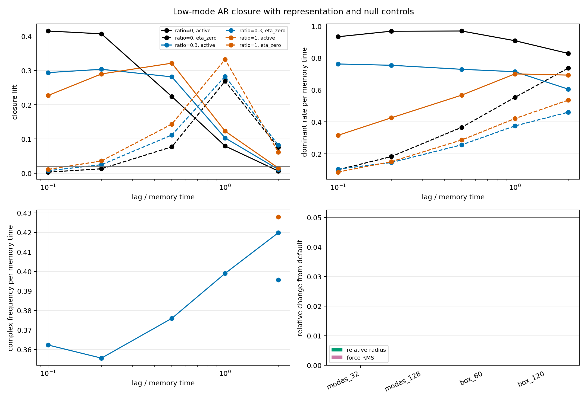

# Low-Mode / AR Feature-Closure Gate

Date: 2026-07-19T19:30:27.747109+00:00.

## Question

Do low scalar-memory modes form a predictive reduced state, and does
relaxation diffusion add a control-separated, lag-stable mode? The
Fourier basis is computational; a direct finite real-space history is
used as a representation check.

## Pre-registered controls

- nu=0 recovers the original spectral exponential memory.
- eta=0 replays identical noise without field feedback.
- Shuffled futures test spurious regression skill.
- Persistence tests whether AR adds more than short-lag continuity.
- 32/64/128 modes and matched-resolution boxes test discretization.

## Gate result

- Direct real-space validation: True (max scaled error 1.869e-09).
- Resolution control: True (max relative change 5.498e-05).
- Closure gate: True (8 passing; required 6 of 10 rows).
- Selected diffusion-length ratio: 0.3.
- Control-separated dominant rate: True (fraction 0.280).
- Seed-stable complex rows in selected arm: 3 (eta=0: 5, nu=0: 0).
- Complex-mode lag stability: True (relative MAD 0.021).
- Candidate omega, Gamma, Q per memory time: 0.475, 0.71, 0.3416.
- Long stability confirmation recommended: True.
- New-mode discovery long run justified: False.

The rate comparison is diagnostic. A fitted complex eigenpair is not
called an oscillator unless frequency is seed- and lag-stable and absent
from both controls. Q below 0.5 is a strongly damped transient, not a
persistent wave.

## Low-mode closure by lag

| ratio | condition | lag / memory time | AR R2 | AR-persistence | AR-shuffled | closure lift | dominant rate / memory time | frequency |
|---:|---|---:|---:|---:|---:|---:|---:|---:|
| 0.0 | active | 0.10 | 0.495 | 0.415 | 0.500 | 0.415 | 0.9331 | 0 |
| 0.0 | active | 0.20 | 0.407 | 0.420 | 0.407 | 0.407 | 0.9677 | 0 |
| 0.0 | active | 0.50 | 0.224 | 0.496 | 0.227 | 0.224 | 0.9689 | 0 |
| 0.0 | active | 1.00 | 0.079 | 0.641 | 0.082 | 0.079 | 0.9082 | 0 |
| 0.0 | active | 2.00 | 0.006 | 0.857 | 0.007 | 0.006 | 0.8287 | 0 |
| 0.0 | eta_zero | 0.10 | 0.931 | 0.003 | 0.932 | 0.003 | 0.1003 | 0 |
| 0.0 | eta_zero | 0.20 | 0.858 | 0.013 | 0.857 | 0.013 | 0.1825 | 0 |
| 0.0 | eta_zero | 0.50 | 0.627 | 0.077 | 0.627 | 0.077 | 0.3657 | 0 |
| 0.0 | eta_zero | 1.00 | 0.327 | 0.269 | 0.326 | 0.269 | 0.5533 | 0 |
| 0.0 | eta_zero | 2.00 | 0.076 | 0.660 | 0.076 | 0.076 | 0.7364 | 0 |
| 0.3 | active | 0.10 | 0.608 | 0.294 | 0.613 | 0.294 | 0.7625 | 0.3623 |
| 0.3 | active | 0.20 | 0.503 | 0.303 | 0.504 | 0.303 | 0.7544 | 0.3556 |
| 0.3 | active | 0.50 | 0.281 | 0.387 | 0.284 | 0.281 | 0.7292 | 0.3759 |
| 0.3 | active | 1.00 | 0.103 | 0.547 | 0.104 | 0.103 | 0.7141 | 0.3989 |
| 0.3 | active | 2.00 | 0.011 | 0.831 | 0.012 | 0.011 | 0.6051 | 0.4198 |
| 0.3 | eta_zero | 0.10 | 0.941 | 0.008 | 0.941 | 0.008 | 0.1042 | 0 |
| 0.3 | eta_zero | 0.20 | 0.881 | 0.025 | 0.882 | 0.025 | 0.1453 | 0 |
| 0.3 | eta_zero | 0.50 | 0.683 | 0.112 | 0.684 | 0.112 | 0.2562 | 0 |
| 0.3 | eta_zero | 1.00 | 0.380 | 0.283 | 0.381 | 0.283 | 0.3746 | 0 |
| 0.3 | eta_zero | 2.00 | 0.082 | 0.619 | 0.083 | 0.082 | 0.4605 | 0.3956 |
| 1.0 | active | 0.10 | 0.638 | 0.227 | 0.642 | 0.227 | 0.3159 | 0 |
| 1.0 | active | 0.20 | 0.537 | 0.290 | 0.538 | 0.290 | 0.4254 | 0 |
| 1.0 | active | 0.50 | 0.321 | 0.360 | 0.323 | 0.321 | 0.5673 | 0 |
| 1.0 | active | 1.00 | 0.123 | 0.538 | 0.124 | 0.123 | 0.7003 | 0 |
| 1.0 | active | 2.00 | 0.015 | 0.822 | 0.016 | 0.015 | 0.6929 | 0.4278 |
| 1.0 | eta_zero | 0.10 | 0.922 | 0.011 | 0.922 | 0.011 | 0.08552 | 0 |
| 1.0 | eta_zero | 0.20 | 0.851 | 0.036 | 0.852 | 0.036 | 0.1508 | 0 |
| 1.0 | eta_zero | 0.50 | 0.638 | 0.143 | 0.638 | 0.143 | 0.2866 | 0 |
| 1.0 | eta_zero | 1.00 | 0.332 | 0.336 | 0.332 | 0.332 | 0.4206 | 0 |
| 1.0 | eta_zero | 2.00 | 0.061 | 0.679 | 0.063 | 0.061 | 0.5359 | 0 |

## Interpretation limits

- Recovery of the known forgetting/heat decay is implementation
  validation, not emergent physics.
- Closure of selected observables does not prove exact Markov closure.
- The selected positive diffusion ratio is an exploratory short-run choice
  based on candidate-mode stability; it is not an optimized nu estimate.
- The experiment is one-dimensional and does not establish a knot,
  physical propagation, a photon, or an internal phase degree of freedom.
- Positive heat diffusion has infinite mathematical propagation speed.

## Reproduction

Run:

    python experiments/current/memory/low_mode_ar_feature_closure.py

Git revision: 5f9b010c6a2c50e6c4a1b8101df61ef91e634664.
Git status at generation: M src/emergenz_knoten/__init__.py
 M src/emergenz_knoten/markov/__init__.py
?? experiments/current/memory/low_mode_ar_feature_closure.py
?? figures/draft/memory/low_mode_ar_feature_closure_2026-07-19.png
?? reports/memory/low_mode_ar_feature_closure_2026-07-19.json
?? reports/memory/low_mode_ar_feature_closure_2026-07-19.md
?? src/emergenz_knoten/markov/closure.py
?? src/emergenz_knoten/spectral_memory_trace.py
?? tests/test_markov_closure.py
?? tests/test_spectral_memory_trace.py.
