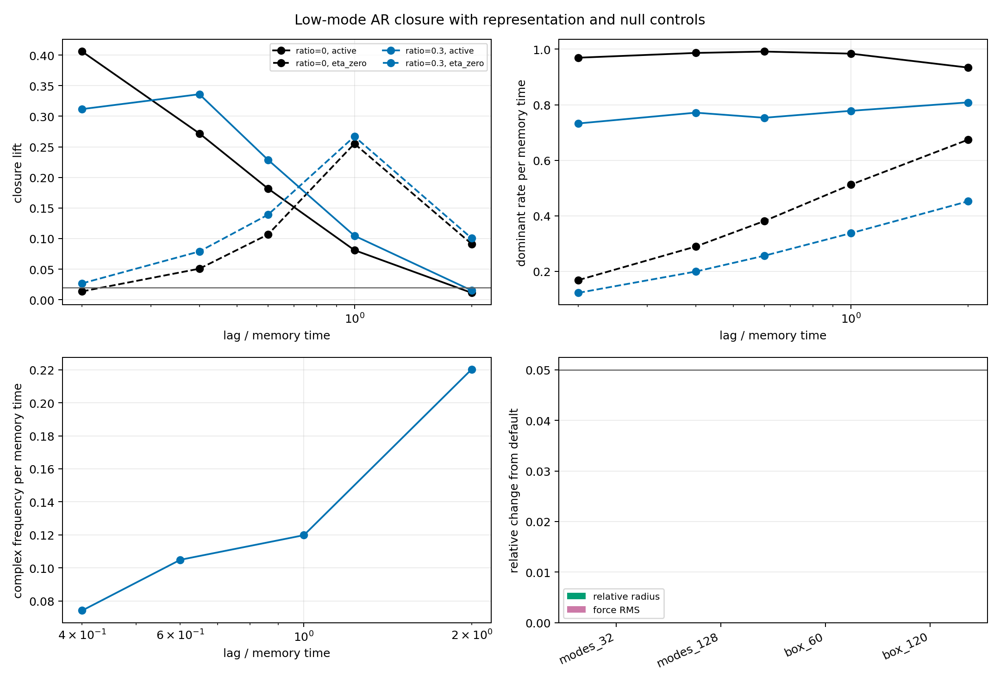

# Low-Mode / AR Feature-Closure Gate

Date: 2026-07-19T19:36:44.160857+00:00.

## Question

Do low scalar-memory modes form a predictive reduced state, and does
relaxation diffusion add a control-separated, lag-stable mode? The
Fourier basis is computational; a direct finite real-space history is
used as a representation check.

## Pre-registered controls

- nu=0 recovers the original spectral exponential memory.
- eta=0 replays identical noise without field feedback.
- Shuffled futures test spurious regression skill.
- Persistence tests whether AR adds more than short-lag continuity.
- 32/64/128 modes and matched-resolution boxes test discretization.

## Gate result

- Direct real-space validation: True (max scaled error 1.867e-09).
- Resolution control: True (max relative change 5.584e-05).
- Closure gate: True (4 passing; required 3 of 5 rows).
- Selected diffusion-length ratio: 0.3.
- Control-separated dominant rate: True (fraction 0.276).
- Seed-stable complex rows in selected arm: 4 (eta=0: 5, nu=0: 0).
- Complex-mode lag stability: True (relative MAD 0.063).
- Candidate omega, Gamma, Q per memory time: 0.2119, 0.7593, 0.1396.
- Long stability confirmation recommended: True.
- New-mode discovery long run justified: False.

The rate comparison is diagnostic. A fitted complex eigenpair is not
called an oscillator unless frequency is seed- and lag-stable and absent
from both controls. Q below 0.5 is a strongly damped transient, not a
persistent wave.

## Low-mode closure by lag

| ratio | condition | lag / memory time | AR R2 | AR-persistence | AR-shuffled | closure lift | dominant rate / memory time | frequency |
|---:|---|---:|---:|---:|---:|---:|---:|---:|
| 0.0 | active | 0.20 | 0.406 | 0.425 | 0.407 | 0.406 | 0.9694 | 0 |
| 0.0 | active | 0.40 | 0.272 | 0.465 | 0.272 | 0.272 | 0.9865 | 0 |
| 0.0 | active | 0.60 | 0.182 | 0.517 | 0.183 | 0.182 | 0.9915 | 0 |
| 0.0 | active | 1.00 | 0.081 | 0.644 | 0.082 | 0.081 | 0.984 | 0 |
| 0.0 | active | 2.00 | 0.011 | 0.847 | 0.012 | 0.011 | 0.9339 | 0 |
| 0.0 | eta_zero | 0.20 | 0.852 | 0.014 | 0.851 | 0.014 | 0.1688 | 0 |
| 0.0 | eta_zero | 0.40 | 0.698 | 0.051 | 0.698 | 0.051 | 0.2895 | 0 |
| 0.0 | eta_zero | 0.60 | 0.557 | 0.107 | 0.558 | 0.107 | 0.3813 | 0 |
| 0.0 | eta_zero | 1.00 | 0.338 | 0.255 | 0.338 | 0.255 | 0.5121 | 0 |
| 0.0 | eta_zero | 2.00 | 0.091 | 0.607 | 0.091 | 0.091 | 0.674 | 0 |
| 0.3 | active | 0.20 | 0.497 | 0.312 | 0.498 | 0.312 | 0.7327 | 0 |
| 0.3 | active | 0.40 | 0.337 | 0.359 | 0.336 | 0.336 | 0.7715 | 0.0742 |
| 0.3 | active | 0.60 | 0.229 | 0.418 | 0.229 | 0.229 | 0.7532 | 0.1049 |
| 0.3 | active | 1.00 | 0.105 | 0.561 | 0.105 | 0.105 | 0.7781 | 0.1198 |
| 0.3 | active | 2.00 | 0.015 | 0.806 | 0.016 | 0.015 | 0.8084 | 0.2203 |
| 0.3 | eta_zero | 0.20 | 0.876 | 0.027 | 0.877 | 0.027 | 0.1228 | 0 |
| 0.3 | eta_zero | 0.40 | 0.747 | 0.079 | 0.746 | 0.079 | 0.1994 | 0 |
| 0.3 | eta_zero | 0.60 | 0.617 | 0.139 | 0.618 | 0.139 | 0.2563 | 0 |
| 0.3 | eta_zero | 1.00 | 0.391 | 0.267 | 0.391 | 0.267 | 0.3374 | 0 |
| 0.3 | eta_zero | 2.00 | 0.101 | 0.586 | 0.101 | 0.101 | 0.4522 | 0 |

## Interpretation limits

- Recovery of the known forgetting/heat decay is implementation
  validation, not emergent physics.
- Closure of selected observables does not prove exact Markov closure.
- The positive diffusion ratio was selected exploratorily in the N=100k run
  and frozen before this N=1M confirmation; it is not an optimized nu estimate
  or evidence for a preferred physical diffusion scale.
- The experiment is one-dimensional and does not establish a knot,
  physical propagation, a photon, or an internal phase degree of freedom.
- Positive heat diffusion has infinite mathematical propagation speed.

## Reproduction

Run:

    python experiments/current/memory/low_mode_ar_feature_closure.py --steps 1000000 --burn-in 50000 --sample-every 20 --diffusion-length-ratios 0,0.3 --lags 1,2,3,5,10 --report reports/memory/low_mode_ar_feature_closure_long_N1M_2026-07-19.md --summary-json reports/memory/low_mode_ar_feature_closure_long_N1M_2026-07-19.json --figure figures/draft/memory/low_mode_ar_feature_closure_long_N1M_2026-07-19.png

Git revision: 5f9b010c6a2c50e6c4a1b8101df61ef91e634664.
Git status at generation: M src/emergenz_knoten/__init__.py
 M src/emergenz_knoten/markov/__init__.py
?? experiments/current/memory/low_mode_ar_feature_closure.py
?? figures/draft/memory/low_mode_ar_feature_closure_2026-07-19.png
?? reports/memory/low_mode_ar_feature_closure_2026-07-19.json
?? reports/memory/low_mode_ar_feature_closure_2026-07-19.md
?? src/emergenz_knoten/markov/closure.py
?? src/emergenz_knoten/spectral_memory_trace.py
?? tests/test_markov_closure.py
?? tests/test_spectral_memory_trace.py.
