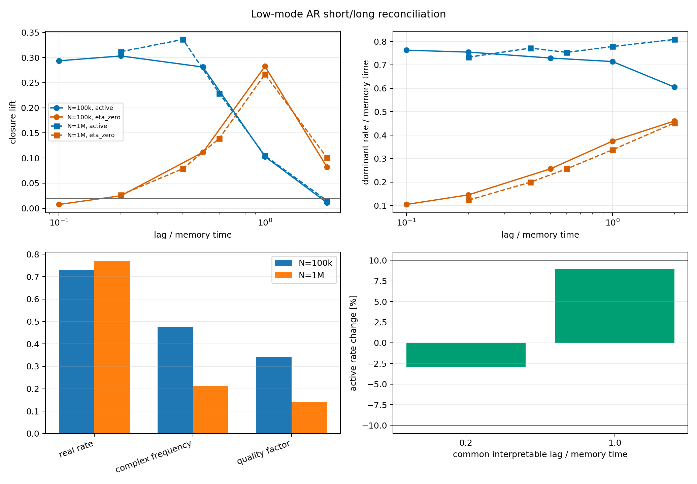

# Low-Mode AR Long-Run Reconciliation

Date: 2026-07-19T20:22:25.157941+00:00.

## Evidence

- The comparison spans 1000 versus 10000 memory times.
- Descriptive aggregate active real rate: 0.7292 to 0.7715 (+5.80 percent).
- Common interpretable active lags: 2 (maximum absolute rate change 8.96 percent).
- eta=0 real rate: 0.2562 to 0.2563.
- Complex frequency: 0.475 to 0.2119 (-55.39 percent).
- Complex quality factor: 0.3416 to 0.1396.
- Stable eta=0 complex rows: 5 and 5.

## Common-lag check

| condition | lag / memory time | short closure | long closure | short rate | long rate | rate change | interpretable |
|---|---:|---:|---:|---:|---:|---:|---|
| active | 0.20 | 0.303 | 0.312 | 0.7544 | 0.7327 | -2.88% | True |
| active | 1.00 | 0.103 | 0.105 | 0.7141 | 0.7781 | +8.96% | True |
| active | 2.00 | 0.011 | 0.015 | 0.6051 | 0.8084 | +33.60% | False |
| eta_zero | 0.20 | 0.025 | 0.027 | 0.1453 | 0.1228 | -15.50% | True |
| eta_zero | 1.00 | 0.283 | 0.267 | 0.3746 | 0.3374 | -9.93% | True |
| eta_zero | 2.00 | 0.082 | 0.101 | 0.4605 | 0.4522 | -1.80% | True |

## Inference

- Real-mode N-stability criterion: True.
- Complex-mode N-stability and control criterion: False.
- The control-separated real relaxation rate is N-stable at all common interpretable active lags under the 10 percent criterion. The complex secondary mode fails N-stability and eta-zero specificity.

The scalar spectral-memory model therefore supports a compact
predictive relaxation description in this local one-dimensional
regime. It does not yet support a feedback-specific oscillatory mode.

## Limits

- The 10 percent stability threshold is applied to every active
  common lag with closure lift above 0.02 in both runs; at least
  two such lags are required. The aggregate rate is descriptive
  because the full short and long lag grids differ.
- The positive diffusion ratio was selected exploratorily in the
  short run and frozen before N=1M; it is not an optimized nu claim.
- This is not evidence for a photon, spin, propagation, or physical
  phase. The complex side modes are explicitly retained as a negative
  result because they also occur for eta=0 and drift with N.

## Reproduction

    python experiments/current/memory/reconcile_low_mode_ar_runs.py
