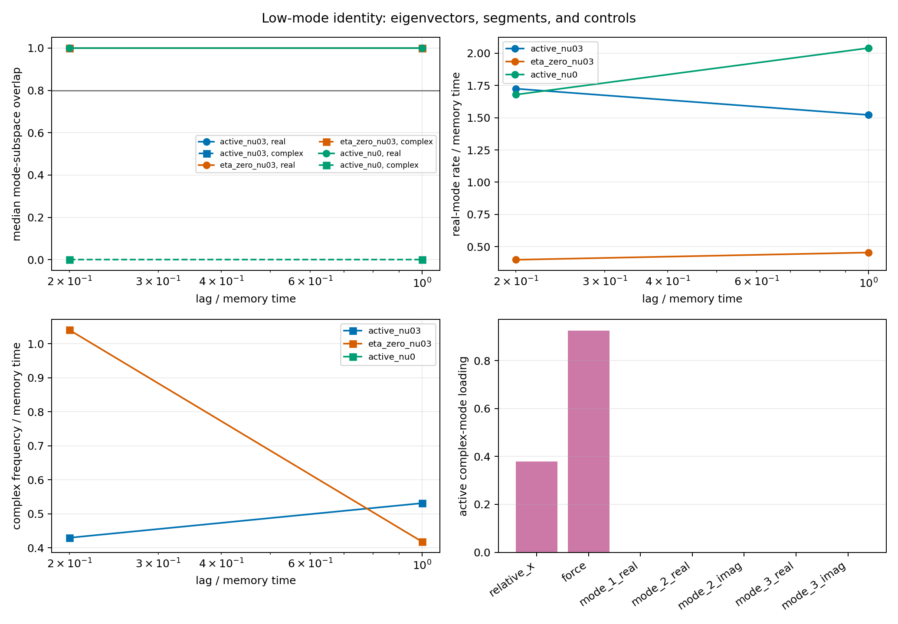

# Low-Mode Eigenvector and Segment Identity Audit

Date: 2026-07-20T05:29:06.695742+00:00.

## Question

Do the previously fitted real and complex AR eigenvalues represent the
same feature-space modes across independent seeds and time segments?
This is a diagnostic closure audit, not a search for new physics.

## Controls

- active feedback with diffusion-length ratio 0.3;
- eta=0 under identical seed noise;
- nu=0 under identical seed noise;
- five non-overlapping time segments per seed;
- physical feature eigenvectors compared as sign/phase-invariant real subspaces.

## Gate

- Real-mode identity: False.
- Complex segment identity: False.
- Complex control separation: False.
- Oscillatory mode supported: False.

## Segment statistics

| arm | kind | lag / memory time | match fraction | median overlap | relative rate MAD | relative frequency MAD | median Q |
|---|---|---:|---:|---:|---:|---:|---:|
| active_nu03 | real | 0.20 | 0.720 | 1.000 | 0.233 | nan | 0.000 |
| active_nu03 | complex | 0.20 | 1.000 | 1.000 | 0.318 | 0.334 | 0.192 |
| active_nu03 | real | 1.00 | 0.800 | 1.000 | 0.278 | nan | 0.000 |
| active_nu03 | complex | 1.00 | 1.000 | 1.000 | 0.251 | 0.383 | 0.318 |
| eta_zero_nu03 | real | 0.20 | 1.000 | 1.000 | 0.136 | nan | 0.000 |
| eta_zero_nu03 | complex | 0.20 | 1.000 | 1.000 | 0.037 | 0.035 | 1.061 |
| eta_zero_nu03 | real | 1.00 | 0.920 | 1.000 | 0.170 | nan | 0.000 |
| eta_zero_nu03 | complex | 1.00 | 1.000 | 1.000 | 0.184 | 0.177 | 0.430 |
| active_nu0 | real | 0.20 | 1.000 | 1.000 | 0.442 | nan | 0.000 |
| active_nu0 | complex | 0.20 | 0.000 | 0.000 | nan | nan | 0.000 |
| active_nu0 | real | 1.00 | 1.000 | 1.000 | 0.068 | nan | 0.000 |
| active_nu0 | complex | 1.00 | 0.000 | 0.000 | nan | nan | 0.000 |

## Interpretation

A positive real-mode result only validates a reproducible reduced
relaxation direction. A complex mode requires both segment identity
and absence from eta=0 and nu=0 controls. Failure of either condition
keeps it classified as a fitting, sampling, or representation mode.

## Limits

- Stochastic traces are exactly regenerated from recorded seeds rather
  than archived.
- Segment fits are descriptive and not independent basin samples.
- The model remains one-dimensional and scalar.
- No photon, spin, synchronization, or propagation claim follows.

## Reproduction

    python experiments/current/memory/low_mode_identity_audit.py

Git revision: 4c136fc6630e4cb5868d6f87c41754511650d709.
Git status at generation: M src/emergenz_knoten/markov/__init__.py
 M src/emergenz_knoten/markov/closure.py
 M tests/test_markov_closure.py
?? experiments/current/memory/low_mode_identity_audit.py.
