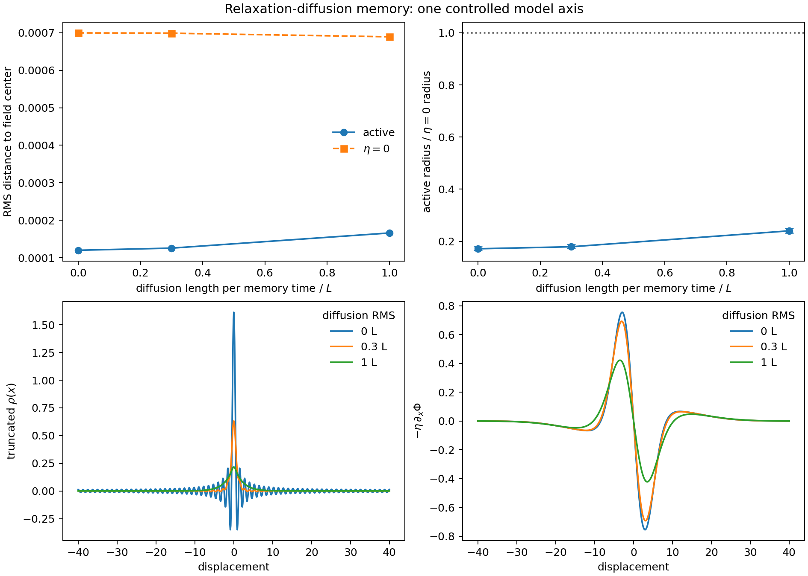

# Relaxation-Diffusion Memory Field Pilot

Date: 2026-07-19T16:38:52Z.

## Scope

This pilot changes one mechanism relative to exponential scalar memory:
after forgetting and deposition, the memory field undergoes one exact
heat-semigroup step. In Fourier space the update is

```text
rho_new_hat(k) = exp(-nu k^2) [(1-lambda) rho_hat(k) + lambda G_hat_x(k)].
```

The `nu=0` arm is exactly the previous model. Positive `nu` is a model
extension, not a coarse-graining identity. It remains diffusive and therefore
does not create a hard finite propagation speed.



## Controlled Design

- updates: `20000`; burn-in cut: `2000`; seeds: `[1, 2, 3, 4, 5]`
- fixed epsilon: `0.0001`; active eta: `0.15`; paired `eta=0`
- diffusion RMS per memory time / L: `[0.0, 0.3, 1.0]`
- lambda: `0.01`; M0: `1.0`; modes: `64`
- zero-integral kernel: `A_att=26.0`, `sigma_att=3.0`, `sigma_comp=10.0`

## Results

| diffusion RMS/L | nu/update | active radius | eta=0 radius | active/control | feedback step/epsilon |
| ---: | ---: | ---: | ---: | ---: | ---: |
| `0` | `0` | `0.00011995` | `0.00069994` | `0.17137` | `0.50663` |
| `0.3` | `0.00405` | `0.00012561` | `0.00069898` | `0.1791` | `0.46635` |
| `1` | `0.045` | `0.00016602` | `0.00068943` | `0.24015` | `0.31052` |

Largest-diffusion / zero-diffusion active radius: `1.3841`.
Largest-diffusion / zero-diffusion confinement ratio: `1.4013`.

## Validation and Interpretation

- kernel integral coefficient: `0`
- maximum eta=0 random-walk replay error: `4.7606e-13`
- maximum memory-mass error: `0`
- the zero-diffusion package test is bitwise equal to the original spectral update

A change with diffusion demonstrates sensitivity to a newly introduced spatial
field law. It does not by itself demonstrate metastability, propagation, or a
physical mediator. The next gate must ask whether any new mode or timescale is
control-separated and stable across lag, seed, box size, and mode count.

## Artifacts

- machine-readable summary: [relaxation_diffusion_field_pilot_2026-07-19.json](relaxation_diffusion_field_pilot_2026-07-19.json)
- git revision before generated artifacts: `6c7bb0235619afface5d159bc9b7acfa9a1fd297`
- recorded worktree status: `clean`
