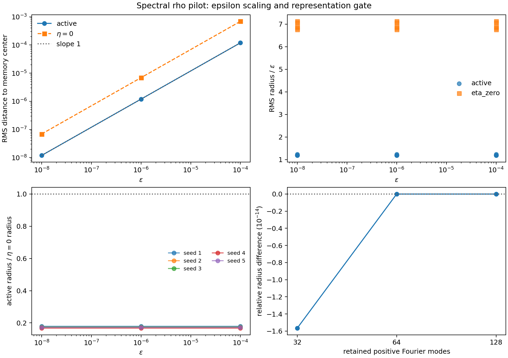
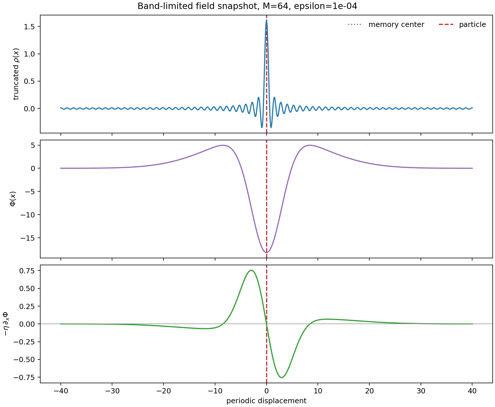

# Spectral rho Field Pilot

Date: 2026-07-19T16:30:03Z.

## Scope

This is a one-dimensional representation and numerical-identification gate.
It rewrites the existing exponentially weighted scalar memory in a finite
Fourier basis. It does **not** introduce a new field equation, finite signal
speed, vector memory, or a particle/space-dimension claim.

The compensated kernel has zero spatial integral (`K_hat(0)=0`). This removes
the constant potential mode but is not an energy-conservation law. Because the
trajectory responds to the potential gradient, any constant mode is dynamically
unobservable even without this constraint.

## Fixed Design

- updates: `50000`; burn-in cut: `5000`; seeds: `[1, 2, 3, 4, 5]`
- epsilon: `[1e-08, 1e-06, 0.0001]`; active eta: `0.15`; paired control: `eta=0`
- lambda: `0.01`; M0: `1.0`
- box length: `80.0`; primary modes: `64`
- mode gate: `[32, 64, 128]`; deposition sigma: `0.0`
- kernel: `-A_att G_sigma_att + A_comp G_sigma_comp` with `A_att=26.0`, `sigma_att=3.0`, `sigma_comp=10.0` and exact 1D zero integral
- one field state uses `1040` bytes at the primary mode count

## Epsilon Scaling

| epsilon | active radius median | eta=0 radius median | active radius/epsilon | feedback step/epsilon |
| ---: | ---: | ---: | ---: | ---: |
| `1e-08` | `1.1948e-08` | `6.9034e-08` | `1.1948` | `0.50661` |
| `1e-06` | `1.1948e-06` | `6.9034e-06` | `1.1948` | `0.50661` |
| `0.0001` | `0.00011948` | `0.00069034` | `1.1948` | `0.50661` |

Active log-log radius slope: `1`.
Spread of the median normalized radius: `1.8488e-09`.
Predefined linear-scaling gate: `True`.

## Mode Convergence

| modes | state bytes | radius | radius/highest-mode radius | tail energy fraction |
| ---: | ---: | ---: | ---: | ---: |
| `32` | `528` | `0.00012072` | `1` | `0.25` |
| `64` | `1040` | `0.00012072` | `1` | `0.25` |
| `128` | `2064` | `0.00012072` | `1` | `0.25` |

## Validation and Reading

- kernel integral coefficient: `0`
- maximum eta=0 random-walk replay error: `9.0239e-13`
- maximum primary memory-mass error: `0`
- primary truncated-field minimum: `-0.34961`
- primary reconstructed negative mass: `0.98019`

A negative pointwise reconstructed rho is expected for a sharply deposited
delta represented by finitely many Fourier modes. The underlying memory
measure remains non-negative and normalized; only the band-limited pointwise
reconstruction has Gibbs lobes. Force convergence, rather than pointwise
positivity of this delta reconstruction, is the relevant representation gate.

If the linear-scaling gate passes, lowering epsilon further has not revealed
a new intrinsic length in this slice. It only scales the same local stochastic
response. That is a stopping rule for the epsilon axis, not evidence against
the existence of scalar feedback confinement at other dimensionless ratios.

## Artifacts

- machine-readable summary: [spectral_rho_field_pilot_2026-07-19.json](spectral_rho_field_pilot_2026-07-19.json)
- git revision before generated artifacts: `77182e3f43b740b130f2f19e5bcddefe29850c3e`
- recorded worktree status: `clean`
