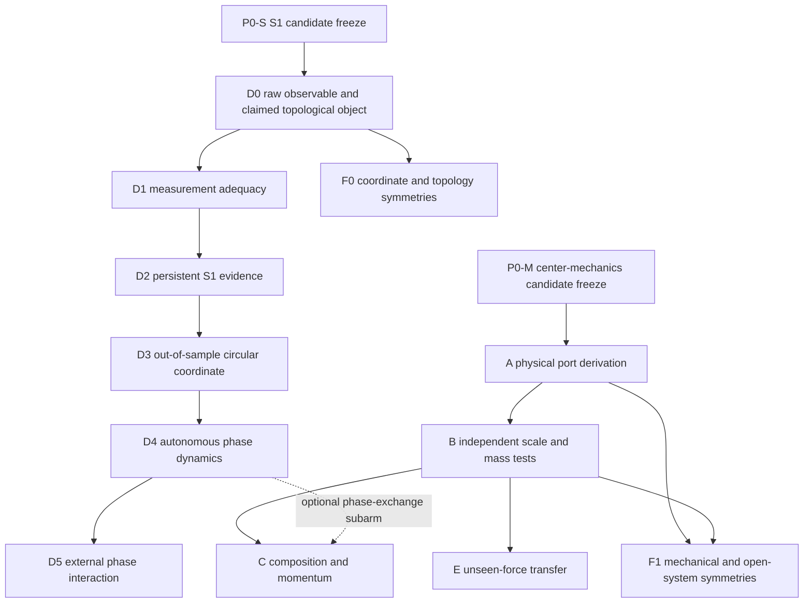

# S1-phase and mass-falsification program

Date: 2026-08-16.

Status: scientific program charter with claim-scoped P0 execution. The S1
branch is not yet an executable preregistration because it has no candidate.
The independent center-effective-mechanics branch has a frozen candidate, but
its physical-port Gate A did not identify a microscopic port; no downstream
physical-mass simulation is authorized.

The second-pass findings and their resolutions are recorded in the
[referee review](../meta/reviews/s1_phase_mass_falsification_program_review_2026-08-16.md).
The first authorized methods-only artifact is the
[candidate-independent synthetic topology control](../../topology/s1_control_pipeline_2026-08-16.md).
The repository-wide
[S1 P0 audit](../meta/preregistration/s1_candidate_p0_audit_2026-08-16.md)
returns `P0-fail-no-eligible-candidate-record`; D0/D1 and S1 target simulation
therefore remain blocked. Separately, the
[center-mechanics P0 audit](../meta/preregistration/scalar_memory_center_mechanics_p0_audit_2026-08-16.md)
passes and authorizes only A. Its subsequent
[Gate-A audit](../meta/reviews/scalar_memory_center_physical_port_gate_a_2026-08-16.md)
retains the mathematical center port but cannot identify physical work
conjugacy from the existing additive \(x\)-input: conditional \(x\)- and
center-coupled realizations both produce that state-equation term.

## Executive decision

A parameter set with knot-internal oscillation and externally measurable
interaction could support a strong publication. The possible result must be
split into logically independent claims:

1. a canonical, non-angularized observable contains an \(S^1\)-like state
   manifold;
2. the motion on it is an internal autonomous phase mode rather than a
   transient, noise loop or externally imposed clock;
3. an external system couples reproducibly to that phase;
4. the memory center has a passive inertial realization;
5. its input/output coefficient is a physical, additive mass.

The current center-port result supports only item 4 in a local and
port-conditional sense. Items 1--3 and 5 remain open. A failure of the mass
branch must not erase a valid topological oscillator result, and a topological
pass must not be used to infer physical mass.

The publication-grade order is therefore:



Scientific decisions are sequential. Method-development controls and
simulation shards may be parallelized, but downstream target data remain
sealed until their upstream gate is frozen and passed.

Before the S1 P0, only a dependency-pinned generic topology adapter and synthetic
positive/negative pipeline controls may be implemented. They may not contain a
candidate-shaped observable, metric, delay, filtration threshold or decision
cutoff. This permits infrastructure work without weakening the candidate
freeze.

## Existing-candidate quarantine

Repository audit at revision `f91cca0` finds no newly committed unique
candidate matching the present description. The following older parameter
points are not eligible to be silently reused as a confirmatory discovery:

| prior point | established result | reason it is not the new confirmatory candidate |
|---|---|---|
| local weak-self witness \(g=0,c=0.02\) | analytically stable complex relative pair | constructed witness, not a formed full-knot oscillator |
| same-law midpoint \(\eta=0.0016266,\ R=\sigma_{\rm rep}\) | local complex-Jacobian eligibility | affine force-balance gate passed 0/13; geometry drifts rather than supporting a stationary normal mode |
| P3.8d existence point \((\delta,\mu,r_\gamma)=(-1.9,0.3,1)\) | energy-consistent damped field transient | ringing is quench-dependent and the autonomous Lyapunov balance excludes a persistent limit cycle |
| center-port \(\chi=4\) continuum slice | passive free-inertial center realization | poles are \(0,-5\), not a complex pair or harmonic mode |

Relevant records are the
[local reciprocal gate](../../response/reciprocal/reciprocal_local_mode_gate_2026-08-04.md),
[same-law balance gate](../../response/reciprocal/same_law_affine_balance_gate_2026-08-11.md),
[P3.8d dynamic gate](../../response/reciprocal/dynamic_two_knot_mediator_gate_2026-08-12.md)
and the
[center-mass referee audit](../meta/reviews/scalar_memory_center_mass_referee_audit_2026-08-16.md).

If the new candidate is one of these points under a materially new architecture
or observable, that difference must be named explicitly. Otherwise its old
negative or conditional controls remain applicable.

## P0: claim-scoped candidate and discovery freeze

P0 is evaluated per claim branch, not once for the entire program. A mechanics
candidate can open A without opening D0, and an S1 candidate can open D0
without establishing a physical port. A joint candidate would require two
separately passing manifests or an explicitly audited union of both contracts.

Before implementation of any target statistic in a branch, create one
immutable candidate manifest for that branch. It must contain at least:

```yaml
candidate_id: pending
claim_scope: pending  # s1-topology or center-effective-mechanics
branch_contract: pending
architecture_level: pending  # K0, K1, K2, K3, or an explicitly new level
time_law: pending  # native discrete map, continuous model, or validated limit
code_revision: pending
working_tree_status: pending
full_parameter_tuple: pending
initial_state_source_and_hashes: pending
discovery_seeds: pending
discovery_run_lengths_and_cadence: pending
discovery_forcing_and_external_system: pending
observables_inspected_during_discovery: pending
parameter_cells_or_optimizers_inspected: pending
selection_rule_that_led_to_candidate: pending
all_discovery_artifacts_and_hashes: pending
confirmatory_seed_generation_rule: pending
untouched_parameter_holdout: pending
```

The current records demonstrate both outcomes. The K0 normalized center has a
complete mechanics manifest and passes P0-M with zero defects. The S1 draft
manifest remains incomplete with 27 defects and no candidate, so P0-S fails.
Neither result can be transferred to the other branch.

The full tuple includes noise, memory, kernel, coupling, integration, horizon,
boundary, external-drive and initialization parameters. Recording only the
apparently interesting coefficients is insufficient.

All data or plots viewed while finding the tuple are discovery data. They may
be used to formulate mechanisms and choose one primary candidate, but never to
count a confirmatory pass. New seeds must be generated by a fixed rule after
the protocol commit. One parameter cell not used for candidate selection must
remain sealed as a transfer holdout. A local neighborhood scan, if desired,
is secondary robustness analysis and cannot replace the primary fixed-cell
decision.

If the architecture introduces an oriented memory, conjugate field, second
knot or periodic drive, the candidate is a result of that extended model. It
must not be described as emergence from canonical scalar \(z=(x,\rho)\) unless
the added state is itself derived and selected by a separate closure gate.

## What an S1 claim refers to

`The topology is S1` is incomplete until the topological object is named.
Exactly one primary object must be chosen before target analysis:

| object | possible claim | principal limitation |
|---|---|---|
| periodic orbit of a continuous-time deterministic skeleton at \(\varepsilon=0\) | the closed non-equilibrium orbit is homeomorphic to \(S^1\) | requires a derived continuous flow plus existence and stability, not only interpolated update points |
| invariant circle of the native discrete map | a map-invariant set is homeomorphic to \(S^1\) | requires an invariant-circle argument and degree-one dynamics, not merely a high-period cycle |
| period-\(p\) orbit of the native discrete map | discrete periodic oscillator | the invariant set is \(p\) points and is not topologically \(S^1\) |
| invariant/slow manifold of the deterministic state | intrinsic phase manifold | requires a coordinate-independent manifold argument |
| density ridge or superlevel set at \(\varepsilon>0\) | stochastic \(S^1\)-like tube/ridge | depends on a preregistered density object and level; the full noisy support is generally higher-dimensional |
| delay-embedded canonical observable | recurrent output geometry | topology belongs first to the reconstructed output, not automatically to the microscopic state |
| forced response loop | phase-resolved susceptibility | a periodic drive can insert its own \(S^1\) clock |
| collective two-knot orbit | interaction-induced collective phase | does not establish a pre-existing single-knot internal phase |

The native knot model is a discrete update law. A period-\(p\) orbit of that
map is a finite set, not an \(S^1\), even when linearly interpolated samples
draw a convincing loop. For a literal mathematical proof, the strongest paths
are therefore either:

1. derive and validate a continuous-time skeleton or continuum limit, then
   certify a non-equilibrium periodic orbit and its transverse stability with
   a Poincare map or interval enclosure; or
2. certify a genuinely invariant circle of the native discrete map together
   with its degree-one phase dynamics.

Only the continuous-time closed orbit is automatically \(S^1\) by periodic
identification. Finite noisy data alone can provide robust evidence for an
\(S^1\)-like recurrent manifold, not a theorem about the complete stochastic
state space.

Homology alone is also insufficient for homeomorphism: many spaces have one
first homology generator. A data-based \(S^1\) classification therefore needs
joint evidence for a connected, compact, effectively one-dimensional manifold
without boundary plus one persistent first cohomology class.

## D: phase and S1 topology

This section expands item D of the
[mass referee audit](../meta/reviews/scalar_memory_center_mass_referee_audit_2026-08-16.md).
It precedes every use of `phase`, `winding`, `internal clock` or `limit cycle`.

### D0: raw observable contract

Fix a canonical observable

\[
Z_t=\Psi(x_t,\rho_t,\text{declared extended states})
\]

without inspecting confirmatory topology. It must be invariant under irrelevant
laboratory translations and must state how ambient rotations and reflections
act. Center, relative coordinate, shape modes and field modes remain distinct
components rather than being pooled with arbitrary scales.

The metric, component weights and any whitening are part of the observable
contract. They must follow declared physical units, an architecture-derived
energy metric or a control-only rule fixed before target labels are opened.
Candidate covariance may not be whitened or rescaled to maximize a hole.

Before D2 passes, the target pipeline may not apply:

- `atan2`, modulo \(2\pi\), a circular mean or an imposed angular coordinate;
- a Hilbert phase selected for visual regularity;
- a delay chosen from the candidate period or spectral peak;
- a projection optimized to make a hole visible;
- a time coordinate or external-drive phase as a state component.

If delay embedding is necessary, the observable, delay family, embedding
dimension and scale normalization are selected using discovery data and
synthetic controls, then frozen. Multiple fixed delays must give the same
topological decision; the best-looking delay is not selected afterward.

### D1: measurement adequacy

D1 determines whether topology is measurable, not whether it exists. Required
checks are:

1. sampling resolves the fastest candidate timescale and is repeated at fixed
   integer downsamplings to expose aliasing;
2. each confirmatory segment contains a predeclared minimum number of apparent
   returns, provisionally at least 20 before the final frequency is inspected;
3. the result is stable across at least two non-overlapping stationary
   segments in at least four of five new formation seeds;
4. finite-\(H\) drop events, burn-in, boundary wrapping, merger and amplitude
   collapse are excluded from the analysis window;
5. local intrinsic dimension, neighbor count and condition number are adequate
   for the registered topology estimator;
6. external-drive-off and mechanism-off traces are recorded at identical
   cadence and duration;
7. temporal thinning at fixed multiples of the autocorrelation time leaves the
   decision unchanged and prevents dense oversampling from acting as sample
   size;
8. the formation seed is the replication unit. Segments and cadence variants
   are repeated measures within a seed, not independent replicates.

Failure is `topology-measurement-inconclusive`. It cannot be rescued by a
candidate-specific projection, shorter window or stronger coupling.

### D2: topology gate

The topology implementation is calibrated and frozen on positive and negative
controls before confirmatory labels are opened. Control realizations are split
into method-training and untouched method-validation sets; a control used to
choose a metric or threshold cannot also certify its false-positive rate. The
coefficient field, filtration convention and treatment of essential classes
are fixed in the executable protocol.

Positive pipeline controls:

- a noisy sampled circle;
- a known stable deterministic limit cycle;
- a noisy torus, which must not be misclassified as a single \(S^1\).

Negative or rival controls matched as closely as possible to the candidate:

- stationary OU and fitted real-pole AR controls with matched covariance and
  autocorrelation;
- a stable complex linear focus producing a damped transient spiral;
- phase-randomized surrogates preserving the registered spectrum and
  amplitude distribution;
- amplitude-only breathing and metastable switching controls;
- drive-only, source-off, cross-off and mechanism-off arms;
- cadence aliases.

For topology of a raw state-space point cloud, a pure permutation of sample
order leaves the cloud and therefore its persistent homology unchanged; this
is a required invariance check, not a negative control. Time or block
shuffling is a negative control only when it is applied before a registered
delay embedding or when D3/D4 tests temporal phase dynamics.

On untouched candidate traces, compute local dimension/boundary diagnostics
and persistent homology/cohomology in the fixed metric. A seed-segment passes
only if:

1. there is one connected recurrent component after the preregistered
   transient rule;
2. at the preregistered mesoscale between sampling noise and loop diameter,
   the ridge geometry is compatible with one intrinsic direction and no
   persistent boundary endpoints;
3. exactly one dominant \(H^1\) class exceeds the null envelope fixed from
   controls;
4. its persistence separation from the second class exceeds the precommitted
   control-calibrated threshold;
5. the class survives the fixed cadence, neighbor and embedding sensitivity
   panel;
6. the corresponding class is absent from mechanism-off and external-clock
   controls.

The aggregate requirement is the same classification in both stationary
segments of at least four of five new seeds. Seedwise block resampling
quantifies uncertainty without treating points or segments as independent.
Threshold values, familywise multiplicity handling and the distance metric are
committed after control calibration but before target labels are opened.

A D2 pass supports `persistent-S1-like-output-manifold`. It does not yet show
directed phase motion, autonomy or physical mass.

### D3: out-of-sample circular coordinate

Use the persistent \(H^1\) class from training data to construct a
cohomological circular coordinate

\[
\theta: Z\longrightarrow S^1.
\]

The map is then evaluated without refit on withheld times, seeds, cadences and
the sealed parameter holdout. Coordinates from different folds may differ by
one constant phase and orientation, but their transition maps must have degree
\(+1\) or \(-1\), not folding or seed-dependent winding number.

The out-of-sample extension rule is itself preregistered. Neighbor,
kernel/harmonic or barycentric interpolation parameters are learned only on
the training cloud and applied unchanged to held-out points. Recomputing a new
cohomology class separately on every holdout is not out-of-sample prediction.

Required checks include:

- branch-cut-invariant circular error;
- integer winding consistency over closed returns;
- reconstruction of the held-out canonical observable from phase plus a
  separately measured amplitude/radial coordinate;
- loss of coherent winding in phase-randomized and mechanism-off controls;
- no use of time or drive phase to orient \(\theta\).

A loop with no stable out-of-sample circular coordinate is geometrical
evidence only, not an operational phase.

### D4: autonomous internal oscillator

D4 distinguishes a self-sustained internal phase from a damped focus, noisy
rotation or forced response. The primary test is performed with periodic
external forcing absent. If the proposed mechanism requires a second knot,
the claim becomes `collective autonomous oscillator` and the single-knot
off-arm remains mandatory.

For a continuous-time deterministic skeleton, seek a non-equilibrium return
of a fixed Poincare section and estimate or validate the Floquet multipliers.
A stable limit cycle requires one neutral flow direction and contracting
transverse directions. For the native discrete map, instead test invariance of
a closed curve, degree-one circle dynamics and transverse contraction. A
stable finite period-\(p\) cycle may be a valid discrete oscillator, but it
fails the structural \(S^1\) gate. For the noisy system, require a stationary
amplitude tube, nonzero mean winding, finite phase diffusion and radial
recovery after weak perturbations.

The following are explicit failures of an internal autonomous-oscillator
claim:

- ringdown amplitude decays to a fixed point after force-off;
- the loop exists only while a periodic drive supplies the clock;
- cycles are single quench transients rather than stationary returns;
- frequency or phase direction changes qualitatively with cadence;
- a fitted linear damped focus predicts the held-out trajectory equally well;
- the phase disappears after removing a global translation, rigid rotation or
  finite-memory drop artifact.

A D2/D3 pass with D4 fail remains publishable only as an \(S^1\)-like output
geometry or driven response manifold, not as a self-sustained knot-internal
oscillator.

### D5: external phase interaction

D5 is opened only after D4 identifies whether the phase is internal,
collective or purely driven. Freeze the D3 phase estimator and apply
perturbations at preregistered phases without re-estimating the phase from the
response.

Candidate observables are:

- a reproducible phase-response curve with circular confidence intervals;
- phase-dependent energy/work transfer under the independently justified
  port;
- recovery of amplitude with a persistent phase shift after a weak pulse;
- entrainment or phase locking over a fixed detuning/amplitude panel;
- loss of coupling in source-off, cross-off, random-phase and nonresonant
  controls.

An Arnold tongue or locked response under a prescribed periodic drive is
evidence for nonlinear phase susceptibility only after D4. Without D4, the
drive phase itself is the simpler explanation. For two autonomous knots,
common-noise and common-drive controls must separate genuine cross-coupling
from shared synchronization.

## A: physical port derivation

The translational and internal-phase ports must be separated. If \(c\) is the
candidate center of mass and \(\theta\) an internal phase, the most general
power statement begins as

\[
P_{\rm ext}=F_c\cdot\dot c+Q_\theta\dot\theta+\cdots,
\]

where \(F_c\) is a force and \(Q_\theta\) a generalized phase torque. The same
symbol \(f\) cannot be assigned to both by interpretation alone.

Before response simulation, derive an external interaction energy or a
virtual-work principle and show which microscopic variable receives the
input. Transform that input to the registered center/phase coordinates and
include every boundary or storage term. The full deterministic energy ledger
must close with nonnegative dissipation and without counting the same power in
both the \(x\) and \(c\) ports.

Decision:

- derived \(F_c\,dc\): physical center-port testing may proceed;
- only mathematical passivity of \(f\,dc\): retain an effective port claim;
- only a phase torque \(Q_\theta\,d\theta\): phase interaction may proceed, but
  it supplies no translational mass claim;
- no closed ledger: B, C and physical-work portions of E are blocked.

## B: independent scale and mass tests

After A, vary memory time \(\tau\), input mobility \(\mu\) and stored memory
mass \(M_0\) independently. Do not retune \(\eta\), force gain or readout scale
to hold the fitted mass fixed.

The current filter realization predicts

\[
m_{\rm filter}={\tau\over\mu},
\qquad
\gamma_{\rm filter}={1+\kappa\tau\over\mu},
\]

and no \(M_0\)-dependence for the normalized center at fixed matched local
rate. This is the preregistered rival, not a nuisance correction.

A material-center hypothesis must specify whether the applied input is total
force or force per unit mass. Under fixed total force it must predict how
impulse velocity, energy and combined-node mass scale with \(M_0\). Under
force-per-mass normalization it cannot use invariant acceleration as evidence
for mass.

Use a small factorial panel fixed before candidate results are opened. Fit one
common scaling law across all cells and reserve at least one joint
\((\tau,\mu,M_0)\) cell. Seedwise mass estimates are secondary; the primary
decision is held-out scaling against the filter and material alternatives.

Changing \(\tau\), \(\mu\) or \(M_0\) may also move the system across a
formation or oscillation boundary. The executable protocol therefore separates
two estimands: weak response around state-matched frozen checkpoints, and
independently re-formed stationary states at each parameter cell. A lost knot
or lost D4 phase is reported as a regime change, not silently removed from the
mass regression.

## C: composition and momentum

C is more discriminating than another one-knot pulse. Use two independently
formed states with declared masses \(M_1,M_2\). Before coupling, require the
composition law

\[
C={M_1c_1+M_2c_2\over M_1+M_2},
\qquad
P=M_1\dot c_1+M_2\dot c_2.
\]

With no external input, equal and opposite internal forces must conserve total
momentum after including any mediator, memory-field and declared bath impulse
required by the architecture. If damping defines an open medium, the paired
knot momentum need not be constant by itself. The primary balance is then
change of knot-plus-field momentum equals the registered bath impulse. A
common-noise cross-off arm must remove background drag before attributing a
residual to internal nonreciprocity. Energy transfer between center, internal
phase, shape, field and bath must close in the same ledger.

Controls include cross-off, label swap, unequal \(M_1/M_2\), common
translation, common boost, source/target swap, large separation and
mechanism-off. Merger or binding does not excuse a missing impulse ledger.

If each knot has a D4 phase, test whether coupling changes phase while
preserving the correct total translational momentum. A phase exchange is not
itself a force or mass law.

## E: unseen-force transfer without refit

Freeze the port, \(m\), \(\gamma\), phase map and every response coefficient.
Use new seeds and force profiles absent from discovery and fitting:

- smooth compact pulse;
- triangular pulse;
- separated double pulse;
- multisine with fixed phases;
- chirp spanning a preregistered band;
- phase-targeted weak pulse after D3/D4.

Predict the complete center, relative, phase and work response, not only one
summary coefficient. Compare against first-order/filter, damped-focus,
second-order inertial and nonparametric delay rivals on identical holdouts.
The number of fitted degrees of freedom and the training information supplied
to every rival must be reported.

A profile-transfer pass validates the frozen input/output realization. It
does not repair a failed A, B or C gate and does not alone distinguish a
self-sustained oscillator from a driven linear resonance.

## F: symmetry and open-system boundary

F is cross-cutting rather than one terminal gate. F0 applies coordinate
symmetries to D0--D3 without requiring a physical force port. F1 applies
mechanical symmetries and the open-system ledger after A/B. Failure is scoped
to the affected claim instead of blocking an unrelated topology result.

Run the same frozen decision under transformations that should not change the
claim:

- common translations and ambient rotations/reflections;
- node-label and source/target permutations;
- phase-origin shifts and orientation reversal of the D3 coordinate;
- cadence refinement and finite-\(H\) extension;
- common boosts, with the expected bath/rest-frame term stated explicitly;
- deterministic time reversal where defined, including the transformation of
  the causal memory and candidate velocity;
- noise/damping variation for an independently stated
  fluctuation-dissipation test, if temperature language is used.

An effective damped object may legitimately possess a preferred medium frame
and irreversible memory. Such a result must be labelled open-system effective
mechanics. Fundamental inertial, Lorentz or closed Hamiltonian language is
blocked unless the omitted bath/field degrees of freedom restore the relevant
symmetry and conservation law.

## Aggregate stop rules

The following rules apply without exception:

1. no complete claim-scoped P0 manifest: no confirmatory target run in that
   claim branch;
2. D1 inconclusive: repair measurement only, without changing candidate
   dynamics or searching for a favorable projection;
3. D2 fail: no `phase`, `winding` or \(S^1\) claim from that observable;
4. D2 pass and D3 fail: report loop geometry, not a phase coordinate;
5. D3 pass and D4 fail: report driven/transient topology, not an internal
   oscillator;
6. D4 fail and D5 pass: classify as driven resonance or externally imposed
   synchronization;
7. A fail: retain only mathematical-port language; physical mass gates are
   blocked;
8. B follows \(\tau/\mu\) and lacks material/additive scaling: retain filter
   effective inertia;
9. C fails total momentum after all declared field terms: no physical mass or
   closed two-body mechanics claim;
10. any result requiring seedwise parameter, delay, phase-map or window
    retuning is exploratory and cannot pass.

The old P3.8f dependency remains in force for claims about emergence from the
canonical scalar write/read path. A new oscillatory parameter set does not
retroactively turn its G1-inconclusive response into second-state evidence.
The pending one-memory-time return-kick repair remains a separate registered
canonical test.

## Publication claim ladder

| minimum passed gates | strongest provisional language |
|---|---|
| D2 | persistent \(S^1\)-like topology in a fixed canonical output |
| D2+D3 | out-of-sample circular phase coordinate |
| D2+D3+D4 | autonomous internal or explicitly collective phase oscillator |
| plus D5 | phase-dependent external interaction or synchronization |
| D2+D3+D5 with D4 fail | driven circular response or phase susceptibility, not an autonomous internal oscillator |
| A+B+E | physically calibrated effective center impedance over unseen inputs |
| A+B+C+E and relevant F | additive effective inertial mass in the declared open-system architecture |
| validated continuous-time periodic orbit plus transverse stability, or a certified invariant circle of the discrete map | computer-assisted/analytic \(S^1\) claim for the declared deterministic law |

The most coherent publication target is therefore not `mass and topology were
both seen`. It is a layered result: a pre-existing memory model develops a
coordinate-independent circular internal mode, that mode survives
out-of-sample dynamical and topological tests, and an independently defined
external port measures its phase response. Mass may appear as a separate
effective-mechanics result only if A--C and E/F close.

## Next checkpoint

For S1, generic topology infrastructure may still be implemented only against
synthetic and architecture-independent controls. Its immediate
candidate-specific artifact remains a completed S1 P0 manifest, not a target
simulation. Once it exists:

1. decide whether the primary topological object is a continuous-time orbit,
   discrete invariant circle, stochastic ridge, delay reconstruction or
   collective orbit;
2. freeze the raw observable and external-drive-off control;
3. implement and validate the D1/D2 pipeline only on synthetic and negative
   controls;
4. commit exact thresholds, seeds and sealed holdouts in an executable
   preregistration;
5. only then open the confirmatory candidate run.

For center mechanics, P0-M is complete but A has stopped the physical branch.
The next admissible action is either to specify a genuinely center-conjugate
external interaction as a new actuator architecture and restart its P0/A
chain, or to preregister a clearly nonphysical filter-scaling robustness study.
The latter may test \(m_{\rm filter}=\tau/\mu\), but it cannot count as B in
the physical-mass claim ladder.

Post-charter execution update: that separately preregistered B-star study has
now passed its common training law and unseen joint factorial corner for both
state-matched and independently reformed states. This closes only the
nonphysical filter-scaling question. It does not revise the failed physical
Gate-A port selection, open physical B/C/E/F1, or supply an S1 candidate.
