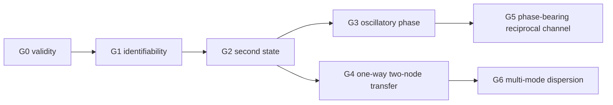

# P3.8f split-gate execution protocol

Date: 2026-08-14.

Status: architecture and decision protocol fixed before implementation of the
canonical write-port run. This document contains no P3.8f result.

## Purpose

P3.8e combined experimental adequacy, temporal model order, complex poles and
spatial-mode independence in one Boolean decision. P3.8f separates these
claims. A downstream claim is not evaluated when an upstream measurement gate
is unresolved.

Every gate has one of five machine-readable states:

| status | meaning |
|---|---|
| `pass` | all fixed checks pass |
| `fail` | the experiment is adequate and the tested claim fails |
| `inconclusive` | the intervention or readout cannot decide the claim |
| `blocked` | an upstream gate is not `pass` |
| `not-run` | no data for this gate have been generated |

## Canonical intervention

Each mature scalar state is continued in two mirrored arms with common random
numbers. One arm receives a weak visible displacement `+delta` followed by the
return displacement `-delta`; the other receives the mirrored sequence. Each
arm therefore has zero final direct translation. Their odd paired response is
written only through the existing trajectory-to-memory deposition rule. No
memory coefficient is edited directly.

The fixed strengths remain

\[
\delta/R_{\rm mem}\in\{0.005,0.01\}.
\]

Five independent mature formation seeds, `eta=0`, write-off, mirror-swap and
common-noise controls are mandatory. Kernel, gain, noise and P3.8d parameters
are not searched.

## G0: experimental validity

G0 checks implementation and perturbative validity, not model order:

* uniform-port identity error at most `1e-10`;
* eta-zero extinction residual at most `1e-8` on the extinction window;
* paired-strength nonlinearity at most `0.1` median and `0.25` maximum;
* memory-radius change at most `0.1`;
* mirror swap changes the sign of the odd response but not its norm beyond
  numerical tolerance;
* write-off and zero-strength arms remain at their registered nulls.

A G0 failure is `fail` for the experiment and blocks every physical gate.

## G1: input-output identifiability

The weighted input-profile Gramians are averaged only to construct a common
basis. Eigenmodes below `1e-2` of the leading mean eigenvalue are discarded.
The largest retained prefix must additionally have transformed condition
number at most `100` in every seed/axis sample. At least two robust directions
are required for the second-state test; four are required before a three-term
spatial law plus one held-out mode can be fitted.

The current P3.8e profiles have mean-supported rank five but robust common rank
four: the fifth prefix reaches condition number about `5.2e3`, whereas the
fourth remains below `31`. This is a diagnostic of the existing data and does
not pre-decide P3.8f.

Responses are recorded at the finest cadence and downsampled only during
analysis. With `tau_mem=1/lambda_m`, the rolling chronological folds are fixed
as:

| fold | coefficient-fit interval | recursive holdout interval |
|---|---|---|
| A | `[0.1,2.0] tau_mem` | `(2.0,3.0] tau_mem` |
| B | `[0.1,3.0] tau_mem` | `(3.0,4.0] tau_mem` |
| C | `[0.1,4.0] tau_mem` | `(4.0,5.0] tau_mem` |

The interval `(6,8] tau_mem` is extinction-only and is not moved into a fit to
rescue signal loss. A fold is informative only when its active memory and
independent visible/force readouts exceed the corresponding write-off and
time-shuffled null envelope. At least two folds in at least four of five seeds
must be informative. Otherwise G1 is `inconclusive`, not evidence against a
second state.

## G2: second-state selection

G2 asks only whether a two-state temporal realization is selected. Complex
poles are not required.

The retained orthogonal inputs and the memory readouts form the fit channels.
The relative visible coordinate and self-force remain independent readouts.
Orders one, two and eight use identical target times and rolling folds. For
each seed and fold define

\[
\Delta_{21}=\log {\operatorname{RMSE}_1\over\operatorname{RMSE}_2}.
\]

The fixed 20-percent improvement rule is retired for P3.8f. Order two passes
only when all of the following hold:

1. `Delta_21>0` for both memory and independent readout in at least two of
   three folds and at least four of five seeds;
2. the active paired `Delta_21` exceeds the 95th percentile of the identical
   statistic from write-off and time-shuffled controls;
3. order-two recursive RMSE is no more than 10 percent above order eight;
4. the second Hankel singular direction exceeds its control noise floor;
5. the fitted poles are stable;
6. one retained spatial direction is withheld from pole estimation and is
   predicted with poles fixed from the remaining directions.

This gate selects minimal effective order only. It does not identify momentum,
phase, energy or a particle property.

## G3: oscillatory phase

G3 is evaluated only after G2 passes. It requires a stable complex-conjugate
pole pair. A block bootstrap over the fixed folds must place the upper 95-percent
confidence bound of the AR(2) discriminant below zero. Positive damping and
nonzero angular frequency must remain compatible across cadences obtained by
downsampling the same raw trace. The same poles must improve the independent
visible/force readout. A real overdamped pair passes G2 but fails G3.

## G4-G6: additional knot and field claims

A second knot is not used to rescue an inconclusive G1. It becomes admissible
after G2 as an independent source-target experiment. One-way coupling is run
before reciprocal coupling so that transfer can be separated from binding,
merger and feedback.

If an informative G2 fails, one separately registered collective-order test is
still logically allowed: a second state may exist only in the pair dynamics.
That branch must retain cross-off, source-off, mirror-swap, distance and
shape-bounded controls and cannot reuse a tuned pair from exploratory scans.

G4 requires reproducible source-to-target transfer without merger. G5 requires
the G3 phase mode in the reciprocal pair. G6 additionally requires at least
three independent training modes and one untouched spatial holdout. None of
these gates is part of P3.8f itself.

## Execution and parallelism

Scientific decisions are sequential; simulation shards may run in parallel.
The intended runner contract is:

1. `simulate --seed N --manifest ...` writes one immutable NPZ/JSON shard;
2. every shard records code revision, input-state hash and complete parameters;
3. `aggregate --manifest ...` refuses missing, duplicated or mismatched seeds;
4. only the aggregate process computes the common basis, null envelopes and
   gate statuses.

GitHub Actions is not the primary compute path yet. The current complete P3.8e
response run takes about 25 seconds locally, so hosted-runner setup would cost
more time than it saves. Moreover, the five mature N=3M snapshots are currently
ignored generated data. Before a manual Actions matrix is defensible, P3.8f
needs a versioned compact five-state bundle and a shardable runner.

After those prerequisites exist, an optional `workflow_dispatch` job may use a
five-seed matrix with `max-parallel: 5`, upload immutable artifacts, and run one
aggregation job. It must not trigger on every push, alter thresholds through
workflow inputs, auto-commit results or replace a local reproducibility run.

## Decision sequence

* G1 inconclusive: repair excitation/readout only; do not add a knot.
* G2 pass, G3 fail: retain a reproducible overdamped second state; do not call
  it phase or momentum.
* G3 pass: proceed to the one-way two-node transfer gate.
* informative G2 fail: close the registered single-node scalar `(m,p)` route;
  either run the single registered collective-order branch or declare an
  oriented/current-memory or dynamic-mediator extension.
