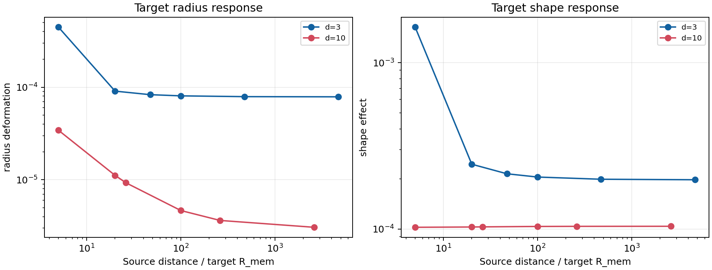
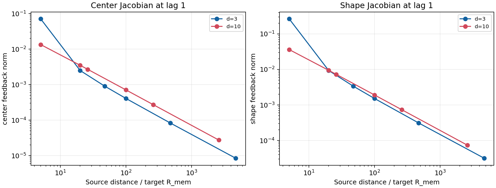
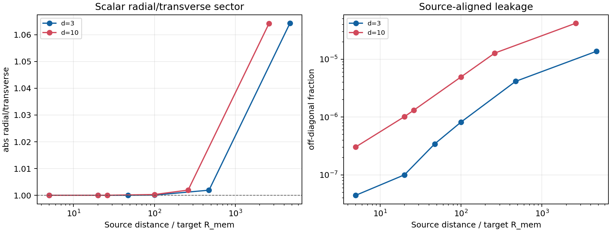

# Frozen-source distance ladder

Date: 2026-07-17T15:31:37+00:00

## Scope

The static field audit shows that the retained source is pointlike at
the current interaction-kernel resolution. This ladder therefore tests
tidal deformation and nonlinear target feedback versus source distance.
It does not test source orientation, charge, or an external dimension.

Every distance is calibrated to the same bare displacement of 0.03 target
memory radii over one memory time. Source translations are 0.03 and 0.10
of the baseline distance, and every distance and paired path shares the same future noise.

## Results at lag one memory time

| d | distance | r/R_mem | r/sigma_rep | eta_cross | zero error | radius deformation | shape effect | center rank | shape rank | radial/transverse |
| ---: | --- | ---: | ---: | ---: | ---: | ---: | ---: | ---: | ---: | ---: |
| 3 | 5 R_mem | 5.0000 | 0.0011 | 1.955e-04 | 0 | 4.463e-04 | 0.0016 | 3 | 3 | 1.0000 |
| 3 | 20 R_mem | 20.0000 | 0.0042 | 6.679e-06 | 0 | 9.070e-05 | 2.450e-04 | 3 | 3 | 1.0000 |
| 3 | 100 R_mem | 100.0000 | 0.0212 | 1.089e-06 | 0 | 8.064e-05 | 2.052e-04 | 3 | 3 | 1.0001 |
| 3 | 0.01 sigma_rep | 47.2470 | 0.0100 | 2.430e-06 | 0 | 8.305e-05 | 2.147e-04 | 3 | 3 | 1.0000 |
| 3 | 0.1 sigma_rep | 472.4704 | 0.1000 | 2.222e-07 | 0 | 7.908e-05 | 1.990e-04 | 3 | 3 | 1.0019 |
| 3 | 1 sigma_rep | 4.725e+03 | 1.0000 | 2.074e-08 | 0 | 7.873e-05 | 1.977e-04 | 3 | 3 | 1.0643 |
| 10 | 5 R_mem | 5.0000 | 0.0019 | 1.971e-05 | 0 | 3.432e-05 | 1.024e-04 | 10 | 10 | 1.0000 |
| 10 | 20 R_mem | 20.0000 | 0.0077 | 5.133e-06 | 0 | 1.116e-05 | 1.028e-04 | 10 | 10 | 1.0000 |
| 10 | 100 R_mem | 100.0000 | 0.0383 | 1.038e-06 | 0 | 4.653e-06 | 1.036e-04 | 10 | 10 | 1.0003 |
| 10 | 0.01 sigma_rep | 26.0843 | 0.0100 | 3.948e-06 | 0 | 9.278e-06 | 1.030e-04 | 10 | 10 | 1.0000 |
| 10 | 0.1 sigma_rep | 260.8425 | 0.1000 | 3.983e-07 | 0 | 3.637e-06 | 1.037e-04 | 10 | 10 | 1.0020 |
| 10 | 1 sigma_rep | 2.608e+03 | 1.0000 | 3.752e-08 | 0 | 3.067e-06 | 1.038e-04 | 10 | 10 | 1.0642 |

## Quality gates

| d | distance | realized fraction | branch radius disturbance | center delta difference | shape delta difference | off-diagonal fraction |
| ---: | --- | ---: | ---: | ---: | ---: | ---: |
| 3 | 5 R_mem | 0.0300 | 7.619e-05 | 9.389e-10 | 8.341e-06 | 4.452e-08 |
| 3 | 20 R_mem | 0.0300 | 1.013e-05 | 1.600e-08 | 4.663e-05 | 1.005e-07 |
| 3 | 100 R_mem | 0.0300 | 8.250e-06 | 4.003e-07 | 5.319e-05 | 8.195e-07 |
| 3 | 0.01 sigma_rep | 0.0300 | 8.700e-06 | 8.954e-08 | 4.523e-05 | 3.441e-07 |
| 3 | 0.1 sigma_rep | 0.0300 | 7.976e-06 | 8.759e-06 | 6.919e-05 | 4.142e-06 |
| 3 | 1 sigma_rep | 0.0300 | 8.395e-06 | 6.470e-04 | 7.202e-04 | 1.370e-05 |
| 10 | 5 R_mem | 0.0300 | 4.818e-06 | 3.306e-09 | 1.066e-04 | 3.049e-07 |
| 10 | 20 R_mem | 0.0300 | 5.021e-06 | 5.251e-08 | 9.861e-05 | 1.018e-06 |
| 10 | 100 R_mem | 0.0300 | 5.077e-06 | 1.312e-06 | 9.592e-05 | 4.943e-06 |
| 10 | 0.01 sigma_rep | 0.0300 | 5.037e-06 | 8.932e-08 | 9.818e-05 | 1.315e-06 |
| 10 | 0.1 sigma_rep | 0.0300 | 5.087e-06 | 8.828e-06 | 9.295e-05 | 1.275e-05 |
| 10 | 1 sigma_rep | 0.0300 | 5.092e-06 | 4.334e-04 | 4.460e-04 | 4.174e-05 |

## Distance effect

| d | max radius deformation | at | max shape effect | at | near/far radius ratio | near/far shape ratio |
| ---: | ---: | --- | ---: | --- | ---: | ---: |
| 3 | 4.463e-04 | 5 R_mem | 0.0016 | 5 R_mem | 5.6683 | 8.2770 |
| 10 | 3.432e-05 | 5 R_mem | 1.038e-04 | 1 sigma_rep | 11.1920 | 0.9863 |

All center and shape Jacobians retain the ambient input rank. At the
smallest distances the radial/transverse ratio approaches one, as
expected for the locally harmonic part of an isotropic scalar field.
The enhanced d=3 near response is a small target-deformation effect,
not resolved source structure; all reported normalized deformations
remain below 0.002. One checkpoint per dimension makes these
descriptive pathwise results, not seed-level inference.

## Guardrails

Full ambient rank remains the expected response of an isotropic scalar
kernel. A distance-dependent target deformation can identify a safe
weak-coupling range, but cannot establish charge, parity violation,
reciprocity, synchronization, or three selected external dimensions.

## Model implication

At the present resolution rho behaves as an unsigned scalar
mass-like channel with universal attraction. Parity and charge
sign are different questions: electric charge is parity-even,
while its sign is an internal/charge-conjugation label. The minimal
next model test is therefore a separate signed scalar cross-channel
with q=0 and sign-reversal controls while self-confinement remains
unchanged. Vector memory is justified only when an observable needs
orientation, phase, circulation, or polarization.

## Figures

## Reproducibility

- Analysis revision: 2aaa0d398e80472fd0e2f862bfccd471b07bf041
- Static field audit: reports/response/frozen_source_field_audit_2026-07-17.md
- Summary: reports/response/frozen_source_distance_ladder_summary_2026-07-17.json
- Command: python experiments/current/memory/synchronization/frozen_source_distance_ladder.py
