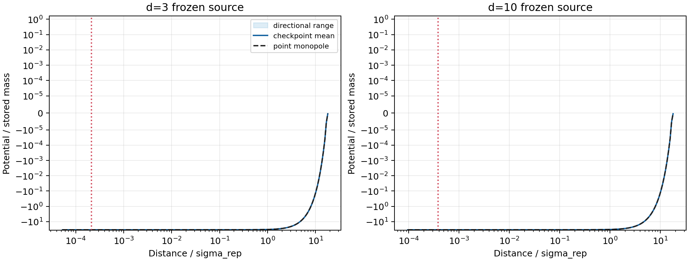
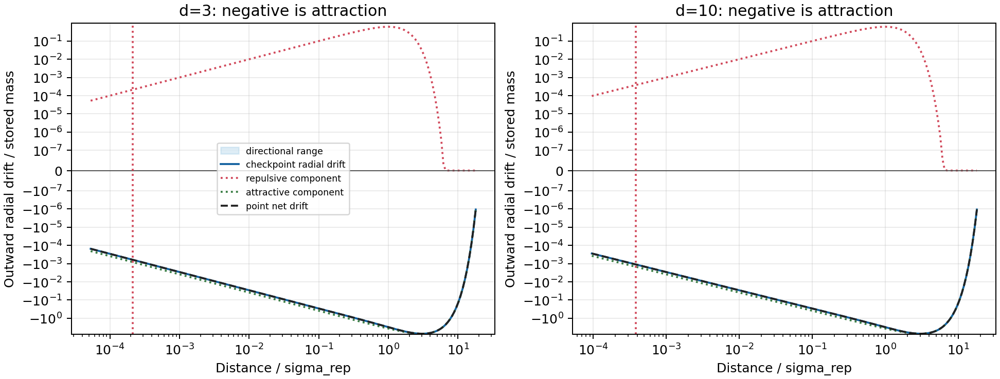
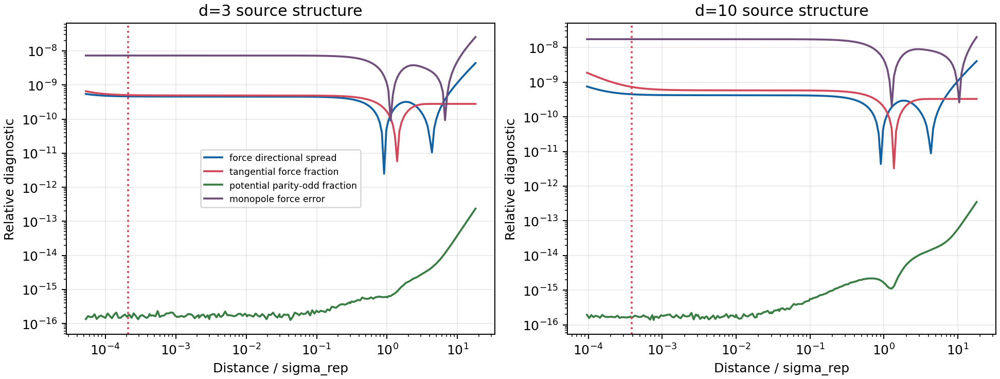

# Frozen-source potential and force audit

Date: 2026-07-17T15:29:10+00:00

## Decision

The observed displacement toward the cloned source is already fixed by
the selected scalar kernel. For the current A_att=35 slice, the broad
attractive curvature exceeds the short repulsive curvature at the origin
and remains dominant at larger radius. The point-source branch therefore
has no force-sign crossing.

This audit evaluates the complete retained checkpoint field without
renormalizing its truncated memory mass. Potential zero is at infinity;
negative radial drift means attraction toward the source centre.

The landmarks cover 5, 20, and 100 memory radii and 0.01, 0.1, and
1 effective repulsive-kernel width.

## Kernel and source scale

| d | R_mem/sigma_rep | stored mass | Phi'' point at 0 | point crossing | measured mean crossings |
| ---: | ---: | ---: | ---: | ---: | ---: |
| 3 | 2.117e-04 | 0.9976 | 2.8889 | none | none |
| 10 | 3.834e-04 | 0.9976 | 2.8889 | none | none |

Positive Phi'' at the point-source origin is a local potential minimum,
so the canonical update -eta grad(Phi) is restoring/attractive there.
For q=sigma_att/sigma_rep=3, a repulsive point core would require
A_att/A_rep < 9; the present ratio is 35.

## Distance landmarks

| d | distance | r/R_mem | r/sigma_rep | radial drift | sign over directions | directional spread | tangential fraction | parity-odd Phi | monopole-force error |
| ---: | --- | ---: | ---: | ---: | --- | ---: | ---: | ---: | ---: |
| 3 | 5 R_mem | 5.0000 | 0.0011 | -0.0030 | all inward | 4.574e-10 | 4.940e-10 | 1.586e-16 | 7.317e-09 |
| 3 | 20 R_mem | 20.0000 | 0.0042 | -0.0122 | all inward | 4.572e-10 | 4.935e-10 | 1.640e-16 | 7.317e-09 |
| 3 | 100 R_mem | 100.0000 | 0.0212 | -0.0610 | all inward | 4.568e-10 | 4.933e-10 | 1.820e-16 | 7.313e-09 |
| 3 | 0.01 sigma_rep | 47.2470 | 0.0100 | -0.0288 | all inward | 4.571e-10 | 4.935e-10 | 1.820e-16 | 7.316e-09 |
| 3 | 0.1 sigma_rep | 472.4704 | 0.1000 | -0.2885 | all inward | 4.491e-10 | 4.889e-10 | 2.325e-16 | 7.225e-09 |
| 3 | 1 sigma_rep | 4.725e+03 | 1.0000 | -3.0648 | all inward | 6.266e-11 | 1.616e-10 | 5.822e-16 | 1.043e-09 |
| 10 | 5 R_mem | 5.0000 | 0.0019 | -0.0055 | all inward | 4.207e-10 | 5.875e-10 | 1.964e-16 | 1.738e-08 |
| 10 | 20 R_mem | 20.0000 | 0.0077 | -0.0221 | all inward | 4.196e-10 | 5.811e-10 | 1.804e-16 | 1.738e-08 |
| 10 | 100 R_mem | 100.0000 | 0.0383 | -0.1105 | all inward | 4.185e-10 | 5.800e-10 | 2.499e-16 | 1.735e-08 |
| 10 | 0.01 sigma_rep | 26.0843 | 0.0100 | -0.0288 | all inward | 4.195e-10 | 5.809e-10 | 1.935e-16 | 1.738e-08 |
| 10 | 0.1 sigma_rep | 260.8425 | 0.1000 | -0.2885 | all inward | 4.122e-10 | 5.753e-10 | 5.592e-16 | 1.719e-08 |
| 10 | 1 sigma_rep | 2.608e+03 | 1.0000 | -3.0648 | all inward | 5.751e-11 | 1.902e-10 | 1.611e-15 | 4.329e-09 |

Across the listed near-to-far landmarks, the maximum point-monopole
force error is 1.738e-08, directional spread is
4.574e-10, and tangential fraction is
5.875e-10. The current read kernel therefore
does not resolve the internal source cloud even at five memory radii.
One checkpoint per dimension makes this a pathwise scale audit.

## Interpretation guardrails

The memory density is non-negative and supplies a positive scalar
monopole. It currently has no knot-specific charge sign. A scalar
field is parity-even; an individual finite cloud can still carry small
odd higher moments, measured here by the parity-paired directions.
Parity does not supply electric-charge sign; that is an internal
or charge-conjugation label.
Charge neutrality would suppress a leading signed monopole, not explain
this universal attraction. A signed scalar channel is the minimal way
to test like/unlike charge. Vector memory is a separate candidate for
orientation, phase, circulation, or polarization.

The source remains frozen and the target is absent from this static
calculation. This is a one-way field audit, not evidence for reciprocal
two-knot attraction, conservation laws, electromagnetism, or gravity.

## Next gate

1. The calibrated distance ladder now tests these six landmarks
   as target-deformation scales, not as source-structure probes.
2. Treat the present rho channel as an unsigned scalar mass-like
   interaction unless a separate charge observable is introduced.
3. Specify a signed scalar cross-channel with q=0 and sign-reversal
   controls before adding oriented memory solely to obtain charge.
4. Reserve vector memory for phase, circulation, or polarization.

## Figures

## Reproducibility

- Analysis revision: 9694f334e6785f377d656baf592ca1ffb887dce8
- Summary: reports/response/frozen_source_field_audit_summary_2026-07-17.json
- Command: python experiments/current/memory/synchronization/frozen_source_field_audit.py
