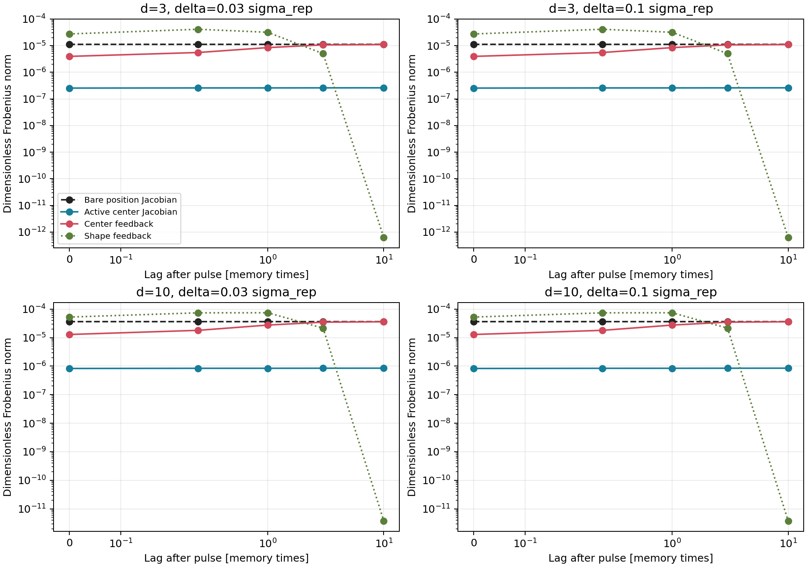
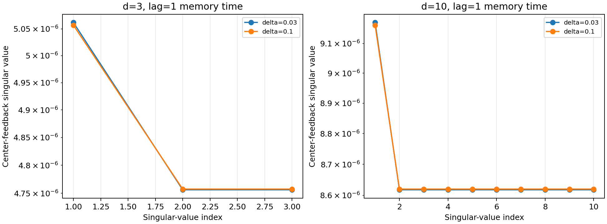
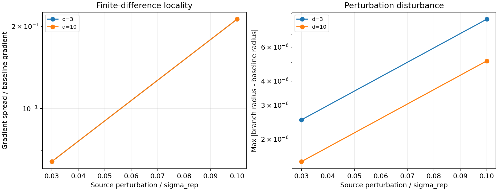

# Frozen localized source pilot

Date: 2026-07-16T19:27:11+00:00

## Decision

A complete cloned source is placed at one fixed offset from the target.
Its full state is translated locally by plus/minus delta along every
input direction. This differentiates one source configuration instead
of repeating an opposite-side radial basis test.

All perturbed branches, an unperturbed baseline-source branch, and a free
no-source branch share future noise. eta_zero retains the source field
but removes target self-feedback. eta_cross=0 must reproduce free
propagation exactly.

One checkpoint per dimension validates the architecture only. It cannot
establish a seed-reproducible rank or an emergent dimension.

## Cases

| d | N | radius | separation/radius | interaction fraction |
| ---: | ---: | ---: | ---: | ---: |
| 3 | 100000000 | 2.117e-04 | 4.725e+03 | 0.0300 |
| 10 | 100000000 | 3.834e-04 | 2.608e+03 | 0.0300 |

The fixed source is one effective sigma_rep from the target, which is
thousands of internal memory radii for these checkpoints.

## Results

The ranks are descriptive 95%-energy ranks at lag one memory time.

| d | delta/sigma_rep | delta/radius | eta_cross | realized baseline fraction | max radius perturbation | center rank | shape rank |
| ---: | ---: | ---: | ---: | ---: | ---: | ---: | ---: |
| 3 | 0.0300 | 141.7411 | 2.072e-08 | 0.0300 | 2.517e-06 | 3 | 3 |
| 3 | 0.1000 | 472.4704 | 2.072e-08 | 0.0300 | 8.386e-06 | 3 | 3 |
| 10 | 0.0300 | 78.2528 | 3.753e-08 | 0.0300 | 1.527e-06 | 10 | 10 |
| 10 | 0.1000 | 260.8425 | 3.753e-08 | 0.0300 | 5.093e-06 | 10 | 10 |

## Controls and convergence

| d | zero-cross error | center-Jacobian difference | shape-Jacobian difference |
| ---: | ---: | ---: | ---: |
| 3 | 0 | 6.470e-04 | 7.202e-04 |
| 10 | 0 | 4.334e-04 | 4.460e-04 |

## Source-aligned symmetry audit

The baseline source lies on axis 1. The table resolves the center-
feedback Jacobian into its radial entry, the mean transverse entry,
and leakage away from this diagonal radial/transverse form.

| d | delta/sigma_rep | radial | transverse mean | abs ratio | off-diagonal fraction | transverse spread |
| ---: | ---: | ---: | ---: | ---: | ---: | ---: |
| 3 | 0.0300 | -5.062e-06 | -4.756e-06 | 1.0643 | 1.370e-05 | 2.723e-09 |
| 3 | 0.1000 | -5.057e-06 | -4.758e-06 | 1.0629 | 1.356e-05 | 2.530e-09 |
| 10 | 0.0300 | -9.171e-06 | -8.618e-06 | 1.0642 | 4.174e-05 | 1.181e-08 |
| 10 | 0.1000 | -9.162e-06 | -8.620e-06 | 1.0629 | 4.129e-05 | 1.150e-08 |

The full ambient ranks split into one radial and d-1 nearly
degenerate transverse responses. This is the symmetry expected from
an isotropic scalar kernel. It is not evidence for selection of three
external dimensions.

## Guardrails

The source is frozen, so this is not synchronization, reciprocal
interaction, retardation, charge, spin, or a particle model. A
descriptive rank from one cloned state must not be interpreted as an
emergent dimension. Independent source and target seeds are required.

## Figures

## Next gate

1. Retain exact zero-cross control, non-destructive baseline
   coupling, and agreement of both finite-difference Jacobians.
2. Run a dimensionless distance ladder from a few memory radii
   to one sigma_rep, with local delta and source rotations.
3. Only if state- or orientation-dependent structure survives,
   form at least six, preferably ten, independent seed pairs.
4. Move to one-way dynamic coupling only after these gates.

## Reproducibility

- Analysis revision: 3e45bc10815c5c3d89ef86e7a3d76f3e8c74853e
- Summary: reports/response/frozen_source_pilot_summary_2026-07-16.json
- Command: python experiments/current/memory/synchronization/frozen_source_response.py
