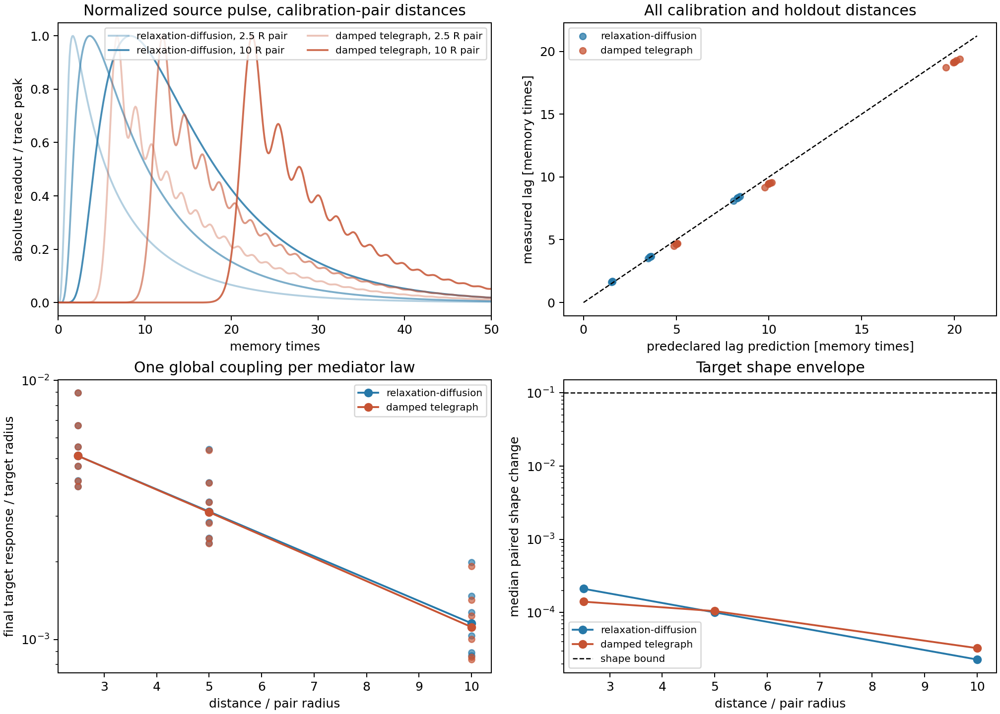

# Local Oriented-Mediator Gate

Generated: `2026-07-28T18:11:00.203406+00:00`.

## Decision

Overall status: **architecture_pass_mechanism_underdetermined**.

Both inserted mediator laws pass their own implementation and fixed-coupling knot-envelope gates. The current experiment cannot choose a physical law because each transport behavior is a model input.



## Fixed design

- The field is evolved locally on the one-dimensional relational axis between source and target. This is a transport-channel approximation, not an ambient-dimension claim.
- A rectangular oriented source pulse lasts `1.0000` memory time(s); the horizon is `50.0000` memory times.
- Both laws share the calibration-pair length `R0=2.095e-04`, correlation length `5.0000 R0`, and nominal zero-mode relaxation time `10.0000` memory times.
- Exactly one scalar coupling per mediator law is calibrated on the first pair at the nearest distance. Every other pair and distance is a holdout; neither the length unit nor coupling is rescaled.
- Active, global-sign-flip, and exact channel-off target paths share the same future noise. The source knot itself is frozen while its added oriented channel is pulsed.

## Transport law

The parabolic arm uses `d_t a = D d_xx a - mu a + s`. Its impulse Green function is proportional to `t^(-1/2) exp[-r^2/(4Dt)-mu t]`. Consequently, `t_peak ~ r^2` is only the near/weak-decay limit. The predeclared peak prediction is

```text
t_peak = [sqrt(1 + 4 mu r^2/D) - 1]/(4 mu) + pulse_duration/2.
```

At large distance it crosses toward a linear peak lag. The hyperbolic arm uses a critically damped field/momentum state and tests the onset against `r/c`. Thus a bare `r^2` versus `r` dichotomy would have been mathematically incorrect for the actual relaxation-diffusion law.

### Relaxation Diffusion

- calibrated coupling: `5.968e-09`
- calibration relative error: `2.400e-08`
- half-amplitude linearity error: `7.799e-12`
- holdout lag median/max relative error: `0.0112` / `0.0909`
- primary/fine lag maximum relative drift: `0.0031`
- passing holdout pairs: `5/5`
- architecture status: **pass**

### Telegraph

- calibrated coupling: `6.022e-10`
- calibration relative error: `3.643e-09`
- half-amplitude linearity error: `7.528e-12`
- holdout lag median/max relative error: `0.0555` / `0.0788`
- primary/fine lag maximum relative drift: `0.0491`
- passing holdout pairs: `5/5`
- architecture status: **pass**

## Claim boundary

A passing arm verifies the implementation, fixed-coupling holdout pipeline, and compatibility with the current scalar knot envelope. It does not discover a propagation law: diffusion or finite-front transport was inserted in the corresponding update rule. The two constructed transfer functions can be distinguished only if an independent source waveform excites their differing frequency bands. Choosing a physical law still needs an external criterion or data.

No reciprocal interaction, photon, spin, charge, particle, Lorentz, QFT, or finite-signal-speed claim follows. A finite-difference diffusion stencil also has a grid cone at finite resolution; that is a numerical property, not a causal continuum bound.

## When could three dimensions be selected?

Not in this gate. A local field equation can be written in any supplied ambient dimension, and this runner uses only a relational axis. Fields may later provide a mechanism that gaps or suppresses directions, but the present code has no dynamical ambient-dimension variable. A defensible selection test must freeze one mediator law and the same absolute dimensionless parameters across several ambient dimensions, then show that an external response or slow-mode rank converges reproducibly to three while additional directions are suppressed. Merely running a field on a 3D grid assumes, rather than derives, three dimensions.

## Reproducibility

- reference: `reports/response/oriented_vector_fixed_pair_distance_gate_2026-07-26.json`
- git revision: `b402aa34410d757851249a774c42fb5947de0ddd`
- git status at start: `clean`
- command: `python experiments/current/memory/synchronization/local_oriented_mediator_gate.py`
